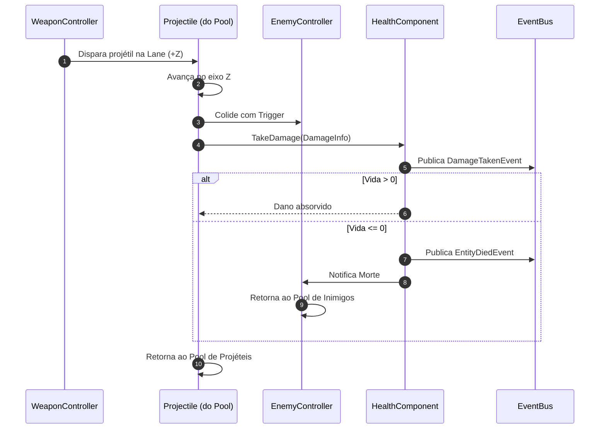
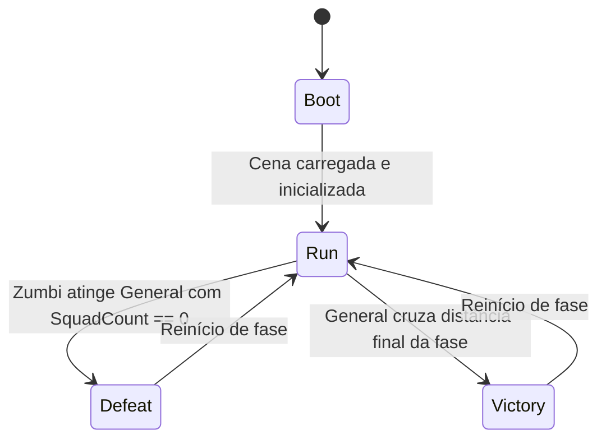

# Plano de Implementação · NEX-509
> Data: 2026-09-28
> Issue: NEX-509 (M4 · Tiro automático e hordas de zumbis)
> Status: Pronto para Execução via /executar

---

## 1. Contexto & Decisões de Produto

O marco M4 fecha o loop jogável essencial do protótipo de *Horde Runner*: a capacidade de enfrentar inimigos, vencer e ser derrotado. É o ponto culminante do Milestone **E1 (Protótipo jogável)**.

Neste marco, a tropa liderada pelo General avança pelo corredor com pistas discretas (`LaneLayout`), atira automaticamente para frente em cadência constante, enfrenta hordas de zumbis Andarilhos marchando pelas lanes em sentido oposto, e resolve colisões letais: zumbis eliminam soldados ao contato direto, e alcançar o General com a tropa zerada resulta em Derrota (`Defeat`). Ao sobreviver ao percurso e superar a horda até a distância final, o jogador alcança a Vitória (`Victory`). Por fim, o pipeline CLI de build Android de desenvolvimento é validado gerando o primeiro APK jogável para testes em aparelho.

### Decisões Fundamentais:
1. **Contratos Puros de Combate em `Game.Core`:**
   - Tipos e interfaces de combate (`DamageInfo`, `DamageType`, `IDamageable`) e eventos (`DamageTakenEvent`, `EntityDiedEvent`) residem em `Game.Core` (C# puro, `noEngineReferences: true`).
   - Garante que a lógica de aplicação de dano, cálculo de HP e regras de morte sejam testáveis sem instanciar cenas do Unity.
2. **Componente de Vida Reutilizável (`HealthComponent`):**
   - Implementado em `Game.Gameplay` implementando `IDamageable`.
   - Gerencia `CurrentHealth`, `MaxHealth`, `IsAlive` e disparo de eventos via `IEventBus`.
   - Suporta reset para reaproveitamento limpo em pooling de objetos (`ResetHealth()`).
3. **Tiro Automático e Pooling de Projéteis (`WeaponController` + `Projectile`):**
   - O disparo é contínuo e automático enquanto o jogo estiver no estado `Run`.
   - Projéteis avançam em velocidade fixa no eixo $+Z$ alinhados à lane do atirador.
   - Detecção de impacto via trigger com `IDamageable`: aplica `DamageInfo` e é reciclado atomicamente no pool de objetos (`ObjectPool<Projectile>`).
4. **Zumbi Andarilho e Gerador de Hordas por Lane (`EnemyController` + `HordeSpawner`):**
   - Zumbi básico avança no eixo $-Z$ com velocidade configurável mantendo-se na sua lane.
   - `HordeSpawner` distribui ondas de zumbis em lanes discretas a distâncias pré-programadas do percurso.
   - Inimigos utilizam `ObjectPool<EnemyController>` para evitar gargalos de GC em dispositivos mobile.
5. **Contato Zumbi × Tropa e Loop de Vitória/Derrota:**
   - Zumbi que alcança a tropa consome 1 soldado (`SquadController.Remove(1)`) e se autodestrói.
   - Se a tropa estiver em zero (`SquadCount == 0`) e um zumbi encostar no General, o `GameStateMachine` transiciona para `GameState.Defeat`.
   - Se o jogador ultrapassar a distância alvo da fase (meta Z), o `GameStateMachine` transiciona para `GameState.Victory`.
6. **Montagem de Cena `M4_Greybox` via `SceneBuilder`:**
   - Integra pista, General com input e movimento em lanes (M1), tropa de soldados com HUD (M2), portões de perk aritméticos (M3) e hordas de zumbis com combate e tiro (M4).
7. **Pipeline CLI de Build Android (`Cli.BuildAndroid`):**
   - Implementa a chamada `BuildPipeline.BuildPlayer` no batchmode headless, direcionando para `Builds/Android/HordeRunner.apk` com a cena `M4_Greybox.unity`.

---

## 2. Armadilhas do Repositório

| Armadilha | Onde morde (arquivo/passo) | Regra a respeitar |
|---|---|---|
| `Game.Core` sem UnityEngine | `DamageInfo.cs`, `IDamageable.cs` — Marco 1 | Não referenciar tipos do Unity em `Game.Core`. Usar apenas primitivos e structs imutáveis. |
| Invariante de dano não-negativo e clamp | `HealthComponent.cs` — Marco 1 | `TakeDamage` deve ignorar quantias $\le 0$. `CurrentHealth` deve permanecer estritamente no intervalo $[0, \text{MaxHealth}]$. |
| Duplo acerto de projétil no mesmo frame | `Projectile.cs` — Marco 2 | Ao registrar colisão com o primeiro `IDamageable`, marcar flag de consumo imediatamente e desativar o collider antes de invocar callbacks de dano ou retornar ao pool. |
| Reciclagem em pooling sem reset de estado | `Projectile.cs`, `EnemyController.cs` — Marco 2 e 3 | Ao ser alugado ou devolvido ao pool, resetar velocidade, posição, status de vida (`ResetHealth()`) e estado de colisão. |
| Colisão zumbi × tropa multiplicada | `CombatDirector.cs` / `EnemyController.cs` — Marco 4 | Um zumbi só pode consumir exatamente 1 soldado e deve ser desativado imediatamente para não colidir com outros soldados no mesmo frame. |
| BuildAndroid headless sem pastas de destino | `Cli.cs` — Marco 5 | Criar diretório `Builds/Android/` via `Directory.CreateDirectory` antes de invocar `BuildPipeline.BuildPlayer` para evitar erros de I/O em batchmode. |

---

## 2.5 Diagramas de Fluxo e Estado

### Fluxo de Tiro e Combate


### Máquina de Estados no Loop M4


---

## 3. Árvore de Arquivos

- [NOVO] `Assets/_Game/Scripts/Core/Damage/DamageType.cs`
- [NOVO] `Assets/_Game/Scripts/Core/Damage/DamageInfo.cs`
- [NOVO] `Assets/_Game/Scripts/Core/Damage/IDamageable.cs`
- [NOVO] `Assets/_Game/Scripts/Core/Events/DamageTakenEvent.cs`
- [NOVO] `Assets/_Game/Scripts/Core/Events/EntityDiedEvent.cs`
- [NOVO] `Assets/_Game/Scripts/Gameplay/HealthComponent.cs`
- [NOVO] `Assets/_Game/Scripts/Gameplay/Combat/Projectile.cs`
- [NOVO] `Assets/_Game/Scripts/Gameplay/Combat/WeaponController.cs`
- [NOVO] `Assets/_Game/Scripts/Presentation/ProjectileView.cs`
- [NOVO] `Assets/_Game/Scripts/Gameplay/Enemies/EnemyController.cs`
- [NOVO] `Assets/_Game/Scripts/Gameplay/Enemies/HordeSpawner.cs`
- [NOVO] `Assets/_Game/Scripts/Presentation/EnemyView.cs`
- [NOVO] `Assets/_Game/Scripts/Gameplay/Combat/CombatDirector.cs`
- [MODIFICAÇÃO] `Assets/_Game/Scripts/Editor/SceneBuilder.cs`
- [MODIFICAÇÃO] `Assets/_Game/Scripts/Editor/Cli.cs`
- [NOVO] `Assets/_Game/Scripts/Tests/EditMode/HealthComponentTests.cs`
- [NOVO] `Assets/_Game/Scripts/Tests/EditMode/WeaponControllerTests.cs`
- [NOVO] `Assets/_Game/Scripts/Tests/EditMode/ProjectileTests.cs`
- [NOVO] `Assets/_Game/Scripts/Tests/EditMode/EnemyControllerTests.cs`
- [NOVO] `Assets/_Game/Scripts/Tests/EditMode/HordeSpawnerTests.cs`
- [NOVO] `Assets/_Game/Scripts/Tests/EditMode/M4CombatLoopTests.cs`
- [NOVO] `Assets/_Game/Scripts/Tests/EditMode/SceneBuilderM4Tests.cs`
- [NOVO] `Assets/_Game/Scripts/Tests/EditMode/CliBuildAndroidTests.cs`

---

## 4. Contratos e Interfaces

```csharp
// Game.Core
namespace Game.Core
{
    public enum DamageType
    {
        Physical,
        Fire,
        Ice,
        Lightning,
        Poison
    }

    public readonly struct DamageInfo
    {
        public int Amount { get; }
        public DamageType Type { get; }
        public object Source { get; }

        public DamageInfo(int amount, DamageType type = DamageType.Physical, object source = null);
    }

    public interface IDamageable
    {
        int CurrentHealth { get; }
        int MaxHealth { get; }
        bool IsAlive { get; }
        void TakeDamage(DamageInfo damage);
    }
}

namespace Game.Core.Events
{
    public readonly struct DamageTakenEvent
    {
        public IDamageable Target { get; }
        public DamageInfo Damage { get; }
        public int RemainingHealth { get; }
        public DamageTakenEvent(IDamageable target, DamageInfo damage, int remainingHealth);
    }

    public readonly struct EntityDiedEvent
    {
        public IDamageable Target { get; }
        public object Source { get; }
        public EntityDiedEvent(IDamageable target, object source = null);
    }
}

// Game.Gameplay
namespace Game.Gameplay
{
    public class HealthComponent : MonoBehaviour, IDamageable
    {
        public int CurrentHealth { get; }
        public int MaxHealth { get; }
        public bool IsAlive { get; }
        public void Initialize(int maxHealth, IEventBus eventBus = null);
        public void TakeDamage(DamageInfo damage);
        public void ResetHealth();
    }

    public class Projectile : MonoBehaviour
    {
        public int LaneIndex { get; set; }
        public float Speed { get; set; }
        public int Damage { get; set; }
        public float MaxDistance { get; set; }
        public void Initialize(int damage, float speed, float maxDistance, Action<Projectile> onRecycle);
    }

    public class WeaponController : MonoBehaviour
    {
        public float FireRate { get; set; }
        public int DamagePerShot { get; set; }
        public float ProjectileSpeed { get; set; }
        public void Initialize(IObjectPool<Projectile> pool, ISquad squad = null);
        public void Fire();
    }

    public class EnemyController : MonoBehaviour, IDamageable
    {
        public int LaneIndex { get; set; }
        public float MoveSpeed { get; set; }
        public HealthComponent Health { get; }
        public void Initialize(int laneIndex, int maxHealth, float moveSpeed, Action<EnemyController> onDeath);
        public void TakeDamage(DamageInfo damage);
    }

    public class HordeSpawner : MonoBehaviour
    {
        public void Initialize(LaneLayout layout, IObjectPool<EnemyController> pool);
        public void SpawnWave(int laneIndex, int count, float startZ, float spacing = 1.5f);
    }

    public class CombatDirector : MonoBehaviour
    {
        public void Initialize(SquadController squad, TrackScroller scroller, IGameStateMachine stateMachine, float victoryDistance);
    }
}

// Game.Presentation
namespace Game.Presentation
{
    public class ProjectileView : MonoBehaviour
    {
        public void SetupVisuals(Color color);
    }

    public class EnemyView : MonoBehaviour
    {
        public void SetupVisuals(Color color);
    }
}
```

---

## 4.5 Linear Overlay

- **História (issue-pai):** `NEX-509` (M4 · Tiro automático e hordas de zumbis)
- **Sub-issues deste plano:**
  1. `NEX-554`: DamageInfo, IDamageable, HealthComponent e eventos de combate [Priority: High]
  2. `NEX-555`: Projectile, WeaponController com tiro automatico e pooling [Priority: High]
  3. `NEX-556`: EnemyController Andarilho e HordeSpawner por lane [Priority: High]
  4. `NEX-557`: Contato zumbi tropa, loop Vitoria Derrota e montagem de cena M4 Greybox [Priority: High]
  5. `NEX-558`: Cli BuildAndroid e pipeline de build de desenvolvimento Android [Priority: High]
- **Modelo Git (modelo C):**
  - Branch da história: `jamilzerati/nex-509-m4-tiro-automatico-e-hordas-de-zumbis` (baseada em `main`)
  - PR de cada tarefa: `branch da tarefa` → `branch da história` (`jamilzerati/nex-509-...`)

---

## 5. Divisão de Execução por Passo

| Faixa | Passos | Por quê |
|---|---|---|
| **Modelo forte, obrigatório** | Marco 1, Marco 2, Marco 3, Marco 4 | Lógica de combate, cálculo de HP, cadência de disparo, pooling e reciclagem de projéteis/inimigos, consumo de soldados ao impacto e transições de vitória/derrota na máquina de estados possuem modos de falha silenciosa (dano truncado, vazamento de instâncias, colisão fantasma ou vitória/derrota não disparadas). |
| **Mecânico, qualquer modelo** | Marco 5 | Configuração do pipeline de build Android headless via `BuildPipeline.BuildPlayer`; erros de compilação, falta de cena ou caminhos inválidos falham imediatamente na execução batchmode com código de saída legível. |

---

## 6. Checklist de Execução

### Marco 1 · [NEX-554] `DamageInfo`, `IDamageable`, `HealthComponent` e eventos de combate
```dispatch
needs: executar
faixa: forte
runtime: medium
verify: tools/unity compile && tools/unity test-edit
```
- **Ação**: Criar `DamageType.cs`, `DamageInfo.cs`, `IDamageable.cs` em `Game.Core`, `DamageTakenEvent.cs`, `EntityDiedEvent.cs` em `Game.Core.Events`, `HealthComponent.cs` em `Game.Gameplay` e testes em `Game.Tests.EditMode/HealthComponentTests.cs`.
- **Lógica de Negócios / Responsabilidade**:
  - `DamageType`: enum com `Physical`, `Fire`, `Ice`, `Lightning`, `Poison`.
  - `DamageInfo`: struct imutável com `Amount`, `Type`, `Source`.
  - `IDamageable`: contrato público de saúde com `CurrentHealth`, `MaxHealth`, `IsAlive` e `TakeDamage(DamageInfo)`.
  - `DamageTakenEvent` e `EntityDiedEvent`: eventos desacoplados disparados no barramento `IEventBus`.
  - `HealthComponent`: gerencia saúde com clamp $[0, \text{MaxHealth}]$, ignora quantias de dano não-positivas, dispara eventos no bus e permite reinicialização via `ResetHealth()`.
- **Seam Público**: `IDamageable.TakeDamage`, `HealthComponent.ResetHealth`, `DamageTakenEvent`
- **Marco de PR**: Marco 1 + `NEX-554`
- **Runtime**: medium

---

### Marco 2 · [NEX-555] `Projectile`, `WeaponController` com tiro automático e pooling
```dispatch
needs: executar
faixa: forte
runtime: medium
verify: tools/unity compile && tools/unity test-edit
```
- **Ação**: Criar `Projectile.cs`, `WeaponController.cs` em `Game.Gameplay`, `ProjectileView.cs` em `Game.Presentation`, e testes em `Game.Tests.EditMode/ProjectileTests.cs` e `WeaponControllerTests.cs`.
- **Lógica de Negócios / Responsabilidade**:
  - `Projectile`: avanço retilíneo $+Z$ com velocidade configurável. Trigger detector colide com `IDamageable`, aplica `DamageInfo`, e recicla imediatamente de volta para o pool. Se ultrapassar `MaxDistance`, recicla automaticamente.
  - `WeaponController`: dispara projéteis em cadência configurável (`FireRate`). Projéteis nascem alinhados com a posição frontal da tropa.
  - `ProjectileView`: apresentação visual greybox (esfera amarela/laranja com material URP Lit).
  - Pooling integrado usando `ObjectPool<Projectile>` com rent/return sem alocação em frame.
- **Seam Público**: `WeaponController.Fire`, `Projectile.Initialize`, `IObjectPool<Projectile>`
- **Marco de PR**: Marco 2 + `NEX-555`
- **Runtime**: medium

---

### Marco 3 · [NEX-556] `EnemyController` (Andarilho) e `HordeSpawner` por lane
```dispatch
needs: executar
faixa: forte
runtime: medium
verify: tools/unity compile && tools/unity test-edit
```
- **Ação**: Criar `EnemyController.cs`, `HordeSpawner.cs` em `Game.Gameplay`, `EnemyView.cs` em `Game.Presentation`, e testes em `Game.Tests.EditMode/EnemyControllerTests.cs` e `HordeSpawnerTests.cs`.
- **Lógica de Negócios / Responsabilidade**:
  - `EnemyController`: zumbi Andarilho com `HealthComponent`, avança em $-Z$ na sua respectiva lane (`LaneIndex`). Ao morrer, executa callback de reciclagem no pool.
  - `HordeSpawner`: gerencia spawn de zumbis em lanes discretas calculadas a partir de `LaneLayout`, posicionando grupos com espaçamento em Z.
  - `EnemyView`: renderização visual greybox do Andarilho (cápsula/cubo avermelhado).
  - Pooling via `ObjectPool<EnemyController>`.
- **Seam Público**: `EnemyController.TakeDamage`, `HordeSpawner.SpawnWave`, `EnemyController.Initialize`
- **Marco de PR**: Marco 3 + `NEX-556`
- **Runtime**: medium

---

### Marco 4 · [NEX-557] Contato zumbi × tropa, loop Vitória/Derrota e montagem de cena `M4_Greybox`
```dispatch
needs: executar
faixa: forte
runtime: medium
verify: tools/unity compile && tools/unity test-edit
```
- **Ação**: Criar `CombatDirector.cs` em `Game.Gameplay`, atualizar `SceneBuilder.cs` adicionando `BuildM4GreyboxScene()`, e testes em `Game.Tests.EditMode/M4CombatLoopTests.cs` e `SceneBuilderM4Tests.cs`.
- **Lógica de Negócios / Responsabilidade**:
  - Resolução de impacto frontal zumbi × tropa: zumbi que atinge soldado remove 1 unidade da tropa (`SquadController.Remove(1)`) e se recicla. Se a tropa estiver em 0 (`SquadCount == 0`) e o General for atingido, dispara `GameStateMachine.TryTransition(GameState.Defeat)`.
  - Resolução de vitória: quando o percurso atinge a distância de vitória (`victoryDistance`), dispara `GameStateMachine.TryTransition(GameState.Victory)`.
  - `CombatDirector`: orquestra eventos de vitória/derrota e pausa o scroller/spawner nos estados terminais.
  - `SceneBuilder.BuildM4GreyboxScene()`: monta a cena completa `Assets/_Game/Scenes/M4_Greybox.unity` contendo pista, General, tropa com tiro automático, pares de portões M3, ondas de zumbis M4, HUD de contagem de tropa e indicador de vitória/derrota.
- **Seam Público**: `CombatDirector.Initialize`, `SceneBuilder.BuildM4GreyboxScene`
- **Marco de PR**: Marco 4 + `NEX-557`
- **Runtime**: medium

---

### Marco 5 · [NEX-558] `Cli.BuildAndroid` e pipeline de build de desenvolvimento Android
```dispatch
needs: executar
faixa: mecânico
runtime: low
verify: tools/unity compile && tools/unity test-edit && tools/unity build-android
```
- **Ação**: Implementar `Cli.BuildAndroid()` em `Game.Editor.Cli`, atualizar configurações de build Android, criar testes em `Game.Tests.EditMode/CliBuildAndroidTests.cs` e validar via `tools/unity build-android`.
- **Lógica de Negócios / Responsabilidade**:
  - `Cli.BuildAndroid()`: invoca `BuildPipeline.BuildPlayer` configurando a cena `Assets/_Game/Scenes/M4_Greybox.unity`, caminho de saída `Builds/Android/HordeRunner.apk`, `BuildTarget.Android` e opções de desenvolvimento.
  - Garante criação do diretório de saída se não existir.
  - Trata erros de build com mensagens claras no log e `EditorApplication.Exit(0)` em sucesso ou `Exit(1)` em erro.
- **Seam Público**: `Game.Editor.Cli.BuildAndroid`
- **Marco de PR**: Marco 5 + `NEX-558`
- **Runtime**: low

---

## 7. Portões de Aceite da História

1. Todos os 5 PRs de tarefas (`NEX-554`, `NEX-555`, `NEX-556`, `NEX-557`, `NEX-558`) integrados na branch `jamilzerati/nex-509-m4-tiro-automatico-e-hordas-de-zumbis`.
2. `tools/unity compile` sem qualquer erro de compilação.
3. `tools/unity test-edit` executando todos os testes automatizados com 100% de sucesso.
4. Cena `M4_Greybox.unity` gerável via CLI e validada com loop jogável completo.
5. `tools/unity build-android` executa com sucesso gerando o APK de desenvolvimento no destino configurado.
