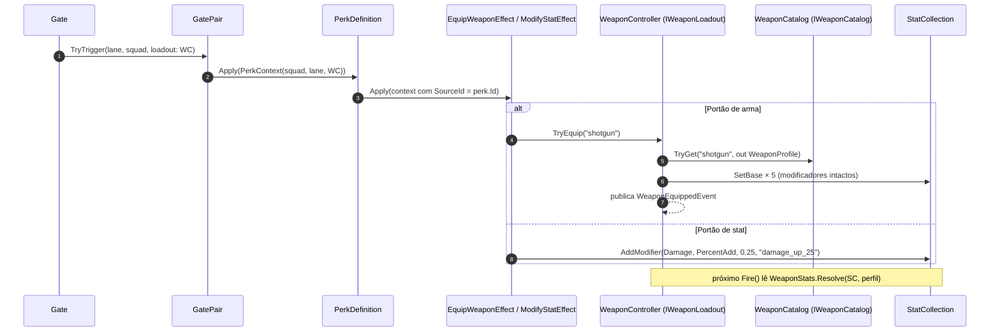
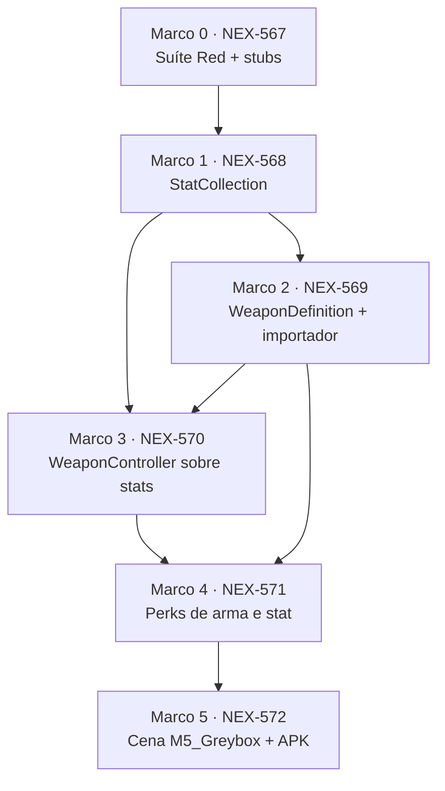

# Plano de Implementação: M5 · Sistema de stats e armas
> Data: 2026-09-28
> Issue: NEX-510
> Status: Pronto para Execução via /executar
> Status: Cenários validados — Suíte Red comprovada em 2026-09-28

## 1. Contexto & Arquitetura

- **Resumo**: primeira história do E2. Troca os campos soltos do `WeaponController` (M4) por um sistema de stats com modificadores por fonte, transforma armas em conteúdo JSON → ScriptableObject e adiciona dois tipos de portão: **arma** (troca a arma equipada) e **stat** (aplica um modificador que sobrevive à troca de arma). Critério do plano-mãe: *trocar arma muda comportamento*. Critério da issue: `StatCollection` com Flat/PercentAdd/PercentMultiply e remoção por fonte; `WeaponDefinition` (JSON → SO); portões de arma e de stat mudam o tiro.
- **Stack**: Unity 6000.6.3f1, C# com asmdefs `Game.Core` (sem UnityEngine) ← `Game.Data` ← `Game.Gameplay` ← `Game.Presentation`; `Game.Editor` para importador e `SceneBuilder`; NUnit via Unity Test Framework.
- **Verificação disponível**: suíte automatizada confiável — `tools/unity compile`, `tools/unity test-edit` (EditMode, NUnit XML, exit code), `tools/unity import-content` e `tools/unity build-android`. Sensação de jogo (números de balanceamento das armas) é do humano no aparelho.
- **Base Git**: a M4 (PR #23) ainda não está na `main`. A branch da história parte da branch da NEX-509; o PR draft da história aponta para `main` e o diff encolhe quando o #23 for mergeado.

### Decisões

1. **Fórmula única, sem cache.** `final = (base + ΣFlat) × (1 + ΣPercentAdd) × Π(1 + PercentMultiply)`, depois clamp do stat. `StatCollection` recalcula a cada leitura: são ≤ 5 stats com poucos modificadores, e sem cache não existe bug de invalidação. Se o profiler pedir cache na M14, ele entra com teste de invalidação.
2. **Convenção de percentual:** `0.25` = +25%. `PercentMultiply` com valor ≤ −1 é rejeitado (zeraria ou inverteria o stat).
3. **Arma define a base; perk define modificador.** Equipar arma reescreve as cinco bases e **não toca** nos modificadores. Portão de stat adiciona modificador com `Source` = id do perk. Passar duas vezes por portões com o mesmo perk empilha dois modificadores com a mesma fonte; `RemoveAllFromSource` remove os dois.
4. **`Source` é `object`, comparado por `object.Equals`** (strings de id comparam por valor). Fonte nula é rejeitada com `ArgumentNullException`.
5. **Stats inteiros** (`Damage`, `ProjectileCount`) arredondam com `Math.Round(x, MidpointRounding.AwayFromZero)` (12,5 → 13). Pisos: `Damage ≥ 1`, `ProjectileCount ∈ [1, 9]`, `ProjectileSpeed ≥ 1`, `Range ≥ 1`, `FireRate ≥ 0` (0 = não atira, guarda já existente no `Tick`).
6. **Spread** é campo do perfil da arma, não stat: N projéteis distribuídos simetricamente em X numa largura `SpreadWidth`; com N = 1 o offset é 0.
7. **Compatibilidade do M4:** os setters `FireRate`, `DamagePerShot`, `ProjectileSpeed`, `MaxDistance` continuam existindo e passam a escrever a **base** do stat; os getters devolvem o valor **resolvido**. As bases padrão do controller (2 / 10 / 15 / 40 / 1 projétil) são iguais à `pistol`, então a cena M4 não muda de comportamento.
8. **Validação na importação, falha alta.** `JsonUtility` preenche campo ausente com 0 sem avisar; o importador rejeita arma com campo numérico ausente/não positivo e perk com stat/kind inválido ou id de arma fora do catálogo. `Cli.ImportContent` sai com código 1 se houver erro.
9. **Cena nova `M5_Greybox`**, montada por um builder compartilhado extraído do M4 em commit de refactor puro. O APK de desenvolvimento passa a apontar para ela.

### Fluxo de um portão de arma/stat



### Dependência entre Marcos



## 2. Armadilhas do Repositório

| Armadilha | Onde morde (arquivo/passo) | Regra a respeitar |
|---|---|---|
| `Game.Core` com `noEngineReferences: true` | `Core/Stats/*`, `Core/Perks/Effects/*` — Marcos 1, 3, 4 | Nada de `Mathf`/`Debug`/`Vector3`. Usar `System.Math`; arredondamento com `MidpointRounding.AwayFromZero` explícito (o default de `Math.Round` é banker's rounding: 12,5 → 12). |
| Ordem de aplicação dos modificadores | `StatCollection.GetValue` — Marco 1 | Flat antes de PercentAdd, PercentAdd somados entre si, PercentMultiply multiplicados entre si. Trocar a ordem não quebra nada, só muda o número. |
| `JsonUtility` preenche campo ausente com 0 em silêncio | `WeaponImporter`, `PerkImporter` — Marcos 2 e 4 | Arma com `fireRate` ausente viraria arma que nunca atira. Rejeitar todo campo numérico obrigatório ≤ 0 e registrar erro com o nome do arquivo. |
| Enum como string no JSON | `PerkImporter` tipo `stat` — Marco 4 | `Enum.TryParse(..., ignoreCase: true, out _)` **e** `Enum.IsDefined`; `TryParse("7")` aceita número fora do enum. |
| `ImportContent` sempre sai 0 hoje | `Cli.ImportContent` — Marco 2 | Agregar erros de armas e perks; `EditorApplication.Exit(errors > 0 ? 1 : 0)`. |
| Perk de arma importado antes do catálogo existir | `Cli.ImportContent` — Marcos 2 e 4 | Importar armas **antes** de perks; a validação de `weaponId` lê o catálogo recém-gerado. |
| `ProjectileSpeed` 0 vaza pool | `WeaponStats.Resolve` / `Projectile.Tick` — Marcos 1 e 3 | Projétil que não anda nunca atinge `MaxDistance` e nunca volta ao pool. Piso `ProjectileSpeed ≥ 1`, `Range ≥ 1`. |
| Spread com 1 projétil divide por zero | `WeaponController.Fire` — Marco 3 | Offset = `-w/2 + i·w/(N−1)` só quando N > 1; N = 1 → offset 0. Senão a posição vira NaN e o projétil some sem erro. |
| Getter resolvido × setter de base | `WeaponController.FireRate` etc. — Marco 3 | `weapon.FireRate = weapon.FireRate * 2` compõe o modificador na base. Código novo usa `TryEquip`/`Stats`; setters ficam só para o M4 e testes legados. |
| Troca de arma sem reajustar o timer | `WeaponController.TryEquip` — Marco 3 | Manter `FireTimer`, mas clampar em `2 × intervalo` da nova arma (mesma regra do `Tick`) para não sair rajada acumulada da arma anterior. |
| Parâmetro opcional posicional em `TryTrigger` | `GatePair.TryTrigger` / `Gate.OnTriggerEnter` — Marco 4 | Novo parâmetro `loadout` entra no **fim** e é passado por nome (`loadout: ...`); chamadas existentes passam `bus` na 3ª posição. |
| Portão de arma que não acha o loadout vira no-op | `Gate.OnTriggerEnter`, cena M5 — Marcos 4 e 5 | `Game.Core` não loga. O teste de cena do Marco 5 garante que o `IWeaponLoadout` é alcançável a partir do collider que dispara o portão (`GetComponentInParent`). |
| Pool, estado reciclado | `Projectile.Initialize` — Marco 3 | N projéteis por disparo multiplicam o aluguel; cada um passa por `Initialize` completo (dano, velocidade, distância, callback). |
| Não editar SO nem cena gerados à mão | `Assets/_Game/Data/**`, `Assets/_Game/Scenes/**` — Marcos 2, 4, 5 | Mudar JSON ou `SceneBuilder`; assets gerados entram no commit com `.meta`. |
| `CombatDirector.StopCombat` desliga `IsFiring` | `WeaponController` — Marco 3 | `TryEquip` não religa `IsFiring`; portão depois de vitória/derrota não volta a atirar. |

## 3. Árvore de Arquivos

- [NOVO] `Assets/_Game/Scripts/Core/Stats/StatId.cs`
- [NOVO] `Assets/_Game/Scripts/Core/Stats/ModifierKind.cs`
- [NOVO] `Assets/_Game/Scripts/Core/Stats/StatModifier.cs`
- [NOVO] `Assets/_Game/Scripts/Core/Stats/StatCollection.cs`
- [NOVO] `Assets/_Game/Scripts/Core/Stats/WeaponProfile.cs`
- [NOVO] `Assets/_Game/Scripts/Core/Stats/WeaponStats.cs`
- [NOVO] `Assets/_Game/Scripts/Core/Stats/IWeaponCatalog.cs`
- [NOVO] `Assets/_Game/Scripts/Core/Stats/IWeaponLoadout.cs`
- [NOVO] `Assets/_Game/Scripts/Core/Events/WeaponEquippedEvent.cs`
- [NOVO] `Assets/_Game/Scripts/Core/Perks/Effects/ModifyStatEffect.cs`
- [NOVO] `Assets/_Game/Scripts/Core/Perks/Effects/EquipWeaponEffect.cs`
- [MODIFICAÇÃO] `Assets/_Game/Scripts/Core/Perks/PerkContext.cs`
- [NOVO] `Assets/_Game/Scripts/Data/WeaponDefinition.cs`
- [NOVO] `Assets/_Game/Scripts/Data/WeaponCatalog.cs`
- [MODIFICAÇÃO] `Assets/_Game/Scripts/Data/PerkDefinition.cs`
- [MODIFICAÇÃO] `Assets/_Game/Scripts/Gameplay/Combat/WeaponController.cs`
- [MODIFICAÇÃO] `Assets/_Game/Scripts/Gameplay/GatePair.cs`
- [MODIFICAÇÃO] `Assets/_Game/Scripts/Gameplay/Gate.cs`
- [NOVO] `Assets/_Game/Scripts/Editor/WeaponImporter.cs`
- [MODIFICAÇÃO] `Assets/_Game/Scripts/Editor/PerkImporter.cs`
- [MODIFICAÇÃO] `Assets/_Game/Scripts/Editor/Cli.cs`
- [MODIFICAÇÃO] `Assets/_Game/Scripts/Editor/SceneBuilder.cs`
- [NOVO] `Content/Source/Weapons/pistol.json`, `shotgun.json`, `smg.json`
- [NOVO] `Content/Source/Perks/weapon_shotgun.json`, `weapon_smg.json`, `damage_up_25.json`, `fire_rate_up_1.json`
- [NOVO, gerado] `Assets/_Game/Data/Weapons/*.asset`, `Assets/_Game/Data/Weapons/WeaponCatalog.asset`, novos `Assets/_Game/Data/Perks/*.asset`, `Assets/_Game/Scenes/M5_Greybox.unity` (+ `.meta`)
- [NOVO] `Assets/_Game/Scripts/Tests/EditMode/StatCollectionTests.cs`
- [NOVO] `Assets/_Game/Scripts/Tests/EditMode/WeaponStatsTests.cs`
- [NOVO] `Assets/_Game/Scripts/Tests/EditMode/WeaponImporterTests.cs`
- [NOVO] `Assets/_Game/Scripts/Tests/EditMode/WeaponLoadoutTests.cs`
- [NOVO] `Assets/_Game/Scripts/Tests/EditMode/StatAndWeaponPerkTests.cs`
- [NOVO] `Assets/_Game/Scripts/Tests/EditMode/SceneBuilderM5Tests.cs`
- [MODIFICAÇÃO] `Assets/_Game/Scripts/Tests/EditMode/PerkImporterTests.cs`, `GatePairTests.cs`, `CliBuildAndroidTests.cs` (cena alvo do APK)

## 4. Contratos e Interfaces

```csharp
// Game.Core.Stats — C# puro
namespace Game.Core.Stats
{
    public enum StatId { Damage, FireRate, ProjectileSpeed, Range, ProjectileCount }

    public enum ModifierKind { Flat, PercentAdd, PercentMultiply }

    public readonly struct StatModifier
    {
        public StatId Stat { get; }
        public ModifierKind Kind { get; }
        public float Value { get; }      // PercentAdd/PercentMultiply: 0.25 = +25%
        public object Source { get; }    // obrigatório; comparado por object.Equals
        public StatModifier(StatId stat, ModifierKind kind, float value, object source);
        // ArgumentNullException se source == null
        // ArgumentOutOfRangeException se Kind == PercentMultiply && value <= -1
    }

    public sealed class StatCollection
    {
        public event Action<StatId> Changed;               // disparado em toda mutação do stat
        public float GetBase(StatId stat);                 // 0 se nunca definido
        public void SetBase(StatId stat, float value);
        public float GetValue(StatId stat);                // fórmula da Decisão 1, sem clamp
        public void AddModifier(StatModifier modifier);
        public bool RemoveModifier(StatModifier modifier); // remove uma ocorrência
        public int RemoveAllFromSource(object source);     // devolve quantos removeu
        public IReadOnlyList<StatModifier> GetModifiers(StatId stat);
    }

    public readonly struct WeaponProfile
    {
        public string Id { get; }
        public float FireRate { get; }
        public int Damage { get; }
        public float ProjectileSpeed { get; }
        public float Range { get; }
        public int ProjectilesPerShot { get; }
        public float SpreadWidth { get; }
        public WeaponProfile(string id, float fireRate, int damage, float projectileSpeed,
                             float range, int projectilesPerShot, float spreadWidth);
        public void ApplyAsBase(StatCollection stats); // SetBase nos 5 StatId, não toca modificadores
    }

    public readonly struct WeaponStats
    {
        public const int MaxProjectilesPerShot = 9;
        public float FireRate { get; }        // ≥ 0
        public int Damage { get; }            // AwayFromZero, ≥ 1
        public float ProjectileSpeed { get; } // ≥ 1
        public float Range { get; }           // ≥ 1
        public int ProjectileCount { get; }   // AwayFromZero, [1, 9]
        public float SpreadWidth { get; }     // do perfil, ≥ 0
        public static WeaponStats Resolve(StatCollection stats, float spreadWidth);
    }

    public interface IWeaponCatalog
    {
        bool TryGet(string weaponId, out WeaponProfile profile);
    }

    public interface IWeaponLoadout
    {
        StatCollection Stats { get; }
        string EquippedWeaponId { get; }   // string.Empty antes do primeiro TryEquip
        bool TryEquip(string weaponId);    // false: id desconhecido ou sem catálogo; arma atual mantida
    }
}

namespace Game.Core.Events
{
    public readonly struct WeaponEquippedEvent
    {
        public string WeaponId { get; }
        public string PreviousWeaponId { get; }
        public WeaponEquippedEvent(string weaponId, string previousWeaponId);
    }
}

namespace Game.Core.Perks
{
    public readonly struct PerkContext
    {
        public ISquad Squad { get; }
        public int LaneIndex { get; }
        public IWeaponLoadout Loadout { get; }  // null: efeitos de arma/stat viram no-op
        public string SourceId { get; }         // id do perk; fonte dos modificadores
        public PerkContext(ISquad squad, int laneIndex = 0, IWeaponLoadout loadout = null, string sourceId = null);
        public PerkContext WithSourceId(string sourceId);
    }
}

namespace Game.Core.Perks.Effects
{
    [Serializable] public class ModifyStatEffect : IPerkEffect
    {
        public StatId Stat; public ModifierKind Kind; public float Value;
        // Apply: context.Loadout?.Stats.AddModifier(new StatModifier(Stat, Kind, Value, context.SourceId ?? (object)this))
    }

    [Serializable] public class EquipWeaponEffect : IPerkEffect
    {
        public string WeaponId;
        // Apply: context.Loadout?.TryEquip(WeaponId)
    }
}

// Game.Data
namespace Game.Data
{
    public class WeaponDefinition : ScriptableObject
    {
        public string Id { get; }
        public string DisplayName { get; }
        public WeaponProfile ToProfile();
        public void SetData(string id, string displayName, float fireRate, int damage, float projectileSpeed,
                            float range, int projectilesPerShot, float spreadWidth);
    }

    public class WeaponCatalog : ScriptableObject, IWeaponCatalog
    {
        public IReadOnlyList<WeaponDefinition> Weapons { get; }
        public bool TryGet(string weaponId, out WeaponProfile profile); // comparação ordinal, case-sensitive
        public void SetWeapons(IEnumerable<WeaponDefinition> weapons);
    }

    // PerkDefinition.Apply(context): repassa context.WithSourceId(Id) quando context.SourceId for nulo.
}

// Game.Gameplay
namespace Game.Gameplay
{
    public class WeaponController : MonoBehaviour, IWeaponLoadout
    {
        [SerializeField] private WeaponCatalog catalog;
        [SerializeField] private string initialWeaponId;   // equipado em Start se não vazio
        public StatCollection Stats { get; }
        public string EquippedWeaponId { get; }
        public WeaponStats CurrentStats { get; }           // WeaponStats.Resolve a cada leitura
        public float FireRate { get; set; }                // get: resolvido; set: base
        public int DamagePerShot { get; set; }             // idem
        public float ProjectileSpeed { get; set; }         // idem
        public float MaxDistance { get; set; }             // idem (StatId.Range)
        public void Initialize(IObjectPool<Projectile> pool, ISquad squad = null,
                               IWeaponCatalog catalog = null, IEventBus eventBus = null);
        public bool TryEquip(string weaponId);
        public IReadOnlyList<Projectile> FireVolley();     // N projéteis; Fire() continua devolvendo o primeiro
    }

    // GatePair.TryTrigger(int laneIndex, ISquad squad, IEventBus bus = null, IWeaponLoadout loadout = null)
    // Gate.OnTriggerEnter: resolve IWeaponLoadout como resolve ISquad e passa loadout: por nome.
}

// Game.Editor
namespace Game.Editor
{
    public static class WeaponImporter
    {
        public const string DefaultSourcePath = "Content/Source/Weapons";
        public const string DefaultTargetPath = "Assets/_Game/Data/Weapons";
        public const string CatalogAssetName = "WeaponCatalog";
        public static int ImportAll(string sourceFolder = null, string targetFolder = null, List<string> errors = null);
        public static WeaponCatalog LoadCatalog(string targetFolder = null);
    }

    // PerkImporter.ImportAll(string sourceFolder = null, string targetFolder = null, List<string> errors = null)
    // SceneBuilder.BuildM5GreyboxScene() / BuildM5GreyboxSceneCli()
    // Cli.DefaultAndroidScenePath = "Assets/_Game/Scenes/M5_Greybox.unity"
}
```

**JSON de arma** (`Content/Source/Weapons/*.json`) — todos os campos numéricos obrigatórios e > 0, exceto `spreadWidth` (≥ 0):

```json
{ "id": "shotgun", "displayName": "Escopeta", "fireRate": 1.2, "damage": 8,
  "projectileSpeed": 14, "range": 22, "projectilesPerShot": 3, "spreadWidth": 1.2 }
```

**JSON de perk** — novos tipos no array `effects`:

```json
{ "type": "weapon", "weaponId": "shotgun" }
{ "type": "stat", "stat": "Damage", "kind": "PercentAdd", "value": 0.25 }
```

**Conteúdo inicial** (placeholders de balanceamento; a sensação no aparelho é do humano):

| Arma | fireRate | damage | speed | range | projéteis | spread |
|---|---|---|---|---|---|---|
| `pistol` | 2 | 10 | 15 | 40 | 1 | 0 |
| `shotgun` | 1.2 | 8 | 14 | 22 | 3 | 1.2 |
| `smg` | 6 | 4 | 20 | 35 | 1 | 0 |

| Perk | Efeito |
|---|---|
| `weapon_shotgun` | equipa `shotgun` |
| `weapon_smg` | equipa `smg` |
| `damage_up_25` | `Damage`, `PercentAdd`, 0.25 |
| `fire_rate_up_1` | `FireRate`, `Flat`, 1 |

## 4.5 Linear overlay

- **História (issue-pai):** `NEX-510` (M5 · Sistema de stats e armas), Milestone E2 · Profundidade de combate. Cartão dono deste plano.
- **Sub-issues deste plano** (todas `Task`, priority High, nascem em Todo):
  1. `NEX-567` Marco 0: Suíte de Cenários & E2E Specs (stats e armas)
  2. `NEX-568` StatCollection, StatModifier e WeaponStats puros em Game.Core
  3. `NEX-569` WeaponDefinition, WeaponCatalog e importador JSON de armas com validação
  4. `NEX-570` WeaponController sobre StatCollection: troca de arma e múltiplos projéteis
  5. `NEX-571` Perks de stat e de arma: ModifyStatEffect, EquipWeaponEffect e portões com loadout
  6. `NEX-572` Cena M5_Greybox com portões de arma e stat e APK apontando para ela
- **PRs (modelo C):** história = `jamilzerati/nex-510-m5-sistema-de-stats-e-armas` (parte da branch da NEX-509 enquanto o PR #23 não mergeia); draft PR → `main`. Cada tarefa ramifica da branch da história e abre PR (Ready for Review) → branch da história.
- **Bloqueio:** `NEX-510` é bloqueada por `NEX-509`. Se o #23 receber mudanças depois deste plano, a branch da história faz merge da branch da NEX-509 antes do Marco seguinte.

## 5. Divisão de Execução por Passo

| Faixa | Passos | Por quê |
|---|---|---|
| **Modelo forte, obrigatório** | 0, 1, 2, 3, 4, 5 | Toda a fatia muda número: ordem da fórmula e arredondamento (1), campo JSON ausente virando 0 e enum fora do domínio (2, 4), getter resolvido × setter de base, spread N = 1 e preservação de modificadores na troca de arma (3), fonte do modificador e parâmetro posicional em `TryTrigger` (4), loadout inalcançável tornando o portão no-op (5). Nenhum desses erros lança exceção. O Marco 0 decide os valores esperados que os demais vão perseguir. |
| **Mecânico, qualquer modelo** | — | O único trecho mecânico (apontar `Cli.DefaultAndroidScenePath` para a M5) vive dentro do Marco 5 e não justifica PR próprio. |

## 6. Checklist de Execução

- [x] **Passo 0 (Marco 0)**: `Suíte de Cenários & E2E Specs` [NEX-567]
  - **Ação**: Criar stubs dos contratos da seção 4 (corpo `throw new NotImplementedException()`) e os testes Red em `Tests/EditMode/`.
  - **Lógica de Negócios / Responsabilidade**: o asmdef `Game.Tests.EditMode` é um só; teste que referencia tipo inexistente derruba a compilação de **todos** os testes. Por isso os stubs vêm neste Marco e só os cenários novos ficam Red. Cenários obrigatórios:
    - `StatCollection`: base 10, Flat +2, PercentAdd +0.5 e +0.5, PercentMultiply +1 → `(10+2)×(1+1)×2 = 48`; mesma coleção sem o PercentMultiply → 24 (prova a ordem).
    - `RemoveAllFromSource("damage_up_25")` com dois modificadores da mesma fonte e um de outra → devolve 2, sobra 1; fonte `new string(...)` com mesmo conteúdo também remove (igualdade por valor).
    - `StatModifier` com fonte nula lança; PercentMultiply −1 lança.
    - `WeaponStats.Resolve`: dano 10 × 1.25 = 12,5 → 13; `ProjectileCount` 0,4 → 1; 50 → 9; velocidade 0 → 1; fireRate negativo → 0.
    - Troca de arma: `pistol` + `damage_up_25` → equipa `shotgun` → dano resolvido `8 × 1.25 = 10`; modificador continua presente.
    - `TryEquip("inexistente")` devolve false e mantém a arma e as bases.
    - `FireVolley` com `shotgun` aluga 3 projéteis com X em `-0.6, 0, 0.6` relativos ao atirador; com `pistol` 1 projétil em X 0 (sem NaN).
    - Importador: arma sem `fireRate` gera erro e não cria asset; perk `stat` com `"stat": "Armor"` ou `"stat": "7"` gera erro; perk `weapon` com id fora do catálogo gera erro; `ImportContent` com erro sai 1 (testar a função que calcula o exit code, não o `Exit`).
    - Portão: `GatePair.TryTrigger(0, squad, loadout: weapon)` com `weapon_shotgun` troca a arma; sem loadout, a tropa continua recebendo perks aritméticos normalmente.
  - **Dependências / Pré-requisitos**: nenhum.
  - **Seam Público**: `StatCollection`, `WeaponStats.Resolve`, `IWeaponLoadout.TryEquip`, `WeaponController.FireVolley`, `WeaponImporter.ImportAll(..., errors)`, `PerkImporter.ImportAll(..., errors)`, `GatePair.TryTrigger`.
  - **Marco de PR**: Marco 0 + `NEX-567`
  - **Runtime**: hard

- [x] **Passo 1 (Marco 1)**: `Assets/_Game/Scripts/Core/Stats/{StatId,ModifierKind,StatModifier,StatCollection,WeaponProfile,WeaponStats}.cs` [NEX-568]
  - **Ação**: Criar (substituir os stubs do Marco 0).
  - **Lógica de Negócios / Responsabilidade**: Decisões 1, 2, 4 e 5. `StatCollection` guarda base por `StatId` (dicionário, 0 quando ausente) e lista de modificadores; `GetValue` aplica a fórmula sem clamp e sem cache; toda mutação dispara `Changed(stat)`. `WeaponProfile.ApplyAsBase` chama `SetBase` nos cinco stats. `WeaponStats.Resolve` aplica arredondamento `AwayFromZero` e pisos. Armadilhas: `Game.Core` sem UnityEngine; ordem da fórmula; banker's rounding.
  - **Dependências / Pré-requisitos**: Passo 0.
  - **Seam Público**: `StatCollection.GetValue`, `StatCollection.RemoveAllFromSource`, `WeaponStats.Resolve`.
  - **Marco de PR**: Marco 1 + `NEX-568`
  - **Runtime**: hard

- [ ] **Passo 2 (Marco 2)**: `Core/Stats/IWeaponCatalog.cs`, `Data/WeaponDefinition.cs`, `Data/WeaponCatalog.cs`, `Editor/WeaponImporter.cs`, `Editor/Cli.cs`, `Content/Source/Weapons/*.json` [NEX-569]
  - **Ação**: Criar / Modificar.
  - **Lógica de Negócios / Responsabilidade**: `WeaponImporter` segue o padrão do `PerkImporter` (DTO + `JsonUtility`, asset em `Assets/_Game/Data/Weapons/<id>.asset`, reaproveita asset existente) e gera/atualiza `WeaponCatalog.asset` com todas as armas importadas. Validação da Decisão 8: campo numérico obrigatório ≤ 0 ou `spreadWidth` < 0 → erro `"<arquivo>: <campo> inválido"` na lista `errors`, sem asset. Id duplicado entre arquivos → erro. `Cli.ImportContent` importa armas, depois perks, loga a contagem e sai 1 se `errors.Count > 0`. Criar os três JSON da tabela da seção 4 e rodar `tools/unity import-content` para gerar os assets. Armadilhas: `JsonUtility` zera campo ausente; `ImportContent` sempre sai 0 hoje; ordem armas → perks.
  - **Dependências / Pré-requisitos**: Passo 1.
  - **Seam Público**: `WeaponImporter.ImportAll(source, target, errors)`, `WeaponCatalog.TryGet`.
  - **Marco de PR**: Marco 2 + `NEX-569`
  - **Runtime**: hard

- [ ] **Passo 3 (Marco 3)**: `Core/Stats/IWeaponLoadout.cs`, `Core/Events/WeaponEquippedEvent.cs`, `Gameplay/Combat/WeaponController.cs` [NEX-570]
  - **Ação**: Criar / Modificar.
  - **Lógica de Negócios / Responsabilidade**: `WeaponController` passa a ter uma `StatCollection` própria com bases iniciais iguais à `pistol` (Decisão 7). `Tick` e `Fire` leem `CurrentStats` (resolvido a cada leitura). `TryEquip(id)`: sem catálogo ou id desconhecido → false, nada muda; senão `profile.ApplyAsBase(Stats)`, guarda `SpreadWidth`, atualiza `EquippedWeaponId`, clampa `FireTimer` em `2 × novo intervalo`, publica `WeaponEquippedEvent` no bus se houver. `Start` equipa `initialWeaponId` quando não vazio e o catálogo existir. `FireVolley` aluga `ProjectileCount` projéteis com offset X da Decisão 6, cada um com `Initialize` completo; `Fire()` delega e devolve o primeiro (compatível com testes do M4). Setters legados escrevem base. `TryEquip` não altera `IsFiring`. Armadilhas: spread N = 1; getter × setter; timer na troca; pool e estado reciclado; `StopCombat`.
  - **Dependências / Pré-requisitos**: Passos 1 e 2.
  - **Seam Público**: `IWeaponLoadout.TryEquip`, `WeaponController.CurrentStats`, `WeaponController.FireVolley`, `WeaponEquippedEvent`.
  - **Marco de PR**: Marco 3 + `NEX-570`
  - **Runtime**: hard

- [ ] **Passo 4 (Marco 4)**: `Core/Perks/PerkContext.cs`, `Core/Perks/Effects/{ModifyStatEffect,EquipWeaponEffect}.cs`, `Data/PerkDefinition.cs`, `Gameplay/GatePair.cs`, `Gameplay/Gate.cs`, `Editor/PerkImporter.cs`, `Content/Source/Perks/*.json` [NEX-571]
  - **Ação**: Criar / Modificar.
  - **Lógica de Negócios / Responsabilidade**: `PerkContext` ganha `Loadout` e `SourceId` com parâmetros opcionais no fim (chamadas existentes continuam compilando). `PerkDefinition.Apply` injeta `Id` como `SourceId` quando ausente. `ModifyStatEffect` usa `context.SourceId` como fonte (fallback: a própria instância do efeito); `Description` no formato `+25% Dano` / `+1 Cadência`. `EquipWeaponEffect.Description` = id da arma. `GatePair.TryTrigger` recebe `loadout` no fim e o repassa ao `PerkContext`; `Gate.OnTriggerEnter` resolve `IWeaponLoadout` com `GetComponentInParent` e passa `loadout:` por nome. `PerkImporter.CreateEffect` aceita `"weapon"` (valida `weaponId` contra `WeaponImporter.LoadCatalog()`) e `"stat"` (valida `stat`/`kind` com `TryParse` + `IsDefined`; `PercentMultiply` ≤ −1 é erro); `ImportAll` ganha a lista `errors`. Criar os quatro JSON de perk da seção 4 e reimportar. Armadilhas: enum como string; parâmetro posicional em `TryTrigger`; perk importado antes do catálogo.
  - **Dependências / Pré-requisitos**: Passos 2 e 3.
  - **Seam Público**: `GatePair.TryTrigger(lane, squad, bus, loadout)`, `PerkDefinition.Apply`, `PerkImporter.ImportAll(source, target, errors)`.
  - **Marco de PR**: Marco 4 + `NEX-571`
  - **Runtime**: hard

- [ ] **Passo 5 (Marco 5)**: `Editor/SceneBuilder.cs`, `Editor/Cli.cs`, `Assets/_Game/Scenes/M5_Greybox.unity` [NEX-572]
  - **Ação**: Modificar [TELA].
  - **Lógica de Negócios / Responsabilidade**:
    1. **Commit de refactor puro, separado:** extrair o corpo de `BuildM4GreyboxScene` para um builder compartilhado parametrizado (caminho da cena, lista de pares de portões, id da arma inicial, catálogo). `BuildM4GreyboxScene` chama o builder com os valores atuais; `SceneBuilderM4Tests` passa sem alteração antes e depois. Declarar no PR.
    2. **Commit de comportamento:** `BuildM5GreyboxScene()` + `BuildM5GreyboxSceneCli()` montam `Assets/_Game/Scenes/M5_Greybox.unity` com `WeaponController` ligado ao `WeaponCatalog.asset` (campo serializado via `SerializedObject`, como o M4 faz com `projectilePrefab`), `initialWeaponId = "pistol"` e portões: z=25 `weapon_shotgun` × `weapon_smg`; z=60 `damage_up_25` × `fire_rate_up_1`; z=95 `add_10` × `multiply_2`. Hordas iguais às do M4. `Cli.DefaultAndroidScenePath` → M5; ajustar `CliBuildAndroidTests`.
    3. `SceneBuilderM5Tests`: a cena tem 3 pares; o `WeaponController` tem catálogo e arma inicial; a partir do collider que dispara `Gate.OnTriggerEnter`, `GetComponentInParent<IWeaponLoadout>()` não é nulo; simular `TryTrigger` no par de arma troca `EquippedWeaponId`.
  - **Dependências / Pré-requisitos**: Passo 4.
  - **Seam Público**: `SceneBuilder.BuildM5GreyboxScene`, `Cli.DefaultAndroidScenePath`.
  - **Marco de PR**: Marco 5 + `NEX-572`
  - **Runtime**: medium

## 7. Portões de Aceite da História

1. PRs de `NEX-567` a `NEX-572` mergeados na branch `jamilzerati/nex-510-m5-sistema-de-stats-e-armas`.
2. `tools/unity compile`, `tools/unity test-edit` e `tools/unity import-content` com exit code 0.
3. `tools/unity build-android` gera o APK a partir de `M5_Greybox.unity`.
4. No aparelho (humano): passar pelo portão de arma muda visivelmente o tiro (3 projéteis da escopeta, cadência da SMG); portão de stat altera o tempo para matar um zumbi. Números de balanceamento ajustados por JSON, não por código.
