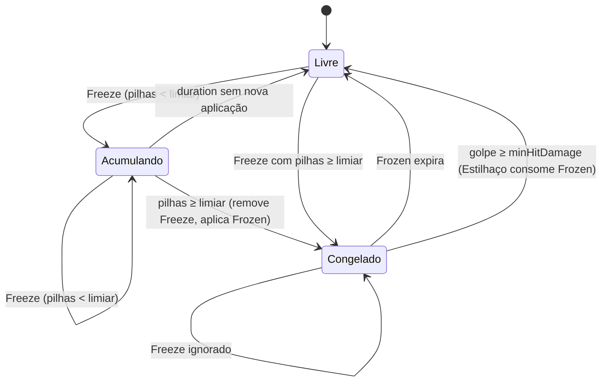
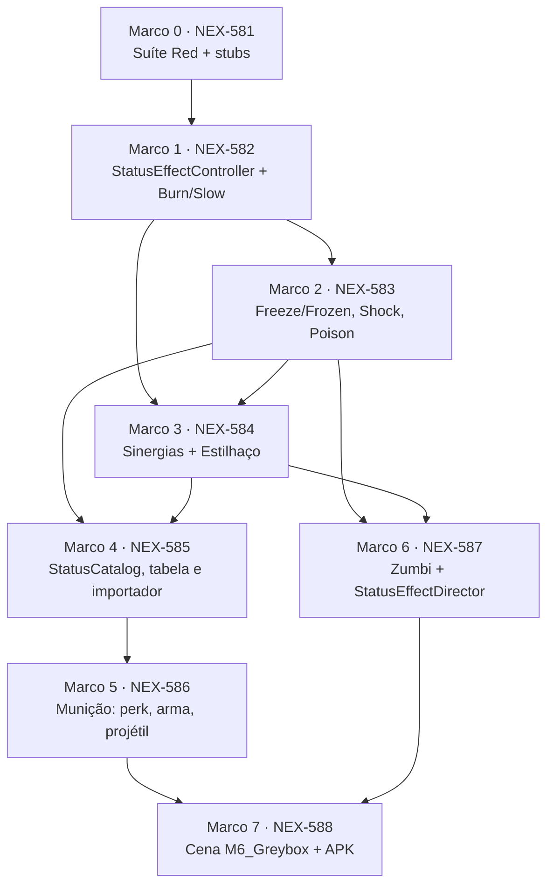

# Plano de Implementação: M6 · Efeitos de status e sinergias
> Data: 2026-09-28
> Issue: NEX-511
> Status: Cenários validados — Suíte Red comprovada em 2026-09-28

## 1. Contexto & Arquitetura

- **Resumo**: segunda história do E2. Adiciona efeitos de status por alvo (queimadura, congelamento com acúmulo → stun, slow, choque em cadeia, veneno com pilhas que explode ao morrer), sinergias lidas de uma `EffectInteractionTable` em dados e a primeira sinergia, **Estilhaço** (congelado + dano pesado). Os status chegam ao zumbi por **portões de munição**: um perk adiciona um status on-hit à arma, o projétil leva esse payload e o zumbi resolve o golpe. Critério do plano-mãe: *Estilhaço funciona e tem teste EditMode*. Critério da issue: os cinco efeitos funcionam; sinergias vêm de `EffectInteractionTable` (dados); Estilhaço coberto por teste EditMode.
- **Stack**: Unity 6000.6.3f1, C# com asmdefs `Game.Core` (sem UnityEngine) ← `Game.Data` ← `Game.Gameplay` ← `Game.Presentation`; `Game.Editor` para importadores e `SceneBuilder`; NUnit via Unity Test Framework (EditMode; o repo não tem testes PlayMode).
- **Verificação disponível**: suíte automatizada confiável — `tools/unity compile`, `tools/unity test-edit` (EditMode, NUnit XML, exit code), `tools/unity import-content` e `tools/unity build-android`. Localmente, `import-content` e `build-android` rodam via `pwsh -NoProfile -File tools/unity.ps1 <cmd>` enquanto o GH #33 estiver aberto. Sensação de jogo e números de balanceamento são do humano no aparelho.
- **Base Git**: M4 (PR #23) e M5 ainda não estão na `main`. A branch da história parte da branch da NEX-510 (`468c5cb`); o PR da história (#38) aponta para `main` e o diff encolhe conforme as histórias anteriores forem mergeadas.

### Decisões

1. **Regra em `Game.Core.Status`, parâmetros em dados.** Cada efeito é uma classe `[Serializable]` que implementa `IStatusEffect` (composição via `[SerializeReference]` no `StatusCatalog`). A classe carrega os parâmetros (duração, dano por tick…) e o comportamento; o estado por alvo vive em `StatusState`, dono do `StatusEffectController`. Um `StatusEffectController` por alvo, C# puro.
2. **`StatusKind` é enum fechado**: `Burn`, `Freeze`, `Frozen`, `Slow`, `Shock`, `Poison`. `Freeze` é o acúmulo; `Frozen` é o congelado (stun). A tabela de sinergias referencia `Frozen`. `Wet` (Molhado) e a sinergia *Molhado + choque = cadeia dobrada* ficam para a M9 (clima), que acrescenta o valor ao enum e um gatilho novo à tabela.
3. **Ordem de um golpe (`ResolveHit`)**: (a) alvo morto → 0; (b) avaliar sinergias contra os status **anteriores** ao golpe; (c) aplicar o dano (já multiplicado) na vida; (d) se morreu → `OnHostDied` de cada status (explosão do veneno), limpar e sair; (e) se vivo → aplicar os status on-hit do golpe, na ordem da lista. Consequência: o golpe que completa o acúmulo de congelamento **não** estilhaça no mesmo golpe, e golpe que mata não aplica status (inclui o choque: não encadeia no golpe que mata — *placeholder, humano avalia no aparelho*).
4. **Tick por fase preservada.** DoT (queimadura, veneno) tem `Remaining` (tempo restante) e `TickTimer` (fase) separados. Reaplicar renova `Remaining` e **não** zera `TickTimer`. Total de ticks = ⌊tempo ativo / intervalo⌋, independente do `dt`; comparação com tolerância `1e-4` para não perder o último tick por erro de ponto flutuante.
5. **Empilhamento por efeito**: `Burn` não empilha (renova duração); `Slow` não empilha (maior percentual vence, renova duração); `Freeze` acumula pilhas até o limiar e, ao atingir, remove `Freeze` e aplica `Frozen`; enquanto `Frozen`, aplicações de `Freeze` são ignoradas; pilhas de `Freeze` expiram todas juntas `duration` depois da última aplicação; `Poison` acumula até `maxStacks`, renova duração, expira todas as pilhas juntas; `Shock` é instantâneo, sem estado.
6. **Movimento**: `MoveSpeedMultiplier = 0` se `Frozen`; senão `1 − maior slow` (1 sem slow). O zumbi multiplica no deslocamento e **nunca** reescreve `MoveSpeed`.
7. **Choque**: ao aplicar num alvo vivo, busca até `chainCount` vizinhos vivos no raio `chainRadius` (mais próximo primeiro, empate pela ordem de registro, origem excluída) e entrega a cada um um golpe de `chainDamage` (`DamageType.Lightning`) **sem status on-hit** — sem recursão. O golpe da cadeia passa por `ReceiveHit` do vizinho, então pode estilhaçar um vizinho congelado se atingir o limiar.
8. **Veneno**: DoT = `damagePerTickPerStack × pilhas` (`DamageType.Poison`). Ao morrer com pilhas > 0, captura as pilhas, limpa os próprios status e entrega `explosionDamagePerStack × pilhas` (sem status on-hit) aos vizinhos vivos no raio `explosionRadius`, sem limite de quantidade. Cascata é permitida e termina porque cada alvo morre uma vez (guarda `diedNotified`). Reciclagem sem morte (contato com a tropa, fim de combate) **não** explode.
9. **Sinergia (Estilhaço)**: entrada da tabela = `id`, status requerido, gatilho (`HeavyHit` na M6), `minHitDamage`, `damageMultiplier`. Casa quando o alvo tem o status requerido **e** `hit.Amount ≥ minHitDamage` (valor do golpe antes da sinergia). Dano final = `Math.Round(amount × multiplier, MidpointRounding.AwayFromZero)`. Toda sinergia **consome** o status requerido (sem campo `consumes` no JSON: bool ausente viraria `false` em silêncio). Só a **primeira** sinergia que casar, na ordem da tabela (ordem ordinal dos arquivos), é aplicada por golpe. Publica `SynergyTriggeredEvent` quando houver bus.
10. **DoT não é golpe.** Dano de tick vai direto à vida (via `IStatusHost.DealDamage`), sem sinergia; detecta morte e dispara `OnHostDied`. Golpe de projétil, de cadeia e de explosão passam por `ReceiveHit`.
11. **Munição por perk, não por arma.** Novo efeito de perk `ApplyStatusOnHitEffect` adiciona um `StatusApplication` ao `OnHitStatusSet` da arma com `Source` = id do perk (mesma regra dos modificadores de stat). O conjunto sobrevive à troca de arma. Dois portões do mesmo perk somam duas entradas (duas aplicações por golpe). Perk não aplica `Frozen` direto (congelamento é acúmulo).
12. **Snapshot no disparo.** `FireVolley` copia o `OnHitStatusSet` para cada projétil; projétil disparado antes do portão não ganha o status. `Projectile.Initialize` sem payload zera o anterior (pool).
13. **Vizinhança por registro, não pela lista do spawner.** `HordeSpawner._activeEnemies` não é serializado: zumbis pré-spawnados pela `SceneBuilder` chegam ao runtime fora dela. `StatusEffectDirector` mantém registro próprio; o zumbi se registra em `Awake` e `Initialize` (idempotente) e sai em `Recycle`.
14. **Dados em JSON, falha alta.** `Content/Source/Statuses/*.json` → um `StatusCatalog.asset`; `Content/Source/Interactions/*.json` → um `EffectInteractionTable.asset`, ambos em `Assets/_Game/Data/Statuses/`. O importador rejeita campo obrigatório ausente/≤ 0/NaN/infinito por tipo, `kind` duplicado, `Freeze` sem `Frozen` no catálogo, sinergia com status fora do catálogo, `damageMultiplier ≤ 1`. `Cli.ImportContent` importa armas → status → sinergias → perks e sai 1 com erro.
15. **Cena nova `M6_Greybox`** montada pelo builder compartilhado (parâmetros novos com default em commit de refactor puro); zumbi com 40 de vida nessa cena; o APK de desenvolvimento passa a apontar para ela.

**Placeholders de balanceamento (humano ajusta no JSON):**

| Efeito | Parâmetros |
|---|---|
| `burn` | 3 de dano a cada 0,5 s por 3 s (6 ticks = 18) |
| `freeze` | limiar 2 pilhas; pilhas expiram 3 s após a última aplicação |
| `frozen` | stun de 1,5 s |
| `slow` | −40% de velocidade por 2 s |
| `shock` | cadeia para 2 vizinhos em raio 4, 6 de dano cada |
| `poison` | 1 de dano por pilha a cada 1 s por 4 s; máx. 5 pilhas; explosão 4 por pilha em raio 2,5 |
| `shatter` | requer `Frozen`; golpe ≥ 12; dano × 2 |

Com esses números, `pistol` (10) não estilhaça sozinha; `pistol` + `damage_up_25` (13) estilhaça; `shotgun` (8 por projétil) e `smg` (4) não.

| Perk | Efeitos |
|---|---|
| `ammo_fire` | `Burn` ×1 |
| `ammo_cryo` | `Freeze` ×1 e `Slow` ×1 (composição de dois efeitos) |
| `ammo_shock` | `Shock` ×1 |
| `ammo_toxic` | `Poison` ×1 |

### Fluxo de um golpe com status

```mermaid
sequenceDiagram
    autonumber
    participant WC as WeaponController
    participant P as Projectile
    participant E as EnemyController (IStatusReceiver)
    participant SC as StatusEffectController
    participant T as IEffectInteractionTable
    participant H as HealthComponent
    participant N as StatusEffectDirector (IStatusNeighborhood)

    WC->>P: Initialize(dano, ..., onHit: snapshot de OnHitStatuses)
    P->>E: ReceiveHit(DamageInfo, onHit)
    E->>SC: ResolveHit(hit, onHit)
    SC->>T: primeira sinergia que casa com os status atuais
    alt Estilhaço (Frozen + golpe ≥ 12)
        SC-->>SC: dano × 2, remove Frozen, publica SynergyTriggeredEvent
    end
    SC->>H: TakeDamage(dano final)
    alt morreu
        SC-->>SC: OnHostDied (veneno explode via N), Clear
    else vivo
        SC-->>SC: aplica onHit (Freeze pode virar Frozen; Shock encadeia via N)
    end
    E-->>E: se !IsAlive → Die() → Recycle (limpa status, sai do registro)
```

### Estados de um alvo quanto ao congelamento



### Dependência entre Marcos



## 2. Armadilhas do Repositório

| Armadilha | Onde morde (arquivo/passo) | Regra a respeitar |
|---|---|---|
| `Game.Core` com `noEngineReferences: true` | `Core/Status/*` — Marcos 1, 2, 3, 5 | Nada de `Mathf`/`Debug`/`Vector3`/`Random`. Distância e posição ficam fora do Core (vizinhança por interface). Arredondamento com `MidpointRounding.AwayFromZero` explícito (o default é banker's rounding: 12,5 → 12). |
| DoT truncado para 0 por frame | `BurnStatus`/`PoisonStatus` — Marcos 1 e 2 | Dano por tick é inteiro por **intervalo**, não `dps × dt` arredondado (a 60 fps, `3 × 0,016` vira 0 e a queimadura nunca causa dano). |
| Refresh que zera a fase do tick | `BurnStatus.OnApply` — Marco 1 | Com a SMG (6 tiros/s) reaplicando a cada 0,17 s e intervalo de 0,5 s, zerar `TickTimer` faz a queimadura nunca tickar. Renovar só `Remaining`. |
| Último tick perdido por ponto flutuante | `StatusEffectController.Tick` — Marco 1 | Acumular `dt` não fecha exatamente em `duration`; comparar `TickTimer >= interval - 1e-4` e limitar o passo a `min(dt, Remaining)`. Teste com `dt` grande (um `Tick(3)`) e pequeno (6 × `Tick(0.5)`) dá o mesmo total. |
| Enumeração de coleção modificada por reentrância | `StatusEffectController` — Marcos 1, 2, 3 | Cadeia → vizinho com veneno morre → explosão atinge a origem **durante** o `ResolveHit` da origem. Iterar sempre sobre cópia (array) dos status e da lista on-hit; `OnHostDied` protegido por `diedNotified`. |
| Recursão infinita do choque | `ShockStatus` — Marco 2 | Golpe da cadeia é entregue **sem** status on-hit; o vizinho não reencadeia. |
| Estilhaço no mesmo golpe que congela | `StatusEffectController.ResolveHit` — Marco 3 | Avaliar sinergias **antes** de aplicar os status do golpe (Decisão 3). A ordem errada não lança exceção: só dobra o dano do golpe que congelou. |
| Duas sinergias compondo | `ResolveHit` — Marco 3 | Só a primeira da tabela que casar se aplica; `continue`/`break` errado multiplica duas vezes em silêncio. |
| `JsonUtility` preenche campo ausente com 0/`false` em silêncio | `StatusContentImporter`, `PerkImporter` — Marcos 4 e 5 | Queimadura sem `tickInterval` viraria loop infinito de ticks (intervalo 0) ou DoT nulo. Rejeitar todo campo numérico obrigatório ≤ 0, NaN ou infinito, por tipo. Nenhum campo bool no JSON (Decisão 9). |
| Intervalo 0 trava o `while` de ticks | `BurnStatus`/`PoisonStatus` — Marcos 1, 2 e 4 | Além do importador, o efeito trata `tickInterval ≤ 0` como "não tica" (guarda defensiva; conteúdo de teste pode montar o efeito à mão). |
| Enum como string no JSON | `StatusContentImporter`, `PerkImporter` tipo `status` — Marcos 4 e 5 | Reusar `TryParseEnumName` (nome exato; `"7"` e `"Burn, Slow"` rejeitados). O helper hoje é `private` no `PerkImporter`: extrair em commit de refactor puro. |
| `ImportContent` na ordem errada | `Cli.ImportContent` — Marcos 4 e 5 | Armas → status → sinergias → perks: sinergia valida contra o catálogo de status; perk `status` valida contra o catálogo de status recém-gerado. |
| Parâmetro opcional posicional | `Projectile.Initialize` — Marco 5 | O payload entra no **fim** (`onHit: ...`, por nome); chamadas existentes passam `laneIndex` na 5ª posição. |
| Pool, estado reciclado | `Projectile.Initialize` (Marco 5), `EnemyController.Initialize`/`Recycle` (Marco 6) | Projétil reaproveitado sem payload zera o anterior; zumbi reaproveitado nasce sem status, com `diedNotified` falso, registrado de novo. Senão um zumbi novo nasce congelado/queimando. |
| Recursão `TakeDamage` ↔ controller | `EnemyController` — Marco 6 | O `StatusEffectController` do zumbi causa dano no `HealthComponent`, **nunca** no próprio `EnemyController` (que agora delega para o controller). |
| Morte fora do caminho do zumbi | `EnemyController`, `StatusEffectDirector` — Marco 6 | Cadeia/explosão atingem vizinhos por `IStatusReceiver.ReceiveHit` (o `EnemyController`), não pela vida crua; senão o vizinho morre e fica ativo como cadáver sem `Recycle`. Idem morte por DoT: `Tick` checa `IsAlive` depois do `Status.Tick` e chama `Die()`. |
| Explosão depois do `Recycle` | `EnemyController.ReceiveHit` — Marco 6 | `OnHostDied` roda dentro de `ResolveHit`, antes de `Die()`; a posição da origem ainda é válida e ela ainda está registrada (excluída como origem). |
| `MoveSpeed` reescrito pelo slow | `EnemyController.Tick` — Marco 6 | Multiplicar só no deslocamento. Gravar `MoveSpeed *= 0.6` compõe a cada frame e nunca volta. |
| Lista de ativos do spawner vazia no runtime | `HordeSpawner._activeEnemies` — Marcos 6 e 7 | Não serializada: zumbis pré-spawnados não estão nela. Vizinhança vem do registro do `StatusEffectDirector` (Decisão 13). |
| `Awake` não roda em EditMode | `EnemyController`, `StatusEffectDirector` — Marcos 6 e 7 | Registro também em `Initialize` e referência lazy (padrão de `CombatDirector`/`WeaponController`); testes de cena chamam o caminho explícito. |
| Referência serializada perdida ao abrir cena | `SceneBuilder` — Marco 7 | Carregar `StatusCatalog`/`EffectInteractionTable` **depois** do `NewScene` (mesmo comentário do `LoadWeaponCatalog`) e falhar alto se ausentes. |
| Material compartilhado entre clones | `EnemyStatusTint` — Marco 7 | O template usa `sharedMaterial`; tingir o material pinta todos os zumbis. Usar `MaterialPropertyBlock` (`_BaseColor` no URP, `_Color` no Standard). |
| Não editar SO nem cena gerados à mão | `Assets/_Game/Data/**`, `Assets/_Game/Scenes/**` — Marcos 4, 5, 7 | Mudar JSON ou `SceneBuilder`; assets gerados entram no commit com `.meta`. |
| Nº de lanes | `StatusEffectDirector`, `SceneBuilder` — Marcos 6 e 7 | Cadeia e explosão são por raio, não por lane; nada assume 2 lanes. A cena continua usando `LaneLayout` como o builder já faz. |

## 3. Árvore de Arquivos

- [NOVO] `Assets/_Game/Scripts/Core/Status/StatusKind.cs`
- [NOVO] `Assets/_Game/Scripts/Core/Status/StatusApplication.cs`
- [NOVO] `Assets/_Game/Scripts/Core/Status/StatusState.cs`
- [NOVO] `Assets/_Game/Scripts/Core/Status/IStatusEffect.cs`
- [NOVO] `Assets/_Game/Scripts/Core/Status/IStatusHost.cs`
- [NOVO] `Assets/_Game/Scripts/Core/Status/IStatusCatalog.cs`
- [NOVO] `Assets/_Game/Scripts/Core/Status/IStatusReceiver.cs`
- [NOVO] `Assets/_Game/Scripts/Core/Status/IStatusNeighborhood.cs`
- [NOVO] `Assets/_Game/Scripts/Core/Status/StatusEffectController.cs`
- [NOVO] `Assets/_Game/Scripts/Core/Status/Effects/{BurnStatus,SlowStatus,FreezeStatus,FrozenStatus,ShockStatus,PoisonStatus}.cs`
- [NOVO] `Assets/_Game/Scripts/Core/Status/EffectInteraction.cs` (inclui `InteractionTrigger`)
- [NOVO] `Assets/_Game/Scripts/Core/Status/IEffectInteractionTable.cs`
- [NOVO] `Assets/_Game/Scripts/Core/Status/OnHitStatusSet.cs`
- [NOVO] `Assets/_Game/Scripts/Core/Events/SynergyTriggeredEvent.cs`
- [NOVO] `Assets/_Game/Scripts/Core/Perks/Effects/ApplyStatusOnHitEffect.cs`
- [MODIFICAÇÃO] `Assets/_Game/Scripts/Core/Stats/IWeaponLoadout.cs`
- [NOVO] `Assets/_Game/Scripts/Data/StatusCatalog.cs`
- [NOVO] `Assets/_Game/Scripts/Data/EffectInteractionTable.cs`
- [MODIFICAÇÃO] `Assets/_Game/Scripts/Gameplay/Combat/WeaponController.cs`
- [MODIFICAÇÃO] `Assets/_Game/Scripts/Gameplay/Combat/Projectile.cs`
- [MODIFICAÇÃO] `Assets/_Game/Scripts/Gameplay/Enemies/EnemyController.cs`
- [NOVO] `Assets/_Game/Scripts/Gameplay/Enemies/StatusEffectDirector.cs`
- [NOVO] `Assets/_Game/Scripts/Presentation/EnemyStatusTint.cs`
- [NOVO] `Assets/_Game/Scripts/Editor/JsonEnumNames.cs` (extraído do `PerkImporter`, refactor puro)
- [NOVO] `Assets/_Game/Scripts/Editor/StatusContentImporter.cs`
- [MODIFICAÇÃO] `Assets/_Game/Scripts/Editor/PerkImporter.cs`
- [MODIFICAÇÃO] `Assets/_Game/Scripts/Editor/Cli.cs`
- [MODIFICAÇÃO] `Assets/_Game/Scripts/Editor/SceneBuilder.cs`
- [NOVO] `Content/Source/Statuses/{burn,freeze,frozen,slow,shock,poison}.json`
- [NOVO] `Content/Source/Interactions/shatter.json`
- [NOVO] `Content/Source/Perks/{ammo_fire,ammo_cryo,ammo_shock,ammo_toxic}.json`
- [NOVO, gerado] `Assets/_Game/Data/Statuses/StatusCatalog.asset`, `Assets/_Game/Data/Statuses/EffectInteractionTable.asset`, novos `Assets/_Game/Data/Perks/ammo_*.asset`, `Assets/_Game/Scenes/M6_Greybox.unity` (+ `.meta`)
- [MODIFICAÇÃO] `CONTEXT.md` (glossário: Efeito de status, Sinergia, Estilhaço)
- [NOVO] `Assets/_Game/Scripts/Tests/EditMode/StatusTestDoubles.cs` (receptor, vizinhança, catálogo e tabela em memória)
- [NOVO] `Assets/_Game/Scripts/Tests/EditMode/StatusEffectControllerTests.cs`
- [NOVO] `Assets/_Game/Scripts/Tests/EditMode/FreezeShockPoisonTests.cs`
- [NOVO] `Assets/_Game/Scripts/Tests/EditMode/ShatterInteractionTests.cs`
- [NOVO] `Assets/_Game/Scripts/Tests/EditMode/StatusContentImporterTests.cs`
- [NOVO] `Assets/_Game/Scripts/Tests/EditMode/OnHitStatusPipelineTests.cs`
- [NOVO] `Assets/_Game/Scripts/Tests/EditMode/EnemyStatusIntegrationTests.cs`
- [NOVO] `Assets/_Game/Scripts/Tests/EditMode/SceneBuilderM6Tests.cs` (Marco 7)
- [MODIFICAÇÃO] `Assets/_Game/Scripts/Tests/EditMode/PerkImporterTests.cs`, `CliBuildAndroidTests.cs` (cena alvo do APK)

## 4. Contratos e Interfaces

```csharp
// Game.Core.Status — C# puro
namespace Game.Core.Status
{
    public enum StatusKind { Burn, Freeze, Frozen, Slow, Shock, Poison }

    public readonly struct StatusApplication
    {
        public StatusKind Kind { get; }
        public int Stacks { get; }        // ≥ 1
        public object Source { get; }     // obrigatório; comparado por object.Equals
        public StatusApplication(StatusKind kind, int stacks, object source);
        // ArgumentNullException se source == null; ArgumentOutOfRangeException se stacks < 1
    }

    // Estado mutável de um status num alvo; pertence ao StatusEffectController.
    public sealed class StatusState
    {
        public StatusKind Kind { get; }
        public int Stacks { get; set; }
        public float Remaining { get; set; }   // ≤ 0 → o controller remove após o Tick
        public float TickTimer { get; set; }   // fase do DoT; preservada no refresh
        public float Potency { get; set; }     // Slow: percentual atual (maior vence)
        public StatusState(StatusKind kind);
    }

    public interface IStatusEffect
    {
        StatusKind Kind { get; }
        bool IsPersistent { get; }                                  // false: Shock (não cria StatusState)
        void OnApply(IStatusHost host, StatusState state, int stacks);   // state == null quando !IsPersistent
        void OnTick(IStatusHost host, StatusState state, float deltaTime);
        void OnHostDied(IStatusHost host, StatusState state);
        float MoveSpeedMultiplier(StatusState state);               // 1 = sem efeito
    }

    public interface IStatusHost
    {
        IStatusReceiver Owner { get; }
        IStatusNeighborhood Neighborhood { get; }                   // pode ser null: cadeia/explosão viram no-op
        IStatusCatalog Catalog { get; }
        bool Has(StatusKind kind);
        int GetStacks(StatusKind kind);                             // 0 se ausente
        void Apply(StatusApplication application);
        bool Remove(StatusKind kind);
        void DealDamage(int amount, DamageType type, object source); // DoT: direto na vida, sem sinergia; detecta morte
    }

    public interface IStatusCatalog
    {
        bool TryGet(StatusKind kind, out IStatusEffect effect);
    }

    public interface IStatusReceiver
    {
        bool IsAlive { get; }
        int ReceiveHit(DamageInfo hit, IReadOnlyList<StatusApplication> onHit); // devolve dano efetivo; onHit null = vazio
    }

    public interface IStatusNeighborhood
    {
        // Vivos e ativos, origem excluída, dentro do raio, mais próximo primeiro, empate pela ordem de registro.
        IReadOnlyList<IStatusReceiver> FindNearby(IStatusReceiver origin, float radius, int maxCount);
    }

    public enum InteractionTrigger { HeavyHit }

    public readonly struct EffectInteraction
    {
        public string Id { get; }
        public StatusKind RequiredStatus { get; }
        public InteractionTrigger Trigger { get; }
        public int MinHitDamage { get; }        // ≥ 1; compara com hit.Amount antes da sinergia
        public float DamageMultiplier { get; }  // > 1
        public EffectInteraction(string id, StatusKind requiredStatus, InteractionTrigger trigger,
                                 int minHitDamage, float damageMultiplier);
    }

    public interface IEffectInteractionTable
    {
        IReadOnlyList<EffectInteraction> Interactions { get; }  // ordem = prioridade
    }

    public sealed class StatusEffectController : IStatusHost
    {
        public StatusEffectController(IDamageable health, IStatusReceiver owner,
                                      IStatusCatalog catalog = null, IEffectInteractionTable interactions = null,
                                      IStatusNeighborhood neighborhood = null, IEventBus eventBus = null);
        public float MoveSpeedMultiplier { get; }   // Decisão 6
        public bool IsStunned { get; }               // Has(Frozen)
        public void Tick(float deltaTime);           // OnTick de cada status (cópia), remove expirados
        public int ResolveHit(DamageInfo hit, IReadOnlyList<StatusApplication> onHit); // Decisão 3
        public void Clear();                         // remove tudo e rearma diedNotified
        // + membros de IStatusHost. Kind sem entrada no catálogo → Apply é no-op.
    }

    // Parâmetros públicos (serializados via [SerializeReference] no StatusCatalog)
    [Serializable] public class BurnStatus   : IStatusEffect { public float Duration; public float TickInterval; public int DamagePerTick; }
    [Serializable] public class SlowStatus   : IStatusEffect { public float Duration; public float SlowPercent; }         // 0 < p < 1
    [Serializable] public class FreezeStatus : IStatusEffect { public float Duration; public int Threshold; }
    [Serializable] public class FrozenStatus : IStatusEffect { public float Duration; }
    [Serializable] public class ShockStatus  : IStatusEffect { public int ChainCount; public float ChainRadius; public int ChainDamage; }
    [Serializable] public class PoisonStatus : IStatusEffect { public float Duration; public float TickInterval; public int DamagePerTickPerStack;
                                                                public int MaxStacks; public int ExplosionDamagePerStack; public float ExplosionRadius; }

    public sealed class OnHitStatusSet
    {
        public event Action Changed;
        public IReadOnlyList<StatusApplication> Items { get; }
        public void Add(StatusApplication application);
        public int RemoveAllFromSource(object source);
        public StatusApplication[] Snapshot();       // cópia; array vazio quando não há itens
    }
}

namespace Game.Core.Events
{
    public readonly struct SynergyTriggeredEvent
    {
        public string InteractionId { get; }
        public IStatusReceiver Target { get; }
        public int HitDamage { get; }      // antes da sinergia
        public int FinalDamage { get; }    // depois do multiplicador
        public SynergyTriggeredEvent(string interactionId, IStatusReceiver target, int hitDamage, int finalDamage);
    }
}

namespace Game.Core.Stats
{
    public interface IWeaponLoadout
    {
        StatCollection Stats { get; }
        OnHitStatusSet OnHitStatuses { get; }   // novo
        string EquippedWeaponId { get; }
        bool TryEquip(string weaponId);
    }
}

namespace Game.Core.Perks.Effects
{
    [Serializable] public class ApplyStatusOnHitEffect : IPerkEffect
    {
        public StatusKind Status; public int Stacks;
        // Apply: context.Loadout?.OnHitStatuses.Add(new StatusApplication(Status, Stacks, context.SourceId ?? (object)this))
        // Description: "Munição: Queimadura" / "Munição: Congelamento x2"
    }
}

// Game.Data
namespace Game.Data
{
    public class StatusCatalog : ScriptableObject, IStatusCatalog
    {
        // [SerializeReference] private List<IStatusEffect> effects;
        public IReadOnlyList<IStatusEffect> Effects { get; }
        public bool TryGet(StatusKind kind, out IStatusEffect effect);
        public void SetEffects(IEnumerable<IStatusEffect> effects);
    }

    public class EffectInteractionTable : ScriptableObject, IEffectInteractionTable
    {
        // [SerializeField] private List<EffectInteractionEntry> entries;  ([Serializable] id, requires, trigger, minHitDamage, damageMultiplier)
        public IReadOnlyList<EffectInteraction> Interactions { get; }
        public void SetInteractions(IEnumerable<EffectInteraction> interactions);
    }
}

// Game.Gameplay
namespace Game.Gameplay
{
    public class Projectile : MonoBehaviour
    {
        public IReadOnlyList<StatusApplication> OnHit { get; }   // vazio por padrão
        public void Initialize(int damage, float speed, float maxDistance, Action<Projectile> onRecycle,
                               int laneIndex = 0, IReadOnlyList<StatusApplication> onHit = null);
        // HandleTrigger: IStatusReceiver do alvo (ou pai) → ReceiveHit(hit, OnHit); senão IDamageable.TakeDamage(hit)
    }

    public class WeaponController : MonoBehaviour, IWeaponLoadout
    {
        public OnHitStatusSet OnHitStatuses { get; }             // sobrevive a TryEquip
        // FireVolley: um Snapshot() por rajada, repassado por nome (onHit:) a cada projétil
    }

    public class EnemyController : MonoBehaviour, IDamageable, IStatusReceiver
    {
        // [SerializeField] private StatusEffectDirector statusDirector;
        public StatusEffectController Status { get; }   // lazy; usa catálogo/tabela/vizinhança/bus do director quando houver
        public int ReceiveHit(DamageInfo hit, IReadOnlyList<StatusApplication> onHit);
        public void AttachStatusDirector(StatusEffectDirector director);   // testes e SceneBuilder
        // TakeDamage(d) => ReceiveHit(d, null); Tick: Status.Tick, morte → Die(), deslocamento × Status.MoveSpeedMultiplier
    }

    public class StatusEffectDirector : MonoBehaviour, IStatusNeighborhood
    {
        // [SerializeField] private StatusCatalog catalog; [SerializeField] private EffectInteractionTable interactions;
        public IStatusCatalog Catalog { get; }
        public IEffectInteractionTable Interactions { get; }
        public IEventBus EventBus { get; }
        public IReadOnlyList<EnemyController> Registered { get; }
        public void Initialize(IStatusCatalog catalog, IEffectInteractionTable interactions, IEventBus eventBus = null);
        public void Register(EnemyController enemy);     // idempotente
        public void Unregister(EnemyController enemy);
        public IReadOnlyList<IStatusReceiver> FindNearby(IStatusReceiver origin, float radius, int maxCount);
    }
}

namespace Game.Presentation
{
    public class EnemyStatusTint : MonoBehaviour
    {
        // LateUpdate: cor por prioridade Frozen > Burn > Poison > Slow > Freeze > base, via MaterialPropertyBlock
        public static Color ColorFor(StatusEffectController status, Color baseColor);   // seam testável
    }
}

// Game.Editor
namespace Game.Editor
{
    internal static class JsonEnumNames
    {
        public static bool TryParse<T>(string text, out T value) where T : struct, Enum; // movido do PerkImporter
    }

    public static class StatusContentImporter
    {
        public const string StatusSourcePath = "Content/Source/Statuses";
        public const string InteractionSourcePath = "Content/Source/Interactions";
        public const string DefaultTargetPath = "Assets/_Game/Data/Statuses";
        public const string CatalogAssetName = "StatusCatalog";
        public const string InteractionTableAssetName = "EffectInteractionTable";
        public static int ImportStatuses(string sourceFolder = null, string targetFolder = null, List<string> errors = null);
        public static int ImportInteractions(string sourceFolder = null, string targetFolder = null, List<string> errors = null);
        public static StatusCatalog LoadStatusCatalog(string targetFolder = null);
        public static EffectInteractionTable LoadInteractionTable(string targetFolder = null);
    }

    // PerkImporter.CreateEffect: "status" → ApplyStatusOnHitEffect (valida contra LoadStatusCatalog())
    // SceneBuilder.BuildM6GreyboxScene() / BuildM6GreyboxSceneCli(); M6GreyboxScenePath
    // Cli.DefaultAndroidScenePath = "Assets/_Game/Scenes/M6_Greybox.unity"
}
```

**JSON de status** (`Content/Source/Statuses/*.json`) — um DTO com todos os campos; o importador exige, por `kind`, os campos da tabela abaixo (> 0 e finitos; `slowPercent` em (0, 1); `threshold`, `maxStacks`, `chainCount` ≥ 1):

```json
{ "kind": "Burn",   "duration": 3,   "tickInterval": 0.5, "damagePerTick": 3 }
{ "kind": "Freeze", "duration": 3,   "threshold": 2 }
{ "kind": "Frozen", "duration": 1.5 }
{ "kind": "Slow",   "duration": 2,   "slowPercent": 0.4 }
{ "kind": "Shock",  "chainCount": 2, "chainRadius": 4, "chainDamage": 6 }
{ "kind": "Poison", "duration": 4,   "tickInterval": 1, "damagePerTickPerStack": 1, "maxStacks": 5,
  "explosionDamagePerStack": 4, "explosionRadius": 2.5 }
```

**JSON de sinergia** (`Content/Source/Interactions/shatter.json`):

```json
{ "id": "shatter", "requires": "Frozen", "trigger": "HeavyHit", "minHitDamage": 12, "damageMultiplier": 2 }
```

**JSON de perk** — novo tipo no array `effects` (`stacks` obrigatório, ≥ 1):

```json
{ "type": "status", "status": "Freeze", "stacks": 1 }
```

## 4.5 Linear overlay

- **História (issue-pai):** `NEX-511` (M6 · Efeitos de status e sinergias), Milestone E2 · Profundidade de combate. Cartão dono deste plano. Bloqueada por `NEX-510`.
- **Sub-issues deste plano** (todas `Task`, priority High, nascem em Todo):
  1. `NEX-581` Marco 0: Suíte de Cenários & E2E Specs (efeitos de status)
  2. `NEX-582` StatusEffectController, queimadura e slow puros em Game.Core
  3. `NEX-583` Congelamento (acúmulo → stun), choque em cadeia e veneno que explode
  4. `NEX-584` Sinergias por EffectInteractionTable em Game.Core: Estilhaço (congelado + dano pesado)
  5. `NEX-585` StatusCatalog, EffectInteractionTable e importador JSON de efeitos com validação
  6. `NEX-586` Munição de status: perk, OnHitStatuses na arma e payload do projétil
  7. `NEX-587` Zumbi com StatusEffectController: StatusEffectDirector, movimento, morte e pool
  8. `NEX-588` Cena M6_Greybox com portões de munição e APK apontando para ela
- **PRs (modelo C):** história = `jamilzerati/nex-511-m6-efeitos-de-status-e-sinergias` (parte da branch da NEX-510 enquanto M4/M5 não mergeiam); PR #38 → `main`. Cada tarefa ramifica da branch da história e abre PR (Ready for Review) → branch da história.
- **Bloqueio:** se a branch da NEX-510 receber mudanças depois deste plano, a branch da história faz merge dela antes do Marco seguinte.

## 5. Divisão de Execução por Passo

| Faixa | Passos | Por quê |
|---|---|---|
| **Modelo forte, obrigatório** | 0, 1, 2, 3, 4, 5, 6, 7 | Toda a fatia muda número sem lançar exceção: ticks perdidos por truncamento, refresh que zera a fase ou ponto flutuante (1, 2); ordem sinergia → dano → status e primeira-que-casa (3); campo JSON ausente virando 0 e enum fora do domínio (4, 5); snapshot do payload e reset no pool (5); `MoveSpeed` composto pelo slow, cadáver não reciclado, zumbi reciclado com status, vizinhança vazia no runtime (6); referência serializada perdida e material compartilhado tingindo todos (7). O Marco 0 fixa os números esperados que os demais perseguem. |
| **Mecânico, qualquer modelo** | — | Os trechos mecânicos (apontar `Cli.DefaultAndroidScenePath`, glossário do `CONTEXT.md`, extrair `TryParseEnumName`) vivem dentro dos Marcos 4 e 7 e não justificam PR próprio. |

## 6. Checklist de Execução

- [x] **Passo 0 (Marco 0)**: `Suíte de Cenários & E2E Specs` [NEX-581]
  - **Ação**: Criar stubs dos contratos da seção 4 (corpo `throw new NotImplementedException()`; campos públicos dos efeitos e SOs podem existir) e os testes Red em `Tests/EditMode/`.
  - **Lógica de Negócios / Responsabilidade**: o asmdef `Game.Tests.EditMode` é um só; teste que referencia tipo inexistente derruba a compilação de **todos** os testes. Por isso os stubs vêm neste Marco e só os cenários novos ficam Red. `IWeaponLoadout.OnHitStatuses` entra como stub no `WeaponController` (getter lançando) sem quebrar os testes da M5 que não o leem. `StatusTestDoubles.cs`: `FakeReceiver` (vida inteira, `ReceiveHit` delegando a um `StatusEffectController` próprio, registro de golpes recebidos), `FakeNeighborhood` (posições 1D, mais próximo primeiro, empate por ordem de inserção), `InMemoryStatusCatalog`, `InMemoryInteractionTable`. Cenários obrigatórios (números = placeholders da seção 1, salvo indicação):
    - **Queimadura**: alvo com 40 de vida; aplicar `Burn`; 6 × `Tick(0.5)` → 18 de dano e `Burn` removido; outro alvo com um único `Tick(3)` → 18; `Tick(10)` → 18 (não passa da duração). Reaplicar a cada `Tick(0.25)` durante 2 s → 4 ticks = 12 (fase preservada; com a fase zerada seriam 0). Primeiro tick só depois de 0,5 s (`Tick(0.49)` → 0 de dano). `BurnStatus` montado à mão com `TickInterval = 0` não trava e não causa dano.
    - **Slow**: aplicar slow 0.4 e depois um slow 0.2 (catálogo de teste) → `MoveSpeedMultiplier` 0,6; `Tick(2)` → 1.
    - **Congelamento**: limiar 2; `Freeze` ×1 → `GetStacks(Freeze)` 1, multiplicador 1, não atordoado; `Freeze` ×1 de novo → `Has(Freeze)` falso, `Has(Frozen)` verdadeiro, multiplicador 0, `IsStunned`; `Freeze` durante `Frozen` → ignorado (depois de `Tick(1.5)` o alvo está livre e com 0 pilhas); `Freeze` ×1 e `Tick(3)` → 0 pilhas; aplicação com `Stacks = 2` congela direto. `Frozen` + slow 0.4 → multiplicador 0.
    - **Choque**: origem em x=0; vizinhos A(1), B(2), C(3), D(5) com 40 de vida; golpe de 10 na origem com `Shock` → A e B recebem 6 cada, C e D nada, origem só 10; A e B não recebem status (sem recursão); vizinho morto é ignorado e o próximo entra na cadeia; golpe que mata a origem não encadeia; sem vizinhança → no-op.
    - **Veneno**: 3 aplicações → 3 pilhas; `Tick(1)` → 3 de dano; 7 aplicações → 5 pilhas (teto); `Tick(4)` expira tudo. Origem com 5 pilhas morre → vizinhos em até 2,5 recebem 20, fora do raio nada. Cascata: vizinho com 20 de vida e 2 pilhas morre com a explosão e explode também (8 no próximo); cada alvo explode uma vez; a origem já morta não é atingida de volta. Reentrância: choque na origem mata vizinho envenenado cuja explosão atinge a origem viva → sem exceção, dano somado.
    - **Estilhaço** (critério de pronto): tabela com `shatter` (requer `Frozen`, `HeavyHit`, 12, ×2). Alvo `Frozen` com 40 de vida: golpe de 13 → 26 de dano, `Frozen` removido, `SynergyTriggeredEvent("shatter", alvo, 13, 26)` publicado no `EventBus`; golpe de 11 → 11 e `Frozen` mantido; alvo não congelado, golpe de 13 → 13. Alvo com 1 pilha de `Freeze`: golpe de 13 com `Freeze` on-hit → 13 de dano e alvo termina `Frozen`; golpe seguinte de 13 → 26. Multiplicador 1,5 com golpe 13 → 20 (19,5 `AwayFromZero`). Duas sinergias que casam → só a primeira da tabela se aplica. Tabela vazia ou nula → dano inalterado.
    - **Importador de status/sinergia**: `burn` sem `tickInterval` → erro e nada no catálogo para `Burn`; `slowPercent` 1 → erro; `"kind": "7"` e `"kind": "Burn, Slow"` → erro; dois arquivos `Burn` → erro de duplicado; `freeze` sem `frozen` → erro; sinergia `"requires": "Wet"` → erro; sinergia requerendo `Poison` com catálogo sem `poison` → erro; `damageMultiplier` 1 → erro; conteúdo válido gera `StatusCatalog` com 6 efeitos e `EffectInteractionTable` com `shatter`.
    - **Munição**: `GatePair.TryTrigger(0, squad, loadout: weapon)` com `ammo_cryo` → `weapon.OnHitStatuses` tem `Freeze` ×1 e `Slow` ×1 com fonte `"ammo_cryo"`; `TryEquip("shotgun")` mantém as entradas; `RemoveAllFromSource("ammo_cryo")` devolve 2. `FireVolley` da `shotgun` → 3 projéteis com o mesmo payload; projétil disparado antes do portão tem payload vazio; projétil reaproveitado do pool com `Initialize` sem `onHit` tem payload vazio. `Projectile.HandleTrigger` num `EnemyController` com `Freeze` → 1 pilha no zumbi. `PerkImporter` tipo `status`: `"status": "Frozen"` → erro; `stacks` ausente → erro; status fora do catálogo → erro.
    - **Zumbi**: `MoveSpeed` 2 com slow 0.4, `Tick(1)` → anda 1,2 e `MoveSpeed` continua 2; `Frozen` → não anda; queimadura que mata no `Tick` → `IsActiveInPool` falso e `OnDeath` invocado uma vez; zumbi reciclado com `Burn` e reinicializado → sem status; `TakeDamage` legado continua matando e reciclando (testes da M4 intactos); morte por projétil com veneno → vizinho registrado no raio recebe a explosão e, se morrer, também é reciclado. `StatusEffectDirector.FindNearby`: exclui origem, inativos e mortos; ordena por distância; respeita `maxCount`; `Register` duas vezes não duplica.
    - **Cli**: `Cli.ComputeImportExitCode` já cobre o exit code; teste novo garante que `ImportContent` importa status antes de perks (perk `status` válido não gera erro num projeto limpo).
  - **Dependências / Pré-requisitos**: nenhum.
  - **Seam Público**: `StatusEffectController` (`ResolveHit`, `Tick`, `Apply`, `MoveSpeedMultiplier`), `IEffectInteractionTable`, `StatusContentImporter.ImportStatuses/ImportInteractions(..., errors)`, `PerkImporter.ImportAll(..., errors)`, `GatePair.TryTrigger`, `WeaponController.FireVolley`, `Projectile.HandleTrigger`, `EnemyController.Tick/ReceiveHit`, `StatusEffectDirector.FindNearby`.
  - **Marco de PR**: Marco 0 + `NEX-581`
  - **Runtime**: hard

- [x] **Passo 1 (Marco 1)**: `Core/Status/{StatusKind,StatusApplication,StatusState,IStatusEffect,IStatusHost,IStatusCatalog,IStatusReceiver,IStatusNeighborhood,StatusEffectController}.cs`, `Core/Status/Effects/{BurnStatus,SlowStatus}.cs` [NEX-582]
  - **Ação**: Criar (substituir os stubs do Marco 0).
  - **Lógica de Negócios / Responsabilidade**: Decisões 1, 3, 4, 5 (Burn/Slow), 6 e 10. `StatusEffectController` guarda `Dictionary<StatusKind, StatusState>`; `Apply` busca o efeito no catálogo (ausente → no-op), cria o estado se `IsPersistent` e chama `OnApply`; `Tick` itera uma cópia dos estados, chama `OnTick` e remove os com `Remaining ≤ 0`; `ResolveHit` segue a Decisão 3 com a etapa (b) chamando um ponto único que devolve o dano inalterado até o Marco 3; `DealDamage` bate na vida e, se ela zerar, dispara `OnHostDied` uma vez (`diedNotified`) e limpa; `Clear` rearma. `BurnStatus.OnTick`: passo = `min(dt, Remaining)`, `TickTimer += passo`, `while (TickTimer >= TickInterval - 1e-4)` causa `DamagePerTick` (`DamageType.Fire`), `Remaining -= dt`; `TickInterval ≤ 0` não tica. `SlowStatus.OnApply`: `Potency = max(Potency, SlowPercent)`, renova `Remaining`. Armadilhas: `Game.Core` sem UnityEngine; DoT truncado; refresh zerando fase; último tick perdido; reentrância.
  - **Dependências / Pré-requisitos**: Passo 0.
  - **Seam Público**: `StatusEffectController.Apply/Tick/ResolveHit/MoveSpeedMultiplier`.
  - **Marco de PR**: Marco 1 + `NEX-582`
  - **Runtime**: hard

- [x] **Passo 2 (Marco 2)**: `Core/Status/Effects/{FreezeStatus,FrozenStatus,ShockStatus,PoisonStatus}.cs`, ajustes em `StatusEffectController` [NEX-583]
  - **Ação**: Criar / Modificar.
  - **Lógica de Negócios / Responsabilidade**: Decisões 5, 7 e 8. `FreezeStatus.OnApply`: se `host.Has(Frozen)` ignora (e o controller não deixa o estado vazio pendurado); senão soma pilhas, renova `Remaining`; ao atingir `Threshold` remove `Freeze` e aplica `Frozen` (fonte: o próprio efeito). `FrozenStatus`: multiplicador 0, expira após `Duration`. `ShockStatus` (`IsPersistent = false`): `host.Neighborhood?.FindNearby(host.Owner, ChainRadius, ChainCount)` e `ReceiveHit(new DamageInfo(ChainDamage, Lightning, this), null)` em cada um (lista já copiada). `PoisonStatus`: pilhas com teto, tick como a queimadura com `DamagePerTickPerStack × Stacks` (`DamageType.Poison`); `OnHostDied` com pilhas > 0 entrega `ExplosionDamagePerStack × pilhas` a todos os vizinhos no raio (`maxCount = int.MaxValue`). O controller garante que `OnHostDied` roda sobre a cópia dos estados capturada antes de limpar. Armadilhas: recursão do choque; reentrância; cascata termina.
  - **Dependências / Pré-requisitos**: Passo 1.
  - **Seam Público**: `StatusEffectController.ResolveHit/Apply`, `IStatusNeighborhood.FindNearby`.
  - **Marco de PR**: Marco 2 + `NEX-583`
  - **Runtime**: hard

- [ ] **Passo 3 (Marco 3)**: `Core/Status/{EffectInteraction,IEffectInteractionTable}.cs`, `Core/Events/SynergyTriggeredEvent.cs`, `StatusEffectController.ResolveHit` [NEX-584]
  - **Ação**: Criar / Modificar.
  - **Lógica de Negócios / Responsabilidade**: Decisão 9 — o critério de pronto da história. Etapa (b) do `ResolveHit`: percorre `Interactions` em ordem; primeira com `Has(RequiredStatus)` e `hit.Amount ≥ MinHitDamage` → dano = `AwayFromZero(hit.Amount × DamageMultiplier)`, `Remove(RequiredStatus)`, publica `SynergyTriggeredEvent` se houver bus, **para**. O `DamageInfo` repassado à vida mantém `Type` e `Source` com o `Amount` novo. `EffectInteraction` valida no construtor (id vazio, `MinHitDamage < 1`, multiplicador ≤ 1 ou não finito → `ArgumentException`). Armadilhas: Estilhaço no mesmo golpe que congela; duas sinergias compondo; banker's rounding.
  - **Dependências / Pré-requisitos**: Passos 1 e 2.
  - **Seam Público**: `StatusEffectController.ResolveHit`, `SynergyTriggeredEvent`.
  - **Marco de PR**: Marco 3 + `NEX-584`
  - **Runtime**: hard

- [ ] **Passo 4 (Marco 4)**: `Editor/JsonEnumNames.cs`, `Editor/PerkImporter.cs` (refactor), `Data/{StatusCatalog,EffectInteractionTable}.cs`, `Editor/StatusContentImporter.cs`, `Editor/Cli.cs`, `Content/Source/Statuses/*.json`, `Content/Source/Interactions/shatter.json` [NEX-585]
  - **Ação**: Criar / Modificar.
  - **Lógica de Negócios / Responsabilidade**:
    1. **Commit de refactor puro, separado:** mover `TryParseEnumName` do `PerkImporter` para `JsonEnumNames.TryParse` (mesma lógica, mesmo comentário); `PerkImporterTests` passam iguais antes e depois. Declarar no PR.
    2. **Commit de comportamento:** `StatusCatalog` com `[SerializeReference] List<IStatusEffect>` e `TryGet` por `Kind`; `EffectInteractionTable` com lista serializada de entradas convertidas para `EffectInteraction`. `StatusContentImporter` segue o padrão do `WeaponImporter` (DTO + `JsonUtility`, arquivos em ordem ordinal, erro `"<arquivo>: <campo> inválido"`, asset reaproveitado, pasta criada via `AssetDatabase`). Validação da Decisão 14 por `kind`; `Freeze` sem `Frozen` é erro reportado no fim da importação de status; sinergias validam `requires` contra o catálogo recém-gerado e `trigger` com `JsonEnumNames`. `Cli.ImportContent`: armas → status → sinergias → perks, contagens no log, exit 1 com erro. Criar os JSON da seção 4 e rodar `import-content` para gerar os assets.
    - Armadilhas: `JsonUtility` zera campo ausente; intervalo 0; enum como string; ordem do `ImportContent`.
  - **Dependências / Pré-requisitos**: Passos 2 e 3.
  - **Seam Público**: `StatusContentImporter.ImportStatuses/ImportInteractions(source, target, errors)`, `StatusCatalog.TryGet`, `EffectInteractionTable.Interactions`.
  - **Marco de PR**: Marco 4 + `NEX-585`
  - **Runtime**: hard

- [ ] **Passo 5 (Marco 5)**: `Core/Status/OnHitStatusSet.cs`, `Core/Stats/IWeaponLoadout.cs`, `Core/Perks/Effects/ApplyStatusOnHitEffect.cs`, `Gameplay/Combat/{WeaponController,Projectile}.cs`, `Editor/PerkImporter.cs`, `Content/Source/Perks/ammo_*.json` [NEX-586]
  - **Ação**: Criar / Modificar.
  - **Lógica de Negócios / Responsabilidade**: Decisões 11 e 12. `OnHitStatusSet` espelha `StatCollection` (fonte por `object.Equals`, `Changed` após mutação). `WeaponController` cria o conjunto no inicializador de campo (mesmo motivo do `stats`), expõe via `IWeaponLoadout`, `TryEquip` não toca nele; `FireVolley` tira **um** `Snapshot()` por rajada e passa `onHit:` por nome. `Projectile.Initialize` guarda o payload (null → vazio); `HandleTrigger` procura `IStatusReceiver` no alvo ou no pai e chama `ReceiveHit`; sem receptor, mantém `TakeDamage`. `ApplyStatusOnHitEffect` segue `ModifyStatEffect` (fonte = `context.SourceId`, fallback a instância). `PerkImporter.CreateEffect` aceita `"status"`: `JsonEnumNames.TryParse<StatusKind>`, `stacks ≥ 1`, `Frozen` rejeitado, kind presente em `StatusContentImporter.LoadStatusCatalog()` (sem catálogo → erro "importe os status antes"). Criar os quatro JSON de perk da seção 1 e reimportar. Armadilhas: parâmetro posicional em `Initialize`; pool; ordem do `ImportContent`.
  - **Dependências / Pré-requisitos**: Passo 4 (catálogo para validar perks) e Passo 1 (tipos).
  - **Seam Público**: `IWeaponLoadout.OnHitStatuses`, `WeaponController.FireVolley`, `Projectile.Initialize/HandleTrigger`, `PerkImporter.ImportAll(source, target, errors)`.
  - **Marco de PR**: Marco 5 + `NEX-586`
  - **Runtime**: hard

- [ ] **Passo 6 (Marco 6)**: `Gameplay/Enemies/{EnemyController,StatusEffectDirector}.cs` [NEX-587]
  - **Ação**: Criar / Modificar.
  - **Lógica de Negócios / Responsabilidade**: Decisões 6 e 13. `StatusEffectDirector`: `Initialize` para testes, referências serializadas para a cena; registro em lista (ordem de inserção) sem duplicar; `FindNearby` itera cópia do registro, ignora origem, `!IsActiveInPool`, `!IsAlive` e fora do raio (distância 3D entre `transform.position`), ordena por distância com desempate estável pela ordem de registro. `EnemyController`: `Status` lazy criado com `Health` (o `HealthComponent`), `this`, e catálogo/tabela/vizinhança/bus do director (null sem director — M4/M5 continuam iguais); `Awake` e `Initialize` registram no director; `Initialize` chama `Status.Clear()`; `TakeDamage(d)` → `ReceiveHit(d, null)`; `ReceiveHit`: guarda de ativo/vivo, `Status.ResolveHit`, `Die()` se morreu; `Tick`: `Status.Tick(dt)`, `Die()` se morreu, deslocamento `MoveSpeed × Status.MoveSpeedMultiplier × dt`; `Recycle`: `Status.Clear()` e `Unregister` antes de desativar. Armadilhas: recursão `TakeDamage` ↔ controller; cadáver não reciclado; explosão depois do `Recycle`; `MoveSpeed` reescrito; lista do spawner vazia; `Awake` em EditMode; pool.
  - **Dependências / Pré-requisitos**: Passos 2 e 3 (controller completo). Independe dos Marcos 4 e 5 (testes usam catálogo em memória), mas mergeia depois deles para o `Projectile` já entregar o payload.
  - **Seam Público**: `EnemyController.ReceiveHit/Tick`, `StatusEffectDirector.FindNearby/Register`.
  - **Marco de PR**: Marco 6 + `NEX-587`
  - **Runtime**: hard

- [ ] **Passo 7 (Marco 7)**: `Editor/SceneBuilder.cs`, `Editor/Cli.cs`, `Presentation/EnemyStatusTint.cs`, `CONTEXT.md`, `Assets/_Game/Scenes/M6_Greybox.unity` [NEX-588]
  - **Ação**: Modificar [TELA].
  - **Lógica de Negócios / Responsabilidade**:
    1. **Commit de refactor puro, separado:** `BuildCombatGreyboxScene` ganha `enemyHealth` (default 20) e um callback opcional de setup de status (default nulo); M4 e M5 chamam sem os novos argumentos. `SceneBuilderM4Tests`, `SceneBuilderM5Tests` e `SceneBuilderM5StartupTests` passam iguais antes e depois. Declarar no PR.
    2. **Commit de comportamento:** `BuildM6GreyboxScene()` + `BuildM6GreyboxSceneCli()` montam `Assets/_Game/Scenes/M6_Greybox.unity` com `pistol` inicial e catálogo de armas (como a M5), GO `StatusEffectDirector` com `StatusCatalog.asset` e `EffectInteractionTable.asset` (carregados depois do `NewScene`, `InvalidOperationException` se ausentes, como `LoadWeaponCatalog`), campo `statusDirector` do template de zumbi apontando para ele (clones pré-spawnados herdam), `EnemyStatusTint` no template, vida 40 (`spawner.DefaultEnemyHealth` antes dos `SpawnWave` e `maxHealth` serializado do template). Portões: z=25 `ammo_cryo` × `ammo_fire`; z=60 `damage_up_25` × `ammo_toxic`; z=95 `ammo_shock` × `multiply_2`. Hordas iguais às da M4. `Cli.DefaultAndroidScenePath` → M6; ajustar `CliBuildAndroidTests`.
    3. `EnemyStatusTint`: `LateUpdate` lê `EnemyController.Status` e aplica `ColorFor` via `MaterialPropertyBlock`; `ColorFor` é estático e testável (Frozen ciano, Burn laranja, Poison verde, Slow azul-claro, Freeze branco-azulado, senão a cor base).
    4. `CONTEXT.md`: termos **Efeito de status** (`StatusKind`; *Avoid*: debuff), **Sinergia** (entrada da `EffectInteractionTable`) e **Estilhaço** (congelado + golpe pesado).
    5. `SceneBuilderM6Tests`: a cena tem 3 pares com os perks acima; o director tem catálogo e tabela; um zumbi pré-spawnado tem `statusDirector` não nulo e vida 40; `TryTrigger` no par de `ammo_cryo` com o loadout do General adiciona `Freeze` e `Slow` ao `OnHitStatuses`; `ColorFor` devolve ciano com `Frozen`.
  - **Dependências / Pré-requisitos**: Passos 5 e 6.
  - **Seam Público**: `SceneBuilder.BuildM6GreyboxScene`, `EnemyStatusTint.ColorFor`, `Cli.DefaultAndroidScenePath`.
  - **Marco de PR**: Marco 7 + `NEX-588`
  - **Runtime**: medium

## 7. Portões de Aceite da História

1. PRs de `NEX-581` a `NEX-588` mergeados na branch `jamilzerati/nex-511-m6-efeitos-de-status-e-sinergias`.
2. `tools/unity compile`, `tools/unity test-edit` e `tools/unity import-content` com exit code 0; `ShatterInteractionTests` verde (critério do plano-mãe).
3. `tools/unity build-android` gera o APK a partir de `M6_Greybox.unity`.
4. No aparelho (humano): portão `ammo_cryo` faz os zumbis desacelerarem e pararem (tinta ciano); com `damage_up_25` o zumbi congelado morre num golpe (Estilhaço); `ammo_fire`/`ammo_toxic` matam por tempo; `ammo_shock` atinge zumbis vizinhos. Números ajustados por JSON, não por código.
