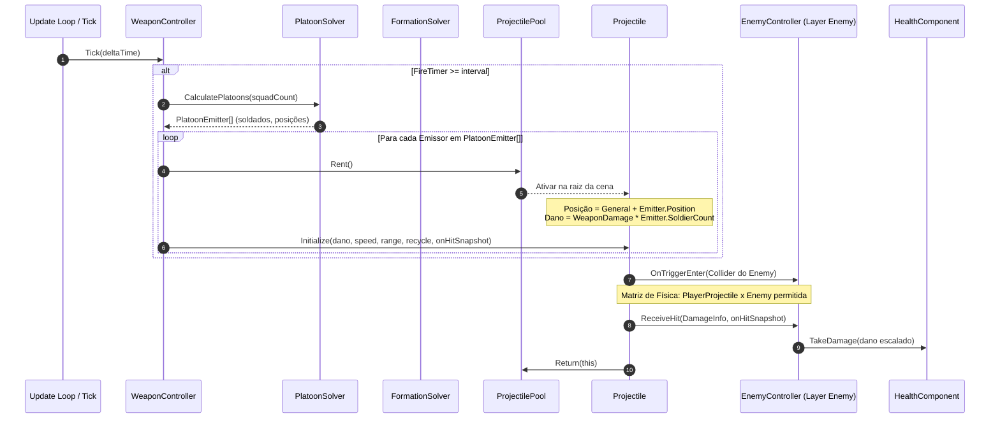
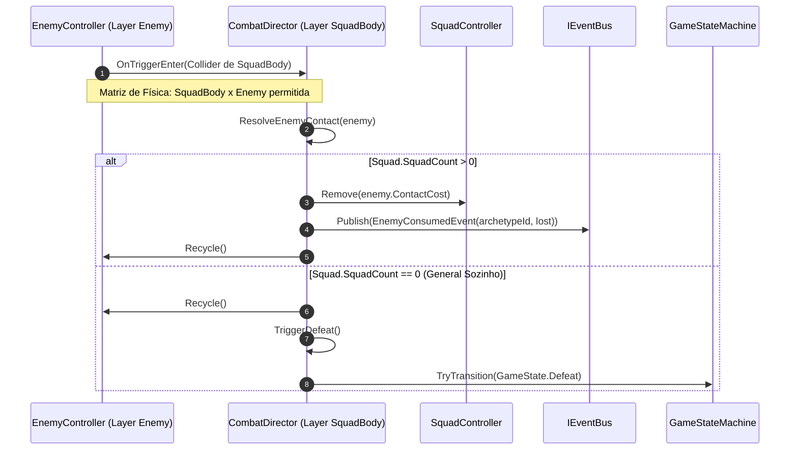
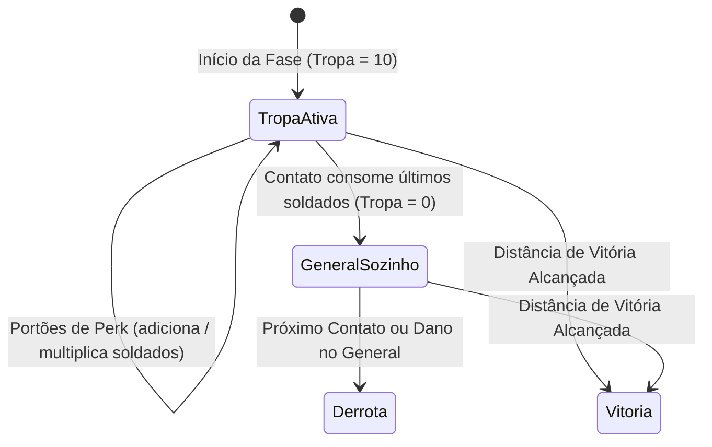
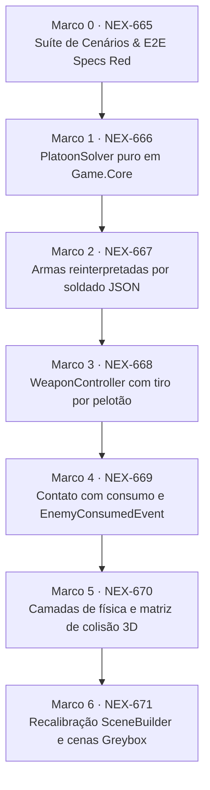

# Plano de Implementação: M15 · Tropa como poder de fogo e física por camadas
> Data: 2026-09-29
> Issue: NEX-650
> Status: Cenários validados — Suíte Red comprovada em 2026-09-29

## 1. Contexto & Arquitetura

- **Resumo**: Primeira história do roadmap atualizado do E2 (`2026-09-29-horde-runner-gameplay-meta-liveops.md`). Transforma a tropa do General na fantasia central de combate: a tropa deixa de ser mero HP e passa a definir diretamente o poder de fogo através do `PlatoonSolver` puro (C# em `Game.Core`, `emissores = min(ceil(tropa/5), 40)`), com dano por projétil proporcional aos soldados representados por cada emissor posicionado pelo `FormationSolver`. Reinterpreta as armas da M5 como dano por soldado (Pistola 2, SMG 1, Shotgun 2) e eleva a tropa base inicial para 10 soldados. Implementa o sistema de contato com consumo de soldados (`contactCost` e publicação de `EnemyConsumedEvent`), permitindo que a tropa zerada deixe o General sozinho antes de sofrer a derrota final. Estabelece a matriz de física por camadas (`SquadBody`, `PlayerProjectile`, `Enemy`, `EnemyProjectile`, `Pickup`) com Rigidbodies cinemáticos próprios fora da hierarquia do General (resolvendo definitivamente as armadilhas de trigger compostos do GH #47) e recalibra as cenas greybox de combate via `SceneBuilder`.
- **Stack**: Unity 6000.6.3f1, C# com asmdefs unidirecionais: `Game.Core` (sem referências ao Unity engine) ← `Game.Data` (ScriptableObjects) ← `Game.Gameplay` (MonoBehaviours) ← `Game.Presentation` (views, VFX, HUD); `Game.Editor` para `SceneBuilder` e importadores; NUnit via Unity Test Framework (EditMode e PlayMode).
- **Verificação disponível**: Suíte automatizada confiável — `./tools/unity compile`, `./tools/unity test-edit`, `./tools/unity test-play`, `./tools/unity import-content` e `./tools/unity validate`.
- **Base Git**: Branch `jamilzerati/nex-650-m15-tropa-como-poder-de-fogo-e-fisica-por-camadas` criada a partir de `jamilzerati/nex-511-m6-efeitos-de-status-e-sinergias` (`cd56c65`), trazendo a especificação de gameplay e meta (`a827e6c`). O PR draft da história aponta para `main`.

### Decisões Arquiteturais e de Combate

1. **Pelotões puros em `Game.Core`**: O cálculo de agrupamento da tropa vive em `PlatoonSolver` (C# puro). Para qualquer contagem $N > 0$, o número de emissores de disparo é dado por $\text{emissores} = \min(\lceil N / 5 \rceil, 40)$. Cada emissor $i$ representa $\lfloor N / \text{emissores} \rfloor + (i < (N \pmod{\text{emissores}}) ? 1 : 0)$ soldados. A conservação de soldados é exata: $\sum \text{soldados} = N$. Se $N \le 0$, retorna array vazio.
2. **Posicionamento dos emissores**: Os emissores utilizam diretamente as posições geradas por `FormationSolver.CalculatePositions(emitterCount, spacing, maxPerRow)`, garantindo que o volume visual de tiros acompanhe espacialmente o formato geométrico da tropa.
3. **Escala linear de dano por projétil**: Cada emissor dispara o perfil da arma equipada. O dano de cada projétil disparado é $\text{dano por projétil} = \text{dano base resolvido da arma} \times \text{soldados representados pelo pelotão}$. O dano total da salva de tiros escala linearmente com o tamanho da tropa, enquanto o número de projéteis em cena é limitado a no máximo $40 \times \text{projectilesPerShot}$ para preservar performance mobile.
4. **Reinterpretação das armas por soldado**: As armas passam a expressar valores de dano por soldado em `Content/Source/Weapons/*.json`:
   - `pistol`: dano 2, fireRate 2, range 40, 1 projétil (4 DPS por soldado; com 10 soldados = 40 DPS);
   - `smg`: dano 1, fireRate 6, range 35, 1 projétil (6 DPS por soldado; com 10 soldados = 60 DPS);
   - `shotgun`: dano 2, fireRate 1.2, range 22, 3 projéteis em leque (7.2 DPS por soldado; com 10 soldados = 72 DPS);
   - `WeaponController.DefaultBaseProfile`: atualizado com dano 2.
5. **Compatibilidade com M6 (Status e Sinergias)**: O payload de status on-hit (`OnHitStatusSet.Snapshot()`) continua sendo anexado por projétil. Um projétil de pelotão aplica o status uma vez ao atingir o zumbi. A sinergia de estilhaço (`shatter`, golpe $\ge 12$ em congelado) não dispara com a pistola base e tropa 10 (2 pelotões de 5 soldados = 10 de dano por projétil), mas dispara ao atingir $\ge 12$ via perk de dano (`damage_up_25`) ou concentração de tropa.
6. **Contato e consumo de zumbis**: Quando um zumbi colide com a camada `SquadBody`, ele consome `contactCost` soldados da tropa (padrão 1 para o Andarilho) e é imediatamente reciclado. Publica o evento `EnemyConsumedEvent(string archetypeId, int soldiersLost)`. O consumo **não** é abate (não emite `EntityDiedEvent` nem pontua em objetivos de abate).
7. **Sobrevivência do General**: Se a perda de soldados reduz a tropa a 0 (`SquadCount == 0`), o General permanece vivo e sozinho no corredor. O próximo contato físico de zumbi ou projétil hostil resulta em derrota imediata (`CombatDirector.TriggerDefeat()`).
8. **Matriz de camadas 3D restrita**: Camadas dedicadas em `TagManager.asset` e `DynamicsManager.asset`:
   - `SquadBody` (8): General e esferas de soldados;
   - `PlayerProjectile` (9): Projéteis disparados pela tropa;
   - `Enemy` (10): Zumbis da horda;
   - `EnemyProjectile` (11): Projéteis hostis (cuspe, etc.);
   - `Pickup` (12): Portões de perk e jaulas de resgate.
   Matriz estrita:
   - `PlayerProjectile` colide APENAS com `Enemy` e `Pickup`;
   - `SquadBody` colide APENAS com `Enemy`, `EnemyProjectile` e `Pickup`;
   - Todas as demais combinações são desabilitadas na física 3D.
9. **Isolamento de Rigidbodies**: Projéteis e zumbis possuem seus próprios componentes `Rigidbody` (cinemáticos, sem gravidade) e residem na raiz da cena (`ProjectilePool` e `HordeSpawner` nunca sob a hierarquia do General), impedindo que seus colisores componham o corpo físico do líder.
10. **Recalibração das cenas Greybox**: Cenas `M4_Greybox`, `M5_Greybox` e `M6_Greybox` são regeneradas via `SceneBuilder` com tropa inicial 10, camadas físicas configuradas e pools desacoplados.

---

### Diagramas Arquiteturais

#### Sequência: Disparo por Pelotões e Resolução de Impacto



#### Sequência: Contato com Consumo de Tropa e Derrota



#### Máquina de Estados: Vida da Tropa e General



#### Dependência entre Marcos



---

## 2. Armadilhas do Repositório

| Armadilha | Onde morde (arquivo/passo) | Regra a respeitar |
|---|---|---|
| **GH #47 / Triggers Compostos do General** | `WeaponController.cs`, `SceneBuilder.cs` — Passo 3, Passo 5 | `ProjectilePool` e instâncias de projéteis e inimigos NUNCA devem ser filhos do GameObject do General. Corpos sem Rigidbody sob o General integram seu corpo composto e geram colisões de contato indesejadas. |
| **Matriz de Colisão Desativada Anula Triggers** | `DynamicsManager.asset`, `CombatDirector.cs` — Passo 5 | No Unity, se duas camadas estão desativadas na collision matrix, colisores trigger NÃO disparam `OnTriggerEnter`. Todas as interações intencionais (`PlayerProjectile x Enemy`, `PlayerProjectile x Pickup`, `SquadBody x Enemy`, `SquadBody x Pickup`) devem estar explicitamente ativas. |
| **Conservação Numérica no Pelotão** | `PlatoonSolver.cs` — Passo 1 | O número total de soldados nos pelotões deve ser estritamente igual à tropa informada ($\sum \text{SoldierCount} = N$). O resto da divisão deve ser distribuído ordenadamente aos primeiros emissores (`i < remainder ? 1 : 0`). |
| **Divisão por Zero em Tropa Nula ou Negativa** | `PlatoonSolver.cs` — Passo 1 | Se `squadCount <= 0`, retornar `Array.Empty<PlatoonEmitter>()` imediatamente sem tentar calcular `Ceil(0 / 5)` ou divisões. |
| **WeaponController Isolado sem Squad** | `WeaponController.cs` — Passo 3 | Testes unitários preexistentes de `WeaponController` instanciam o componente sem `SquadController`. O controller deve manter fallback para 1 emissor na origem representando 1 soldado quando `Squad == null` ou `SquadCount <= 0`. |
| **Shatter Interaction vs Dano por Soldado** | `Content/Source/Weapons/pistol.json`, `Content/Source/Interactions/shatter.json` — Passo 2 | A sinergia de estilhaço exige dano de impacto $\ge 12$. Com dano 2 por soldado e 10 soldados base (2 pelotões de 5), o dano do projétil é 10 ($< 12$), preservando a regra de design de que a pistola base não estilhaça sem perks. |
| **Consumo de Zumbi Não é Abate** | `CombatDirector.cs`, `EnemyController.cs` — Passo 4 | Zumbi consumido em contato remove soldados e é reciclado, mas NÃO emite `EntityDiedEvent` e nem conta como morte por combate. Emite estritamente `EnemyConsumedEvent`. |

---

## 3. Árvore de Arquivos

- [NOVO] `Assets/_Game/Scripts/Core/Combat/PlatoonEmitter.cs`
- [NOVO] `Assets/_Game/Scripts/Core/Combat/PlatoonSolver.cs`
- [NOVO] `Assets/_Game/Scripts/Core/Events/EnemyConsumedEvent.cs`
- [NOVO] `Assets/_Game/Scripts/Gameplay/Combat/CollisionLayers.cs`
- [NOVO] `Assets/_Game/Scripts/Tests/EditMode/PlatoonSolverTests.cs`
- [NOVO] `Assets/_Game/Scripts/Tests/EditMode/PlatoonCombatTests.cs`
- [NOVO] `Assets/_Game/Scripts/Tests/PlayMode/PhysicsLayersPlayModeTests.cs`
- [MODIFICAÇÃO] `Assets/_Game/Scripts/Core/FormationSolver.cs`
- [MODIFICAÇÃO] `Assets/_Game/Scripts/Gameplay/Combat/WeaponController.cs`
- [MODIFICAÇÃO] `Assets/_Game/Scripts/Gameplay/Combat/CombatDirector.cs`
- [MODIFICAÇÃO] `Assets/_Game/Scripts/Gameplay/Enemies/EnemyController.cs`
- [MODIFICAÇÃO] `Assets/_Game/Scripts/Presentation/SquadVisualController.cs`
- [MODIFICAÇÃO] `Assets/_Game/Scripts/Editor/SceneBuilder.cs`
- [MODIFICAÇÃO] `Content/Source/Weapons/pistol.json`
- [MODIFICAÇÃO] `Content/Source/Weapons/smg.json`
- [MODIFICAÇÃO] `Content/Source/Weapons/shotgun.json`
- [MODIFICAÇÃO] `ProjectSettings/TagManager.asset`
- [MODIFICAÇÃO] `ProjectSettings/DynamicsManager.asset`
- [MODIFICAÇÃO] `Assets/_Game/Scenes/M4_Greybox.unity`
- [MODIFICAÇÃO] `Assets/_Game/Scenes/M5_Greybox.unity`
- [MODIFICAÇÃO] `Assets/_Game/Scenes/M6_Greybox.unity`
- [MODIFICAÇÃO] `Assets/_Game/Scripts/Tests/EditMode/WeaponControllerTests.cs`
- [MODIFICAÇÃO] `Assets/_Game/Scripts/Tests/EditMode/WeaponImporterTests.cs`

---

## 4. Contratos e Interfaces

### 4.1 `PlatoonEmitter` e `PlatoonSolver` (`Game.Core.Combat`)

```csharp
namespace Game.Core
{
    public readonly struct PlatoonEmitter : IEquatable<PlatoonEmitter>
    {
        public readonly int Index;
        public readonly int SoldierCount;
        public readonly FormationPosition Position;

        public PlatoonEmitter(int index, int soldierCount, FormationPosition position)
        {
            Index = index;
            SoldierCount = soldierCount;
            Position = position;
        }

        public bool Equals(PlatoonEmitter other) =>
            Index == other.Index && SoldierCount == other.SoldierCount && Position.Equals(other.Position);

        public override bool Equals(object obj) => obj is PlatoonEmitter other && Equals(other);
        public override int GetHashCode() => HashCode.Combine(Index, SoldierCount, Position);
    }

    public static class PlatoonSolver
    {
        public const int MaxEmitters = 40;
        public const int SoldiersPerEmitterThreshold = 5;

        public static PlatoonEmitter[] CalculatePlatoons(
            int squadCount,
            float spacing = FormationSolver.DefaultSpacing,
            int maxPerRow = FormationSolver.DefaultMaxPerRow);
    }
}
```

### 4.2 `EnemyConsumedEvent` (`Game.Core.Events`)

```csharp
namespace Game.Core.Events
{
    public readonly struct EnemyConsumedEvent
    {
        public readonly string ArchetypeId;
        public readonly int SoldiersLost;

        public EnemyConsumedEvent(string archetypeId, int soldiersLost)
        {
            ArchetypeId = archetypeId;
            SoldiersLost = soldiersLost;
        }
    }
}
```

### 4.3 `CollisionLayers` (`Game.Gameplay`)

```csharp
namespace Game.Gameplay
{
    public static class CollisionLayers
    {
        public const string SquadBody = "SquadBody";
        public const string PlayerProjectile = "PlayerProjectile";
        public const string Enemy = "Enemy";
        public const string EnemyProjectile = "EnemyProjectile";
        public const string Pickup = "Pickup";

        public const int SquadBodyLayer = 8;
        public const int PlayerProjectileLayer = 9;
        public const int EnemyLayer = 10;
        public const int EnemyProjectileLayer = 11;
        public const int PickupLayer = 12;

        public const int SquadBodyMask = 1 << SquadBodyLayer;
        public const int PlayerProjectileMask = 1 << PlayerProjectileLayer;
        public const int EnemyMask = 1 << EnemyLayer;
        public const int EnemyProjectileMask = 1 << EnemyProjectileLayer;
        public const int PickupMask = 1 << PickupLayer;
    }
}
```

### 4.4 `EnemyController` e `CombatDirector` Contratos Atualizados (`Game.Gameplay`)

```csharp
// Em EnemyController.cs:
public int ContactCost { get; set; } = 1;
public string ArchetypeId { get; set; } = "walker";

// Em CombatDirector.cs:
public bool ResolveEnemyContact(EnemyController enemy);
public void TriggerDefeat();
```

---

## 4.5 Linear overlay

- **História (issue-pai):** `NEX-650` (`M15 · Tropa como poder de fogo e física por camadas`)
- **Sub-issues deste plano:**
  - `NEX-665` (Marco 0: Suíte de Cenários & E2E Specs, Priority: High)
  - `NEX-666` (Marco 1: PlatoonSolver puro em Game.Core e testes EditMode, Priority: High)
  - `NEX-667` (Marco 2: Reinterpretação de armas por soldado e importação JSON, Priority: High)
  - `NEX-668` (Marco 3: WeaponController com disparo por pelotões e escala de dano, Priority: High)
  - `NEX-669` (Marco 4: Contato com consumo de tropa e EnemyConsumedEvent, Priority: High)
  - `NEX-670` (Marco 5: Camadas de física, matriz de colisão e teste PlayMode, Priority: High)
  - `NEX-671` (Marco 6: Recalibração de cenas Greybox via SceneBuilder e verificação final, Priority: High)
- **PRs (modelo C):**
  - Branch da história: `jamilzerati/nex-650-m15-tropa-como-poder-de-fogo-e-fisica-por-camadas`
  - PR da história: draft PR `#49` (ou seguinte) → `main`
  - PR de cada tarefa: ramifica da branch da história e abre PR para `jamilzerati/nex-650-m15-tropa-como-poder-de-fogo-e-fisica-por-camadas`.

---

## 5. Divisão de Execução por Passo

| Faixa | Passos | Por quê |
|---|---|---|
| **Modelo forte, obrigatório** | Passo 0, Passo 1, Passo 3, Passo 4, Passo 5 | Envolve regras matemáticas estritas (divisão de soldados e resto em pelotões sem truncamento), escala linear de dano em combate, ordem de resolução de contato físico com zumbi, persistência do General sem tropa e configuração matricial de física 3D em arquivos de settings com modos de falha silenciosos. |
| **Mecânica, qualquer modelo** | Passo 2, Passo 6 | Alteração de valores em catálogos JSON (`Content/Source/Weapons/*.json`), reimportação de ScriptableObjects e chamada de script de geração de cena `SceneBuilder`. Qualquer erro de sintaxe ou referência quebrada é apontado imediatamente no compilador ou validador. |

---

## 6. Checklist de Execução

- [x] **Passo 0 (Marco 0)**: `Suíte de Cenários & E2E Specs (tropa e física por camadas)` [NEX-665]
  - **Ação**: Criar cenários de teste Red para EditMode e PlayMode com stubs dos novos contratos.
  - **Lógica de Negócios / Responsabilidade**: Declarar testes comportamentais caixa-preta para:
    1. `PlatoonSolver`: cálculo de emissores ($\min(\lceil N / 5 \rceil, 40)$), soma total de soldados idêntica ao squad, distribuição de sobra nos primeiros emissores, teto de 40 emissores e posições via `FormationSolver`;
    2. `WeaponController`: dano proporcional por projétil (`dano da arma * soldados do pelotão`), volume de tiros escalando com emissores e posições nos offsets da formação;
    3. `CombatDirector`: contato de zumbi consome `contactCost`, publica `EnemyConsumedEvent`, recicla zumbi sem emitir evento de abate; zumbi que zera tropa deixa General vivo; próximo contato com tropa zerada encerra em derrota;
    4. `PhysicsLayersPlayModeTests`: PlayMode validando que `PlayerProjectile` atinge `Enemy` e `Pickup`, `SquadBody` atinge `Enemy`, `EnemyProjectile` e `Pickup`, e `PlayerProjectile` ignora `SquadBody`.
  - **Seam Público**: `Game.Tests.EditMode.PlatoonSolverTests`, `Game.Tests.EditMode.PlatoonCombatTests`, `Game.Tests.PlayMode.PhysicsLayersPlayModeTests`.
  - **Marco de PR**: Marco 0 + `NEX-665`
  - **Runtime**: hard

- [x] **Passo 1 (Marco 1)**: `Assets/_Game/Scripts/Core/Combat/PlatoonSolver.cs` e `PlatoonEmitter.cs` [NEX-666]
  - **Ação**: Implementar `PlatoonEmitter` e `PlatoonSolver` em `Game.Core`.
  - **Lógica de Negócios / Responsabilidade**:
    1. Criar struct imutável `PlatoonEmitter(int index, int soldierCount, FormationPosition position)`;
    2. Implementar `PlatoonSolver.CalculatePlatoons(int squadCount, float spacing, int maxPerRow)`:
       - Retornar vazio para `squadCount <= 0`;
       - `emitterCount = Math.Min((squadCount + 4) / 5, 40)`;
       - `baseSoldiers = squadCount / emitterCount`;
       - `remainder = squadCount % emitterCount`;
       - Para cada $i \in [0, \text{emitterCount}-1]$, atribuir `soldierCount = baseSoldiers + (i < remainder ? 1 : 0)` e `position = positions[i]`;
    3. Garantir suite verde de testes unitários para todas as contagens canônicas (0, 1, 3, 5, 6, 7, 10, 12, 199, 200, 205, 300).
  - **Dependências / Pré-requisitos**: Passo 0.
  - **Seam Público**: `Game.Core.PlatoonSolver.CalculatePlatoons(int, float, int)`.
  - **Marco de PR**: Marco 1 + `NEX-666`
  - **Runtime**: hard

- [x] **Passo 2 (Marco 2)**: `Content/Source/Weapons/*.json` e `DefaultBaseProfile` [NEX-667]
  - **Ação**: Atualizar catálogo de armas com valores por soldado e reimportar ScriptableObjects.
  - **Lógica de Negócios / Responsabilidade**:
    1. Atualizar `pistol.json` para `damage = 2`;
    2. Atualizar `smg.json` para `damage = 1`;
    3. Atualizar `shotgun.json` para `damage = 2`;
    4. Atualizar `WeaponController.DefaultBaseProfile` com dano 2;
    5. Executar importador de conteúdo via harness CLI (`import-content`);
    6. Atualizar testes EditMode de importação e stats que esperavam os números anteriores.
  - **Dependências / Pré-requisitos**: Passo 1.
  - **Seam Público**: `Content/Source/Weapons/*.json`, `Assets/_Game/Data/Weapons/WeaponCatalog.asset`.
  - **Marco de PR**: Marco 2 + `NEX-667`
  - **Runtime**: low

- [x] **Passo 3 (Marco 3)**: `Assets/_Game/Scripts/Gameplay/Combat/WeaponController.cs` [NEX-668]
  - **Ação**: Implementar disparo por pelotões e escala de dano linear no `WeaponController`.
  - **Lógica de Negócios / Responsabilidade**:
    1. Em `FireVolley()`:
       - Se `Squad != null && Squad.SquadCount > 0`, obter `platoons = PlatoonSolver.CalculatePlatoons(Squad.SquadCount)`;
       - Se `Squad == null || Squad.SquadCount <= 0`, fallback gracioso com 1 emissor de 1 soldado na origem;
       - Para cada emissor em `platoons`:
         - Posição base do emissor = `transform.position + new Vector3(emitter.Position.X, 0f, emitter.Position.Z) + Vector3.forward * 0.5f`;
         - Para cada projétil do disparo da arma ($1 \dots \text{ProjectileCount}$):
           - Rent do projétil no pool;
           - Offset lateral do leque somado à posição do emissor;
           - Inicializar com `damage = CurrentStats.Damage * emitter.SoldierCount`;
           - Anexar snapshot de status (`onHitStatuses.Snapshot()`);
    2. Respeitar isolamento do `ProjectilePool` na raiz da cena (não atrelar como filho do General);
    3. Validar testes EditMode de combate e disparo de pelotão.
  - **Dependências / Pré-requisitos**: Passo 2.
  - **Seam Público**: `Game.Gameplay.WeaponController.FireVolley()`.
  - **Marco de PR**: Marco 3 + `NEX-668`
  - **Runtime**: hard

- [x] **Passo 4 (Marco 4)**: `Assets/_Game/Scripts/Gameplay/Combat/CombatDirector.cs` e `EnemyController.cs` [NEX-669]
  - **Ação**: Implementar lógica de consumo de zumbis por contato, evento `EnemyConsumedEvent` e derrota do General sozinho.
  - **Lógica de Negócios / Responsabilidade**:
    1. Criar struct `EnemyConsumedEvent(string archetypeId, int soldiersLost)` em `Game.Core.Events`;
    2. Adicionar propriedades `ContactCost` (int, padrão 1) e `ArchetypeId` (string, padrão "walker") no `EnemyController`;
    3. Em `CombatDirector.ResolveEnemyContact(EnemyController enemy)`:
       - Se `Squad != null && Squad.SquadCount > 0`:
         - `cost = enemy != null ? enemy.ContactCost : 1`;
         - `lost = Mathf.Min(cost, Squad.SquadCount)`;
         - `Squad.Remove(cost)`;
         - Publicar `EnemyConsumedEvent(enemy?.ArchetypeId ?? "walker", lost)`;
         - `enemy.Recycle()` (não dispara abate);
         - Retornar `true`;
       - Se `Squad.SquadCount == 0`:
         - General estava sozinho; `enemy.Recycle()`;
         - Chamar `TriggerDefeat()`;
         - Retornar `true`;
    4. Validar testes EditMode cobrindo o ciclo de contato, consumo e derrota.
  - **Dependências / Pré-requisitos**: Passo 3.
  - **Seam Público**: `Game.Gameplay.CombatDirector.ResolveEnemyContact(EnemyController)`.
  - **Marco de PR**: Marco 4 + `NEX-669`
  - **Runtime**: hard

- [x] **Passo 5 (Marco 5)**: `ProjectSettings/TagManager.asset`, `DynamicsManager.asset` e `CollisionLayers.cs` [NEX-670]
  - **Ação**: Configurar camadas de física 3D, matriz estrita de colisão e teste PlayMode.
  - **Lógica de Negócios / Responsabilidade**:
    1. Adicionar camadas 8 (`SquadBody`), 9 (`PlayerProjectile`), 10 (`Enemy`), 11 (`EnemyProjectile`), 12 (`Pickup`) em `TagManager.asset`;
    2. Configurar `m_LayerCollisionMatrix` em `DynamicsManager.asset`:
       - Habilitar estritamente `PlayerProjectile x Enemy`, `PlayerProjectile x Pickup`, `SquadBody x Enemy`, `SquadBody x EnemyProjectile`, `SquadBody x Pickup`;
       - Desabilitar `PlayerProjectile x SquadBody`, `PlayerProjectile x PlayerProjectile`, `SquadBody x SquadBody`, `Enemy x Enemy`, etc.;
    3. Criar classe de constantes `CollisionLayers` em `Game.Gameplay`;
    4. Garantir que `Projectile` e `EnemyController` tenham `Rigidbody` cinemático próprio sem gravidade e camada configurada;
    5. Atribuir camada `SquadBody` aos soldados instanciados por `SquadVisualController`;
    6. Executar e validar teste PlayMode `PhysicsLayersPlayModeTests`.
  - **Dependências / Pré-requisitos**: Passo 4.
  - **Seam Público**: `Game.Gameplay.CollisionLayers`, matriz de física Unity 3D.
  - **Marco de PR**: Marco 5 + `NEX-670`
  - **Runtime**: hard

- [ ] **Passo 6 (Marco 6)**: `Assets/_Game/Scripts/Editor/SceneBuilder.cs` e Cenas Greybox [NEX-671]
  - **Ação**: Recalibrar geração de cenas greybox via `SceneBuilder` com tropa 10 e camadas físicas.
  - **Lógica de Negócios / Responsabilidade**:
    1. Atualizar `SceneBuilder`:
       - Tropa inicial base recalibrada para 10 soldados em cenas greybox de combate (M4, M5, M6);
       - Atribuição explícita de camadas: `SquadBody` no General e no template de soldados, `PlayerProjectile` no template de projétil, `Enemy` no template de inimigos e spawner, `Pickup` nos portões;
       - Garantir que `ProjectilePool` e `HordeSpawner` residam na raiz da cena;
    2. Regenerar cenas `M4_Greybox.unity`, `M5_Greybox.unity`, `M6_Greybox.unity`;
    3. Validar testes EditMode do `SceneBuilder`;
    4. Executar verificação completa pelo harness CLI (`compile`, `test-edit`, `test-play`, `validate`).
  - **Dependências / Pré-requisitos**: Passo 5.
  - **Seam Público**: `Game.Editor.SceneBuilder.BuildM4GreyboxScene()`, `BuildM5GreyboxScene()`, `BuildM6GreyboxScene()`.
  - **Marco de PR**: Marco 6 + `NEX-671`
  - **Runtime**: low
