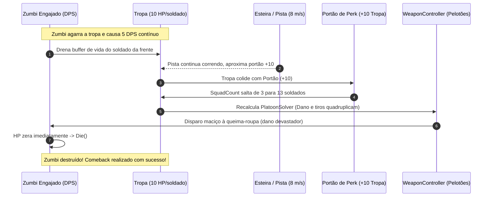

# Design Spec: Combate de Atrito, Vida da Tropa e Mecânica de Comeback (M15 Refinamento)
> Data: 2026-09-30  
> Contexto: Refinamento de Gameplay de Contato para NEX-650 (M15)  
> Alvo: `Game.Core`, `Game.Gameplay`, `Game.Presentation`

---

## 1. Visão Geral e Motivação

### 1.1 O Problema Atual (M15 Baseline)
Na implementação inicial da M15, a colisão de um zumbi com a tropa (`CombatDirector.ResolveEnemyContact`) operava como um "atropelamento instantâneo":
* O zumbi tocava a tropa, subtraía 1 soldado imediatamente e era reciclado (desaparecia da cena).
* **Defeito de sensação de jogo (Game Feel):** O zumbi não passava a sensação de uma ameaça que ataca ou morde; funcionava como uma "moeda negativa" descartável. O jogador não sentia a urgência de uma batalha corpo-a-corpo, não havia chance de contra-ataque à queima-roupa e nem a emoção de virar o jogo após ser alcançado.

### 1.2 A Nova Visão (Combate de Atrito & Comeback)
* O zumbi que alcança a tropa **não desaparece**: ele entra em estado de **engajamento corpo-a-corpo ("Latch-on")**, travando na vanguarda da formação e acompanhando o avanço da tropa pela pista.
* **Vida da Tropa com Buffer:** Cada soldado possui um buffer de HP (ex: 10 HP). O zumbi causa dano contínuo por segundo (DPS de contato). Se os tiros da tropa matarem o zumbi rápido, **nenhum soldado morre**. Se o zumbi permanecer engajado, soldados caem conforme a vida do soldado ativo esgota.
* **A Corrida Continua (Esteira Ativa):** O General e a tropa não param de avançar na pista (8 m/s). Novos zumbis e portões de perk continuam vindo na sua direção.
* **Mecânica de Comeback (Virada de Batalha):** Ao manobrar a tropa e atravessar um portão positivo (`+10`, `x2`, Shotgun, munição elemental), a tropa ganha reforços maciços e novo poder de fogo na hora, **aniquilando o zumbi engajado** e salvando o General antes da derrota final.
* **Última Chance (General Sozinho):** Se toda a tropa for consumida, o General segue correndo sozinho. Se ele não eliminar o zumbi ou sofrer novo contato sem soldados, ocorre a Derrota definitiva (`Defeat`).

---

## 2. Arquitetura e Contratos de Código

```
Game.Core (C# Puro)
  ├── SquadHealthBuffer (Gerenciamento de HP por soldado e dano cumulativo)
  └── Events:
        ├── SoldierDamagedEvent (Dano parcial no soldado da frente)
        ├── SoldierFellEvent (Soldado tombou por esgotamento de vida)
        └── EnemyEngagedEvent / EnemyDisengagedEvent

Game.Gameplay (MonoBehaviours & Física 3D)
  ├── EnemyController (Novo estado Engaged, DPS contínuo, tracking espacial na vanguarda)
  ├── MeleeEngagementManager (Gerencia lista de zumbis agarrados na tropa)
  ├── CombatDirector (Orquestra engajamento, colisão e derrota)
  └── WeaponController (Tiros automáticos atingem zumbi colado à queima-roupa)
```

### 2.1 `SquadHealthBuffer` (`Game.Core.Combat`)
Classe pura em C# responsável pelo controle de vida contínua da tropa:

```csharp
namespace Game.Core
{
    public class SquadHealthBuffer
    {
        public float SoldierMaxHealth { get; }
        public float CurrentSoldierHealth { get; private set; }

        public SquadHealthBuffer(float soldierMaxHealth = 10f)
        {
            SoldierMaxHealth = Mathf.Max(1f, soldierMaxHealth);
            CurrentSoldierHealth = SoldierMaxHealth;
        }

        /// <summary>
        /// Aplica dano contínuo à tropa. Retorna a quantidade de soldados que tombaram neste tick.
        /// </summary>
        public int ApplyDamage(float damage, int currentSquadCount)
        {
            if (damage <= 0f || currentSquadCount <= 0) return 0;

            CurrentSoldierHealth -= damage;
            int soldiersLost = 0;

            while (CurrentSoldierHealth <= 0f && (currentSquadCount - soldiersLost) > 0)
            {
                soldiersLost++;
                if ((currentSquadCount - soldiersLost) > 0)
                {
                    CurrentSoldierHealth += SoldierMaxHealth;
                }
                else
                {
                    CurrentSoldierHealth = 0f;
                    break;
                }
            }

            return soldiersLost;
        }

        public void ResetSoldierHealth()
        {
            CurrentSoldierHealth = SoldierMaxHealth;
        }
    }
}
```

### 2.2 `EnemyController` no Estado Engajado (`Game.Gameplay`)
* **Propriedades:**
  * `bool IsEngaged { get; private set; }`
  * `float ContactDPS { get; set; } = 5f;` (configurável por arquétipo de zumbi).
  * `Transform FollowTarget { get; private set; }`
  * `Vector3 EngagementOffset { get; private set; }`
* **Comportamento no `Tick(float deltaTime)`:**
  * Quando `IsEngaged == true`:
    * Ignora o deslocamento padrão em $-Z$ relativo ao mundo.
    * Sua posição passa a ser: `transform.position = FollowTarget.position + EngagementOffset`.
    * O zumbi permanece com seu `HealthComponent` e `Collider` ativos na camada `Enemy`.
  * Ao receber dano dos projéteis à queima-roupa e morrer (`CurrentHealth <= 0`):
    * Desengaja imediatamente do `MeleeEngagementManager`.
    * Executa `Die()` e emite `EntityDiedEvent` (contabiliza abate de combate legítimo).

### 2.3 `MeleeEngagementManager` (`Game.Gameplay.Combat`)
Componente acoplado ao General / Tropa que orquestra o combate corpo-a-corpo:
* Mantém `List<EnemyController> _engagedEnemies`.
* Limite de engajamento frontal: máximo de 1 zumbi por lane ativa (ou 2 em hordas densas) para evitar sobreposição visual confusa. Zumbis excedentes colidem com os zumbis da frente.
* A cada frame:
  $$\text{Dano Total} = \sum_{\text{zumbis engajados}} (\text{ContactDPS} \times \Delta t)$$
* Aplica `Dano Total` ao `SquadHealthBuffer`.
* Se `soldiersLost > 0`: chama `SquadController.Remove(soldiersLost)`.
* Se `SquadCount == 0`:
  * Os zumbis engajados passam a atacar o HP do General (General tem 10 HP base).
  * Se o General zerar a vida: chama `CombatDirector.TriggerDefeat()`.

---

## 3. Dinâmica de Tiro à Queima-Roupa e Resolução Física

1. **Posição do Zumbi Engajado:**
   * O zumbi fica posicionado a $+0.6\text{m}$ à frente do líder na lane correspondente.
2. **Emissores de Tiro (`PlatoonSolver`):**
   * Os emissores de disparo do `PlatoonSolver` continuam posicionados na formação dos soldados e no líder ($Z \approx 0$).
   * Os projéteis viajam em $+Z$ a $25\text{m/s}$.
   * Como a distância entre o cano da arma e o colisor do zumbi engajado é de apenas $0.6\text{m}$, o projétil atinge o zumbi em aproximadamente $0.024\text{s}$ (praticamente no mesmo frame!).
3. **Escala de Poder de Fogo no Duelo:**
   * Se a tropa tiver 10 soldados (Pistola, dano 2 por soldado, 2 pelotões de 5 soldados): cada disparo causa 20 de dano total.
   * Um zumbi Andarilho com 15 HP morre no primeiro disparo da tropa à queima-roupa antes de conseguir causar 1 segundo de DPS!
   * Um zumbi Tanque ou Elite com 80 HP exigirá 4 disparos para morrer, conseguindo roer alguns pontos do buffer de vida da tropa.

---

## 4. O Ciclo de Comeback via Portões de Perk



---

## 5. Tratamento de Casos Limítrofes (Edge Cases)

| Cenário Limítrofe | Comportamento Esperado |
|---|---|
| **Troca de Lane ($A/D$) com Zumbi Engajado** | O zumbi agarrado acompanha a movimentação lateral da tropa, reforçando a sensação física de que ele está atracado na vanguarda. |
| **Zumbi toma Stun/Freeze enquanto engajado** | O efeito de Stun/Frozen interrompe o `ContactDPS` do zumbi pela duração do efeito. Ele continua grudado, mas sem morder a tropa. |
| **Passagem por Portão Negativo (`-5` ou `÷2`)** | A tropa encolhe na hora. Se a tropa for reduzida a zero pelo portão, o General fica sozinho com o zumbi colado. |
| **Tiro penetrante ou Shotgun em múltiplos zumbis** | Se houver 2 zumbis engajados lado a lado, os tiros dos pelotões correspondentes acertam o zumbi da sua respectiva coluna. Projéteis em leque da Shotgun acertam ambos. |
| **Morte do zumbi engajado** | O colisor do zumbi é desativado no momento da morte para não bloquear novos projéteis em direção aos zumbis seguintes na lane. |

---

## 6. Critérios de Homologação e Testes

1. **Testes Unitários EditMode (`SquadHealthBufferTests`):**
   - Dano menor que `SoldierMaxHealth` não reduz `SquadCount`;
   - Dano cumulativo que ultrapassa `SoldierMaxHealth` reduz `SquadCount` com precisão;
   - Dano massivo reduz múltiplos soldados e preserva o resto da divisão.
2. **Testes EditMode (`MeleeEngagementTests`):**
   - Zumbi colidindo com tropa entra em `IsEngaged = true` e não é reciclado;
   - Zumbi engajado aplica dano ao longo do tempo (`Tick`);
   - Zumbi engajado morre e desengaja ao receber dano letal de projéteis.
3. **Testes PlayMode (`CombatEngagementPlayModeTests`):**
   - Zumbi engajado acompanha o avanço da tropa na esteira;
   - Passagem por portão de perk durante o engajamento incrementa a tropa e acelera a eliminação do zumbi.
