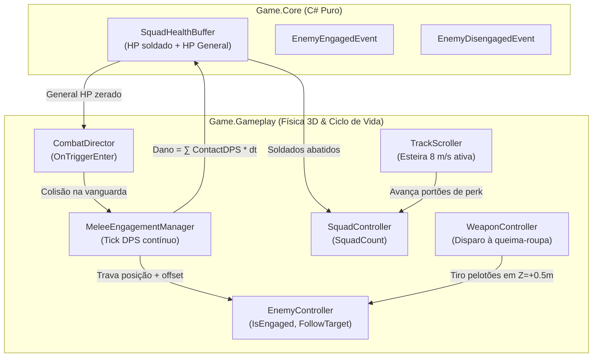

# [NEX-650] Plano de Implementação: Combate de Atrito, Vida da Tropa e Latch-on Melee (Comeback)

> **Data:** 2026-09-30  
> **Issue:** [NEX-650](https://linear.app/aintegrado/issue/NEX-650/story-m15-tropa-como-poder-de-fogo-e-fisica-por-camadas)  
> **Status:** Pronto para Execução via /executar  
> **For agentic workers:** REQUIRED SUB-SKILL: Use superpowers:subagent-driven-development to implement this plan task-by-task. Steps use checkbox (`- [ ]`) syntax for tracking.

**Goal:** Transformar o contato de zumbis com a tropa de um "atropelamento instantâneo com moeda negativa" para um sistema dinâmico de atrito corpo-a-corpo ("Latch-on"), onde zumbis engajam na vanguarda causando DPS contínuo contra um buffer de vida por soldado, permitindo disparos à queima-roupa e viradas épicas de batalha (Comeback) ao cruzar portões de perk na esteira contínua.

**Architecture:** A regra de dano contínuo e vida por soldado é encapsulada em C# puro (`SquadHealthBuffer`) em `Game.Core`. No `Game.Gameplay`, o `EnemyController` ganha estado `Engaged` com travamento espacial relativo ao líder, e o `MeleeEngagementManager` orquestra a aplicação de DPS, absorção pelo buffer, perda progressiva de soldados e transbordo para o General em caso de Last Stand. O `CombatDirector` delega o contato físico para o engajamento melee em vez de reciclar o zumbi de imediato.

**Architecture Diagram:**



**Tech Stack:** Unity 6000.0.65f1, C# (.NET Standard 2.1), VContainer, Unity NUnit Test Runner (EditMode & PlayMode).

## Global Constraints

- Asmdefs estritos unidirecionais: `Game.Core` (C# puro) ← `Game.Data` ← `Game.Gameplay` ← `Game.Presentation`.
- Diffs cirúrgicos: máximo de 300 linhas de código de produção por tarefa.
- CLI-first: verificação obrigatória via `./tools/unity compile`, `./tools/unity test-edit` e `./tools/unity test-play`.
- Sem comentários narrativos: código autoexplicativo por tipos e nomenclatura estrita; comentários restritos a invariantes e armadilhas.
- Formato de caminhos de arquivos em markdown: sempre forward slashes `/`.

---

## 1. Contexto & Arquitetura

- **Resumo:** Refinamento do contato de combate da M15. Zumbis não morrem ao tocar a tropa; agarram na linha de frente (`EngagementOffset` $+0.8\text{m}$ em $Z$). O pelotão continua atirando à queima-roupa na direção deles. A tropa tem 10 HP por soldado gerenciado pelo `SquadHealthBuffer`. Se o jogador sofrer atrito, perde soldados progressivamente; se passar por um portão positivo (`+10`, `x2`), ganha soldados imediatamente, quadruplica o dano dos pelotões e tritura os zumbis agarrados (Comeback). Se a tropa inteira cair, o General corre sozinho com 10 HP antes de ser derrotado.
- **Stack:** Unity 6 (URP 3D), C#, VContainer.
- **Verificação disponível:** Suíte automatizada confiável (452 testes EditMode passando + 12 testes PlayMode passando).

---

## 2. Armadilhas do Repositório

| Armadilha | Onde morde (arquivo/passo) | Regra a respeitar |
|---|---|---|
| **Disparo Instantâneo Dentro do Colisor** | `WeaponController.cs` / Passo 2 | Projéteis nascem em $Z = 0.5\text{m}$. Se o zumbi agarrado estiver em $Z \le 0.5\text{m}$, o colisor do projétil nasce intersectando e pode gerar falso positivo de física antes de orientar. O offset de engajamento do zumbi DEVE ser $Z = +0.8\text{m}$ para o projétil viajar de forma limpa pelo trigger. |
| **Colisor Múltiplo / Re-trigger** | `MeleeEngagementManager.cs` / Passo 3 | Um zumbi que entra no trigger da tropa já está na lista de engajamento. `ResolveEnemyContact` DEVE ignorar zumbis que já possuam `IsEngaged == true` para evitar duplicação na lista. |
| **Pause Indesejado da Esteira** | `CombatDirector.cs` / Passo 3 | O contato melee NÃO pausa o `TrackScroller`. A esteira continua correndo a 8 m/s para permitir que portões de perk alcancem a tropa. Apenas `TriggerDefeat` ou `TriggerVictory` pausam a esteira. |
| **Divisão por Zero no PlatoonSolver** | `WeaponController.cs` / Passo 3 | Quando `SquadCount == 0` (General sozinho), `PlatoonSolver` recebe 0 e cai no `FallbackEmitters` (1 emissor central), permitindo ao General atirar sozinho no Last Stand. |
| **Reciclagem do Inimigo Morto** | `EnemyController.cs` / Passo 2 | Quando um zumbi engajado morre por tiros, `Die()` chama `Recycle()`. O zumbi DEVE invocar `Disengage()` para sair da lista do `MeleeEngagementManager` e desligar seu `Collider` imediatamente. |

---

## 3. Árvore de Arquivos

- [NOVO] `Assets/_Game/Scripts/Core/Combat/SquadHealthBuffer.cs`
- [NOVO] `Assets/_Game/Scripts/Core/Events/EnemyEngagedEvent.cs`
- [NOVO] `Assets/_Game/Scripts/Core/Events/EnemyDisengagedEvent.cs`
- [NOVO] `Assets/_Game/Scripts/Core/Events/SoldierDamagedEvent.cs`
- [MODIFICAÇÃO] `Assets/_Game/Scripts/Gameplay/Enemies/EnemyController.cs`
- [NOVO] `Assets/_Game/Scripts/Gameplay/Combat/MeleeEngagementManager.cs`
- [MODIFICAÇÃO] `Assets/_Game/Scripts/Gameplay/Combat/CombatDirector.cs`
- [NOVO] `Assets/_Game/Scripts/Tests/EditMode/SquadHealthBufferTests.cs`
- [MODIFICAÇÃO] `Assets/_Game/Scripts/Tests/EditMode/EnemyControllerTests.cs`
- [NOVO] `Assets/_Game/Scripts/Tests/EditMode/MeleeEngagementTests.cs`
- [NOVO] `Assets/_Game/Scripts/Tests/PlayMode/CombatEngagementPlayModeTests.cs`

---

## 4. Contratos e Interfaces

### 4.1 `SquadHealthBuffer` (`Game.Core`)
```csharp
namespace Game.Core
{
    public class SquadHealthBuffer
    {
        public float SoldierMaxHealth { get; }
        public float CurrentSoldierHealth { get; private set; }
        public float GeneralMaxHealth { get; }
        public float CurrentGeneralHealth { get; private set; }
        public bool IsGeneralAlive => CurrentGeneralHealth > 0f;

        public SquadHealthBuffer(float soldierMaxHealth = 10f, float generalMaxHealth = 10f);
        public int ApplyDamage(float damage, int currentSquadCount, out bool generalDied);
        public void ResetSoldierHealth();
        public void ResetGeneralHealth();
    }
}
```

### 4.2 Eventos de Engajamento (`Game.Core.Events`)
```csharp
namespace Game.Core.Events
{
    public readonly struct EnemyEngagedEvent
    {
        public readonly string ArchetypeId;
        public readonly int LaneIndex;
        public EnemyEngagedEvent(string archetypeId, int laneIndex);
    }

    public readonly struct EnemyDisengagedEvent
    {
        public readonly string ArchetypeId;
        public readonly bool WasKilled;
        public EnemyDisengagedEvent(string archetypeId, bool wasKilled);
    }

    public readonly struct SoldierDamagedEvent
    {
        public readonly float CurrentHealth;
        public readonly float MaxHealth;
        public SoldierDamagedEvent(float currentHealth, float maxHealth);
    }
}
```

### 4.3 Extensão no `EnemyController` (`Game.Gameplay`)
```csharp
public bool IsEngaged { get; }
public float ContactDPS { get; set; }
public Transform FollowTarget { get; }
public Vector3 EngagementOffset { get; }
public void Engage(Transform target, Vector3 offset);
public void Disengage();
```

### 4.4 `MeleeEngagementManager` (`Game.Gameplay`)
```csharp
public class MeleeEngagementManager : MonoBehaviour
{
    public IReadOnlyList<EnemyController> EngagedEnemies { get; }
    public SquadHealthBuffer HealthBuffer { get; }
    public bool Engage(EnemyController enemy);
    public bool Disengage(EnemyController enemy, bool wasKilled = false);
    public void Tick(float deltaTime);
    public void ClearAll();
}
```

---

## 4.5 Linear Overlay

- **História (issue-pai):** [NEX-650](https://linear.app/aintegrado/issue/NEX-650/story-m15-tropa-como-poder-de-fogo-e-fisica-por-camadas) (`E2 · Profundidade de combate`, Priority: High)
- **Sub-issues deste plano:**
  - `Marco 0`: [NEX-673](https://linear.app/aintegrado/issue/NEX-673/task-marco-0-suite-de-cenarios-and-contratos-de-combate-de-atrito-e) (Priority: High)
  - `Marco 1`: [NEX-674](https://linear.app/aintegrado/issue/NEX-674/task-marco-1-squadhealthbuffer-puro-em-gamecore-e-testes-editmode) (Priority: High)
  - `Marco 2`: [NEX-675](https://linear.app/aintegrado/issue/NEX-675/task-marco-2-estado-engaged-no-enemycontroller-e-tracking-na-vanguarda) (Priority: High)
  - `Marco 3`: [NEX-676](https://linear.app/aintegrado/issue/NEX-676/task-marco-3-meleeengagementmanager-e-integracao-com-combatdirector) (Priority: High)
  - `Marco 4`: [NEX-677](https://linear.app/aintegrado/issue/NEX-677/task-marco-4-teste-playmode-de-combate-de-atrito-e-virada-de-batalha) (Priority: High)

---

## 5. Divisão de Execução por Passo

| Faixa | Passos | Por quê |
|---|---|---|
| **Modelo forte, obrigatório** | Marco 0 (Passo 0), Marco 1 (Passo 1), Marco 2 (Passo 2), Marco 3 (Passo 3) | Lógica de acumulação de DPS em float, transbordo para morte de soldados/General, física de tracking no frame update e desengajamento na morte são suscetíveis a erros silenciosos (ex.: dano aplicado 2x, divisão de HP inconsistente, perda de tracking espacial na troca de lane). |
| **Mecânica, qualquer modelo** | Marco 4 (Passo 4) | Teste PlayMode de ponta a ponta: acoplamento de componentes já validados, falhas quebram visualmente ou com assert no log. |

---

## 6. Checklist de Execução

### Marco 0: Suíte de Cenários & Contratos de Combate de Atrito e Latch-on [NEX-673]

**Files:**
- Create: `Assets/_Game/Scripts/Core/Combat/SquadHealthBuffer.cs` (stub)
- Create: `Assets/_Game/Scripts/Core/Events/EnemyEngagedEvent.cs`
- Create: `Assets/_Game/Scripts/Core/Events/EnemyDisengagedEvent.cs`
- Create: `Assets/_Game/Scripts/Core/Events/SoldierDamagedEvent.cs`
- Create: `Assets/_Game/Scripts/Tests/EditMode/SquadHealthBufferTests.cs` (failing tests)

**Interfaces:**
- Consumes: `Game.Core`
- Produces: `SquadHealthBuffer`, `EnemyEngagedEvent`, `EnemyDisengagedEvent`, `SoldierDamagedEvent`

- [ ] **Passo 0.1: Criar os stubs dos eventos e do SquadHealthBuffer**

```csharp
// Assets/_Game/Scripts/Core/Events/EnemyEngagedEvent.cs
namespace Game.Core.Events
{
    public readonly struct EnemyEngagedEvent
    {
        public readonly string ArchetypeId;
        public readonly int LaneIndex;

        public EnemyEngagedEvent(string archetypeId, int laneIndex)
        {
            ArchetypeId = archetypeId;
            LaneIndex = laneIndex;
        }
    }
}
```

```csharp
// Assets/_Game/Scripts/Core/Events/EnemyDisengagedEvent.cs
namespace Game.Core.Events
{
    public readonly struct EnemyDisengagedEvent
    {
        public readonly string ArchetypeId;
        public readonly bool WasKilled;

        public EnemyDisengagedEvent(string archetypeId, bool wasKilled)
        {
            ArchetypeId = archetypeId;
            WasKilled = wasKilled;
        }
    }
}
```

```csharp
// Assets/_Game/Scripts/Core/Events/SoldierDamagedEvent.cs
namespace Game.Core.Events
{
    public readonly struct SoldierDamagedEvent
    {
        public readonly float CurrentHealth;
        public readonly float MaxHealth;

        public SoldierDamagedEvent(float currentHealth, float maxHealth)
        {
            CurrentHealth = currentHealth;
            MaxHealth = maxHealth;
        }
    }
}
```

```csharp
// Assets/_Game/Scripts/Core/Combat/SquadHealthBuffer.cs (stub)
namespace Game.Core
{
    public class SquadHealthBuffer
    {
        public float SoldierMaxHealth => 10f;
        public float CurrentSoldierHealth => 10f;
        public float GeneralMaxHealth => 10f;
        public float CurrentGeneralHealth => 10f;
        public bool IsGeneralAlive => true;

        public SquadHealthBuffer(float soldierMaxHealth = 10f, float generalMaxHealth = 10f) { }

        public int ApplyDamage(float damage, int currentSquadCount, out bool generalDied)
        {
            generalDied = false;
            return 0;
        }

        public void ResetSoldierHealth() { }
        public void ResetGeneralHealth() { }
    }
}
```

- [ ] **Passo 0.2: Escrever testes unitários em SquadHealthBufferTests.cs comprovando o estado RED**

```csharp
// Assets/_Game/Scripts/Tests/EditMode/SquadHealthBufferTests.cs
using NUnit.Framework;
using Game.Core;

namespace Game.Tests.EditMode
{
    [TestFixture]
    public class SquadHealthBufferTests
    {
        [Test]
        public void DamageLessThanSoldierHealth_DoesNotKillSoldier()
        {
            var buffer = new SquadHealthBuffer(10f, 10f);
            int lost = buffer.ApplyDamage(4f, currentSquadCount: 5, out bool generalDied);

            Assert.AreEqual(0, lost);
            Assert.AreEqual(6f, buffer.CurrentSoldierHealth, 0.001f);
            Assert.IsFalse(generalDied);
        }

        [Test]
        public void CumulativeDamage_KillsSoldier_AndResetsBufferForNextSoldier()
        {
            var buffer = new SquadHealthBuffer(10f, 10f);
            buffer.ApplyDamage(6f, currentSquadCount: 3, out _);
            int lost = buffer.ApplyDamage(7f, currentSquadCount: 3, out bool generalDied);

            Assert.AreEqual(1, lost);
            Assert.AreEqual(7f, buffer.CurrentSoldierHealth, 0.001f);
            Assert.IsFalse(generalDied);
        }

        [Test]
        public void MassiveDamage_KillsMultipleSoldiers()
        {
            var buffer = new SquadHealthBuffer(10f, 10f);
            int lost = buffer.ApplyDamage(25f, currentSquadCount: 5, out bool generalDied);

            Assert.AreEqual(2, lost);
            Assert.AreEqual(5f, buffer.CurrentSoldierHealth, 0.001f);
            Assert.IsFalse(generalDied);
        }

        [Test]
        public void DamageOverflowsToGeneral_WhenSquadReachesZero()
        {
            var buffer = new SquadHealthBuffer(10f, 10f);
            int lost = buffer.ApplyDamage(15f, currentSquadCount: 1, out bool generalDied);

            Assert.AreEqual(1, lost);
            Assert.AreEqual(0f, buffer.CurrentSoldierHealth, 0.001f);
            Assert.AreEqual(5f, buffer.CurrentGeneralHealth, 0.001f);
            Assert.IsFalse(generalDied);
        }

        [Test]
        public void LethalDamageToGeneral_TriggersGeneralDied()
        {
            var buffer = new SquadHealthBuffer(10f, 10f);
            int lost = buffer.ApplyDamage(25f, currentSquadCount: 1, out bool generalDied);

            Assert.AreEqual(1, lost);
            Assert.AreEqual(0f, buffer.CurrentGeneralHealth, 0.001f);
            Assert.IsTrue(generalDied);
        }
    }
}
```

- [ ] **Passo 0.3: Executar teste e validar falha esperada (RED)**
  - Comando: `./tools/unity test-edit`
  - Esperado: Falha nos testes de dano cumulativo e overflow para o General.

- [ ] **Passo 0.4: Commit de contratos e suíte RED**
  - Commit: `test(core): adicionar cenarios red para SquadHealthBuffer [NEX-673]`

---

### Marco 1: SquadHealthBuffer puro em Game.Core e testes EditMode [NEX-674]

**Files:**
- Modify: `Assets/_Game/Scripts/Core/Combat/SquadHealthBuffer.cs`
- Test: `Assets/_Game/Scripts/Tests/EditMode/SquadHealthBufferTests.cs`

**Interfaces:**
- Consumes: C# puro
- Produces: `SquadHealthBuffer` completo e testado

- [ ] **Passo 1.1: Implementar lógica completa em SquadHealthBuffer.cs**

```csharp
// Assets/_Game/Scripts/Core/Combat/SquadHealthBuffer.cs
using System;

namespace Game.Core
{
    public class SquadHealthBuffer
    {
        public float SoldierMaxHealth { get; }
        public float CurrentSoldierHealth { get; private set; }
        public float GeneralMaxHealth { get; }
        public float CurrentGeneralHealth { get; private set; }
        public bool IsGeneralAlive => CurrentGeneralHealth > 0f;

        public SquadHealthBuffer(float soldierMaxHealth = 10f, float generalMaxHealth = 10f)
        {
            SoldierMaxHealth = Math.Max(1f, soldierMaxHealth);
            CurrentSoldierHealth = SoldierMaxHealth;
            GeneralMaxHealth = Math.Max(1f, generalMaxHealth);
            CurrentGeneralHealth = GeneralMaxHealth;
        }

        public int ApplyDamage(float damage, int currentSquadCount, out bool generalDied)
        {
            generalDied = false;
            if (damage <= 0f)
            {
                return 0;
            }

            int soldiersLost = 0;
            if (currentSquadCount > 0)
            {
                CurrentSoldierHealth -= damage;
                while (CurrentSoldierHealth <= 0f && (currentSquadCount - soldiersLost) > 0)
                {
                    soldiersLost++;
                    if ((currentSquadCount - soldiersLost) > 0)
                    {
                        CurrentSoldierHealth += SoldierMaxHealth;
                    }
                    else
                    {
                        float overflow = -CurrentSoldierHealth;
                        CurrentSoldierHealth = 0f;
                        if (overflow > 0f)
                        {
                            CurrentGeneralHealth -= overflow;
                            if (CurrentGeneralHealth <= 0f)
                            {
                                CurrentGeneralHealth = 0f;
                                generalDied = true;
                            }
                        }
                        return soldiersLost;
                    }
                }
                return soldiersLost;
            }

            CurrentGeneralHealth -= damage;
            if (CurrentGeneralHealth <= 0f)
            {
                CurrentGeneralHealth = 0f;
                generalDied = true;
            }
            return 0;
        }

        public void ResetSoldierHealth()
        {
            CurrentSoldierHealth = SoldierMaxHealth;
        }

        public void ResetGeneralHealth()
        {
            CurrentGeneralHealth = GeneralMaxHealth;
        }
    }
}
```

- [ ] **Passo 1.2: Rodar testes EditMode e validar 100% GREEN**
  - Comando: `./tools/unity test-edit`
  - Esperado: `SUCCESS: n/n passed`

- [ ] **Passo 1.3: Commit**
  - Commit: `feat(core): implementar SquadHealthBuffer com dano continuo e protecao ao General [NEX-674]`

---

### Marco 2: Estado Engaged no EnemyController e tracking na vanguarda [NEX-675]

**Files:**
- Modify: `Assets/_Game/Scripts/Gameplay/Enemies/EnemyController.cs`
- Modify: `Assets/_Game/Scripts/Tests/EditMode/EnemyControllerTests.cs`

**Interfaces:**
- Consumes: `EnemyController`
- Produces: `IsEngaged`, `ContactDPS`, `Engage()`, `Disengage()`

- [ ] **Passo 2.1: Adicionar propriedades e métodos de engajamento no EnemyController.cs**

```csharp
// Modificações cirúrgicas em EnemyController.cs:
public bool IsEngaged { get; private set; }
public float ContactDPS { get; set; } = 5f;
public Transform FollowTarget { get; private set; }
public Vector3 EngagementOffset { get; private set; }

public void Engage(Transform target, Vector3 offset)
{
    if (!IsActiveInPool || !IsAlive)
    {
        return;
    }
    IsEngaged = true;
    FollowTarget = target;
    EngagementOffset = offset;
    transform.position = target.position + offset;
}

public void Disengage()
{
    IsEngaged = false;
    FollowTarget = null;
    EngagementOffset = Vector3.zero;
}
```

No método `Tick(float deltaTime)`:
```csharp
if (IsEngaged)
{
    if (FollowTarget != null)
    {
        transform.position = FollowTarget.position + EngagementOffset;
    }
}
else
{
    transform.position += Vector3.back * (MoveSpeed * Status.MoveSpeedMultiplier * deltaTime);
}
```

No método `Recycle()`:
```csharp
Disengage();
```

- [ ] **Passo 2.2: Adicionar testes em EnemyControllerTests.cs**
  - Testar `Engage()` atualiza posição e ativa `IsEngaged = true`.
  - Testar `Tick()` segue `FollowTarget + EngagementOffset`.
  - Testar `Recycle()` limpa estado de engajamento.

- [ ] **Passo 2.3: Compilar e rodar testes EditMode**
  - Comando: `./tools/unity compile && ./tools/unity test-edit`
  - Esperado: 0 erros, todos testes verdes.

- [ ] **Passo 2.4: Commit**
  - Commit: `feat(gameplay): adicionar estado Engaged e tracking no EnemyController [NEX-675]`

---

### Marco 3: MeleeEngagementManager e integração com CombatDirector [NEX-676]

**Files:**
- Create: `Assets/_Game/Scripts/Gameplay/Combat/MeleeEngagementManager.cs`
- Modify: `Assets/_Game/Scripts/Gameplay/Combat/CombatDirector.cs`
- Create: `Assets/_Game/Scripts/Tests/EditMode/MeleeEngagementTests.cs`

**Interfaces:**
- Consumes: `SquadController`, `CombatDirector`, `SquadHealthBuffer`, `EnemyController`
- Produces: `MeleeEngagementManager`

- [ ] **Passo 3.1: Criar MeleeEngagementManager.cs**

```csharp
// Assets/_Game/Scripts/Gameplay/Combat/MeleeEngagementManager.cs
using System;
using System.Collections.Generic;
using Game.Core;
using Game.Core.Events;
using UnityEngine;

namespace Game.Gameplay
{
    public class MeleeEngagementManager : MonoBehaviour
    {
        [SerializeField] private float soldierMaxHealth = 10f;
        [SerializeField] private float generalMaxHealth = 10f;
        [SerializeField] private float forwardEngagementOffset = 0.8f;

        private SquadController _squad;
        private CombatDirector _combatDirector;
        private IEventBus _eventBus;
        private SquadHealthBuffer _healthBuffer;
        private readonly List<EnemyController> _engagedEnemies = new List<EnemyController>();

        public IReadOnlyList<EnemyController> EngagedEnemies => _engagedEnemies;
        public SquadHealthBuffer HealthBuffer => _healthBuffer;

        public void Initialize(SquadController squad, CombatDirector combatDirector, IEventBus eventBus = null)
        {
            _squad = squad;
            _combatDirector = combatDirector;
            _eventBus = eventBus;
            _healthBuffer = new SquadHealthBuffer(soldierMaxHealth, generalMaxHealth);
            _engagedEnemies.Clear();
        }

        private void Awake()
        {
            if (_healthBuffer == null)
            {
                _healthBuffer = new SquadHealthBuffer(soldierMaxHealth, generalMaxHealth);
            }
            if (_squad == null)
            {
                _squad = GetComponent<SquadController>() ?? GetComponentInParent<SquadController>();
            }
            if (_combatDirector == null)
            {
                _combatDirector = GetComponent<CombatDirector>() ?? GetComponentInParent<CombatDirector>();
            }
        }

        public bool Engage(EnemyController enemy)
        {
            if (enemy == null || !enemy.IsActiveInPool || !enemy.IsAlive || enemy.IsEngaged)
            {
                return false;
            }

            if (_engagedEnemies.Contains(enemy))
            {
                return false;
            }

            _engagedEnemies.Add(enemy);
            float lateralOffset = enemy.transform.position.x - transform.position.x;
            Vector3 offset = new Vector3(lateralOffset, 0f, forwardEngagementOffset);
            enemy.Engage(transform, offset);

            _eventBus?.Publish(new EnemyEngagedEvent(enemy.ArchetypeId, enemy.LaneIndex));
            return true;
        }

        public bool Disengage(EnemyController enemy, bool wasKilled = false)
        {
            if (enemy == null || !_engagedEnemies.Remove(enemy))
            {
                return false;
            }

            enemy.Disengage();
            _eventBus?.Publish(new EnemyDisengagedEvent(enemy.ArchetypeId, wasKilled));
            return true;
        }

        public void Tick(float deltaTime)
        {
            if (_combatDirector != null && _combatDirector.IsResolved)
            {
                ClearAll();
                return;
            }

            // Remove zumbis inativos ou mortos
            for (int i = _engagedEnemies.Count - 1; i >= 0; i--)
            {
                var enemy = _engagedEnemies[i];
                if (enemy == null || !enemy.IsActiveInPool || !enemy.IsAlive)
                {
                    _engagedEnemies.RemoveAt(i);
                    if (enemy != null)
                    {
                        enemy.Disengage();
                    }
                    _eventBus?.Publish(new EnemyDisengagedEvent(enemy?.ArchetypeId ?? "walker", true));
                }
            }

            if (_engagedEnemies.Count == 0)
            {
                return;
            }

            float totalDamage = 0f;
            for (int i = 0; i < _engagedEnemies.Count; i++)
            {
                var enemy = _engagedEnemies[i];
                if (enemy != null && enemy.IsAlive && enemy.IsActiveInPool)
                {
                    if (enemy.Status != null && enemy.Status.IsFrozen)
                    {
                        continue;
                    }
                    totalDamage += enemy.ContactDPS * deltaTime;
                }
            }

            if (totalDamage <= 0f)
            {
                return;
            }

            int currentSquad = _squad != null ? _squad.SquadCount : 0;
            int soldiersLost = _healthBuffer.ApplyDamage(totalDamage, currentSquad, out bool generalDied);

            if (soldiersLost > 0 && _squad != null)
            {
                _squad.Remove(soldiersLost);
            }

            _eventBus?.Publish(new SoldierDamagedEvent(_healthBuffer.CurrentSoldierHealth, _healthBuffer.SoldierMaxHealth));

            if (generalDied && _combatDirector != null)
            {
                _combatDirector.TriggerDefeat();
            }
        }

        private void Update()
        {
            Tick(Time.deltaTime);
        }

        public void ClearAll()
        {
            for (int i = 0; i < _engagedEnemies.Count; i++)
            {
                if (_engagedEnemies[i] != null)
                {
                    _engagedEnemies[i].Disengage();
                }
            }
            _engagedEnemies.Clear();
        }
    }
}
```

- [ ] **Passo 3.2: Integrar MeleeEngagementManager ao CombatDirector.cs**
  - Adicionar referência `[SerializeField] private MeleeEngagementManager meleeManager;`
  - Em `ResolveEnemyContact(EnemyController enemy)`:
    - Se `enemy.IsEngaged`, retorna false.
    - Se `MeleeManager != null`: chama `MeleeManager.Engage(enemy)` e retorna true.
  - Em `StopCombat()`:
    - Chama `MeleeManager?.ClearAll();`

- [ ] **Passo 3.3: Escrever testes EditMode em MeleeEngagementTests.cs**
  - Testar que contato aciona `Engage()` no zumbi sem reciclá-lo de imediato.
  - Testar que `Tick` aplica dano acumulado e abate soldados quando buffer zera.
  - Testar que derrota só é disparada quando General morre (`generalDied`).

- [ ] **Passo 3.4: Compilar e rodar testes EditMode**
  - Comando: `./tools/unity compile && ./tools/unity test-edit`
  - Esperado: 100% verde.

- [ ] **Passo 3.5: Commit**
  - Commit: `feat(gameplay): integrar MeleeEngagementManager ao CombatDirector [NEX-676]`

---

### Marco 4: Teste PlayMode de combate de atrito e virada de batalha (Comeback) [NEX-677]

**Files:**
- Create: `Assets/_Game/Scripts/Tests/PlayMode/CombatEngagementPlayModeTests.cs`

**Interfaces:**
- Consumes: Todo o pipeline de combate (Squad, WeaponController, Projectile, EnemyController, MeleeEngagementManager)
- Produces: Validação PlayMode de física e jogabilidade de comeback

- [x] **Passo 4.1: Escrever teste PlayMode CombatEngagementPlayModeTests.cs**

```csharp
// Assets/_Game/Scripts/Tests/PlayMode/CombatEngagementPlayModeTests.cs
using System.Collections;
using NUnit.Framework;
using UnityEngine;
using UnityEngine.TestTools;
using Game.Core;
using Game.Gameplay;

namespace Game.Tests.PlayMode
{
    public class CombatEngagementPlayModeTests
    {
        [UnityTest]
        public IEnumerator EngagedZombie_IsShotPointBlank_AndKilledQuickly()
        {
            var squadGo = new GameObject("Squad");
            var squad = squadGo.AddComponent<SquadController>();
            squad.Initialize(10);

            var combatGo = new GameObject("CombatDirector");
            var combat = combatGo.AddComponent<CombatDirector>();
            var melee = squadGo.AddComponent<MeleeEngagementManager>();
            melee.Initialize(squad, combat);
            combat.Initialize(squad, null, null, 100f);

            var enemyGo = new GameObject("Enemy");
            var enemyCol = enemyGo.AddComponent<BoxCollider>();
            enemyCol.isTrigger = true;
            var enemy = enemyGo.AddComponent<EnemyController>();
            enemy.Initialize(0, maxHealth: 15, moveSpeed: 2f, null);
            enemy.ContactDPS = 5f;

            combat.ResolveEnemyContact(enemy);
            Assert.IsTrue(enemy.IsEngaged, "Zumbi deve estar engajado");
            Assert.AreEqual(1, melee.EngagedEnemies.Count);

            // Simula dano recebido pelo tiro à queima-roupa
            enemy.TakeDamage(new DamageInfo(20, DamageType.Physical, null));
            yield return null;

            melee.Tick(0.1f);
            Assert.AreEqual(0, melee.EngagedEnemies.Count, "Zumbi morto deve ter desengajado");
            Assert.AreEqual(10, squad.SquadCount, "Nenhum soldado deve ter sido perdido");

            Object.Destroy(squadGo);
            Object.Destroy(combatGo);
            Object.Destroy(enemyGo);
        }

        [UnityTest]
        public IEnumerator ComebackMechanic_PerkGateBoostsSquad_AndOvercomesAttrition()
        {
            var squadGo = new GameObject("Squad");
            var squad = squadGo.AddComponent<SquadController>();
            squad.Initialize(1); // 1 soldado restando

            var combatGo = new GameObject("CombatDirector");
            var combat = combatGo.AddComponent<CombatDirector>();
            var melee = squadGo.AddComponent<MeleeEngagementManager>();
            melee.Initialize(squad, combat);

            var enemyGo = new GameObject("EliteEnemy");
            var enemy = enemyGo.AddComponent<EnemyController>();
            enemy.Initialize(0, maxHealth: 50, moveSpeed: 2f, null);
            enemy.ContactDPS = 20f; // Alto DPS

            melee.Engage(enemy);

            // 0.6s de dano = 12 de dano -> derruba o soldado de 10 HP
            melee.Tick(0.6f);
            Assert.AreEqual(0, squad.SquadCount, "Soldado deve ter tombado");
            Assert.IsTrue(melee.HealthBuffer.IsGeneralAlive, "General ainda deve estar vivo");

            // Comeback! Passa no portão +10
            squad.Add(10);
            Assert.AreEqual(10, squad.SquadCount, "Tropa recebeu reforço de +10!");

            // Tropa dispara e abate o zumbi
            enemy.TakeDamage(new DamageInfo(50, DamageType.Physical, null));
            yield return null;

            melee.Tick(0.1f);
            Assert.AreEqual(0, melee.EngagedEnemies.Count, "Zumbi derrotado!");
            Assert.IsFalse(combat.IsResolved, "General sobreviveu e segue correndo!");

            Object.Destroy(squadGo);
            Object.Destroy(combatGo);
            Object.Destroy(enemyGo);
        }
    }
}
```

- [x] **Passo 4.2: Executar testes PlayMode via tools/unity**
  - Comando: `./tools/unity test-play`
  - Esperado: `SUCCESS: n/n passed`

- [x] **Passo 4.3: Executar a suíte completa de verificação**
  - Comando: `./tools/unity compile && ./tools/unity test-edit && ./tools/unity test-play`
  - Esperado: 0 erros, todos os testes EditMode e PlayMode verdes.

- [x] **Passo 4.4: Commit final do plano**
  - Commit: `test(gameplay): adicionar testes PlayMode de combate de atrito e virada de batalha [NEX-677]`
