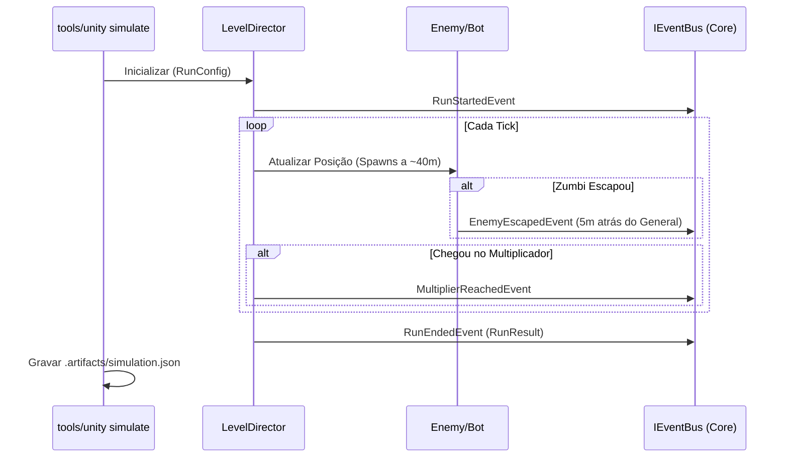

# Plano de Implementação: M7 · Level Director, simulador headless e pista de multiplicador
> Data: 2026-10-02
> Issue: NEX-512
> Status: Pronto para Execução via /executar

## 1. Contexto & Arquitetura
- **Resumo**: Transição do level design estático para fases orientadas a dados (LevelDirector), introdução de pipeline de validação/simulação headless e mecânica de pista multiplicadora (pagamento em tropas) ao fim das runs.
- **Stack**: Unity, C#, JSON (Conteúdo), Bash/PowerShell (Harness `tools/unity`).
- **Verificação disponível**: Suíte automatizada confiável. O projeto usa TDD e testes no Edit/Play mode.

## 2. Armadilhas do Repositório
| Armadilha | Onde morde (arquivo/passo) | Regra a respeitar |
|---|---|---|
| Nenhuma identificada | Geral | Todo número de combate vive em dados; nenhum valor de balanceamento fica fixo em SceneBuilder ou MonoBehaviour. |

## 3. Árvore de Arquivos
- [NOVO] `Assets/_Game/Scripts/Core/State/RunConfig.cs`
- [NOVO] `Assets/_Game/Scripts/Core/State/RunResult.cs`
- [NOVO] `Assets/_Game/Scripts/Core/Events/RunStartedEvent.cs`
- [NOVO] `Assets/_Game/Scripts/Core/Events/EnemyEscapedEvent.cs`
- [NOVO] `Assets/_Game/Scripts/Core/Events/RunEndedEvent.cs`
- [NOVO] `Assets/_Game/Scripts/Core/Events/MultiplierReachedEvent.cs`
- [MODIFICADO] `Assets/_Game/Scripts/Core/Events/EnemyKilledEvent.cs`
- [NOVO] `Assets/_Game/Scripts/Data/LevelDefinition.cs`
- [NOVO] `Assets/_Game/Scripts/Data/SegmentDefinition.cs`
- [NOVO] `Content/Source/Levels/level_01.json`
- [NOVO] `Assets/_Game/Scripts/Editor/LevelImporter.cs`
- [NOVO] `Assets/_Game/Scripts/Gameplay/LevelDirector.cs`
- [NOVO] `Assets/_Game/Scripts/Gameplay/MultiplierLane.cs`
- [NOVO] `Assets/_Game/Scripts/Editor/Tools/ValidateCommand.cs`
- [NOVO] `Assets/_Game/Scripts/Editor/Tools/SimulateCommand.cs`
- [MODIFICADO] `tools/unity`
- [NOVO] `Assets/_Game/Scripts/Tests/EditMode/LevelDirectorTests.cs`
- [NOVO] `Assets/_Game/Scripts/Tests/EditMode/SimulatorTests.cs`

## 4. Contratos e Interfaces

```csharp
namespace Game.Core.State
{
    public class RunConfig
    {
        public string LevelId;
        public int InitialTroops;
        // Boosts, mutações...
    }

    public class RunResult
    {
        public string LevelId;
        public bool Victory;
        public float Distance;
        public int SquadAtEnd;
        public int MultiplierReached;
        public Dictionary<string, int> KillsByArchetype;
        public int Rescued;
        public int CoinsEarned;
        public List<string> MutationIds;
        public float DurationSeconds;
    }
}
```

## 4.5 Linear overlay
- **História (issue-pai):** NEX-512
- **Sub-issues deste plano:** 
  - Marco 0: Suíte de Cenários & Contratos de Level Director e Simulador [NEX-512-M0] (Priority: High)
  - Marco 1: RunConfig, RunResult e Sinais de Core [NEX-512-M1] (Priority: High)
  - Marco 2: LevelDefinition, SegmentDefinition e Importador JSON [NEX-512-M2] (Priority: High)
  - Marco 3: Pista de Multiplicador x1..x5 [NEX-512-M3] (Priority: High)
  - Marco 4: LevelDirector e Validador headless [NEX-512-M4] (Priority: High)
  - Marco 5: Simulador headless [NEX-512-M5] (Priority: High)
- **PRs (modelo C):** Draft PR → `main`. Tarefas ramificam de `jamilzerati/nex-512-story-m7-level-director-simulador-headless-e-pista-de`.

## 5. Divisão de Execução por Passo
| Faixa | Passos | Por quê |
|---|---|---|
| **Modelo forte, obrigatório** | 1, 2, 3, 4, 5 | Mexe em balanceamento (multiplicador, spawns, regras do bot fujão/guloso, validador de overlap) onde erros são lógicos e silenciosos. |
| **Mecânico, qualquer modelo** | 0 | Apenas scaffold de suíte Red sem regras ativas afetando o app real. |

## 6. Checklist de Execução

- [ ] **Passo 0 (Marco 0)**: `Suíte de Cenários & Contratos` [NEX-512-M0]
  - **Ação**: Criar cenários de teste Red (EditMode).
  - **Lógica de Negócios / Responsabilidade**: Definir contratos de Seams públicos. Criar as estruturas vazias e testes cobrindo o validador de lane, bots de simulador, pista de multiplicador e LevelDirector.
  - **Seam Público**: Testes na assembly Game.Editor e Game.Gameplay.
  - **Marco de PR**: Marco 0
  - **Runtime**: hard

- [ ] **Passo 1 (Marco 1)**: `Core: Config, Result e Sinais` [NEX-512-M1]
  - **Ação**: Criar/Modificar classes em Game.Core
  - **Lógica de Negócios / Responsabilidade**: Implementar `RunConfig`, `RunResult` e os eventos necessários (RunStartedEvent, RunEndedEvent, EnemyEscapedEvent, etc).
  - **Seam Público**: `IEventBus`
  - **Marco de PR**: Marco 1
  - **Runtime**: hard

- [ ] **Passo 2 (Marco 2)**: `Data: Definitions e Importer` [NEX-512-M2]
  - **Ação**: Criar ScriptableObjects e importador JSON.
  - **Lógica de Negócios / Responsabilidade**: `LevelDefinition`, `SegmentDefinition` e parseamento a partir de `Content/Source/Levels/level_01.json`.
  - **Seam Público**: `LevelImporter`
  - **Marco de PR**: Marco 2
  - **Runtime**: hard

- [ ] **Passo 3 (Marco 3)**: `Gameplay: Pista de Multiplicador` [NEX-512-M3]
  - **Ação**: Criar componente de pista
  - **Lógica de Negócios / Responsabilidade**: A cada 15m, marcos x1 a x5 exigem e consomem soldados.
  - **Seam Público**: `MultiplierLane`
  - **Marco de PR**: Marco 3
  - **Runtime**: hard

- [ ] **Passo 4 (Marco 4)**: `Gameplay/Editor: LevelDirector e Validador` [NEX-512-M4]
  - **Ação**: Criar `LevelDirector` e script de CLI `ValidateCommand`.
  - **Lógica de Negócios / Responsabilidade**: O diretor lê os eventos por distância. O validador rejeita fase com lane vazia em segmento de horda (sobreposição mínima de 8m).
  - **Seam Público**: `LevelDirector`, `ValidateCommand`
  - **Marco de PR**: Marco 4
  - **Runtime**: hard

- [ ] **Passo 5 (Marco 5)**: `Editor: Simulador headless` [NEX-512-M5]
  - **Ação**: Modificar shell e criar `SimulateCommand`.
  - **Lógica de Negócios / Responsabilidade**: Roda com `-level <id> -seed <n>`. Roda "bot guloso" e "bot fujão" e cospe `.artifacts/simulation.json`. Regra: bot fujão vence <= 20% das fases comuns.
  - **Seam Público**: `SimulateCommand` (CLI entry point)
  - **Marco de PR**: Marco 5
  - **Runtime**: hard

## Diagrama de Fluxo (Level Director & Simulador)


