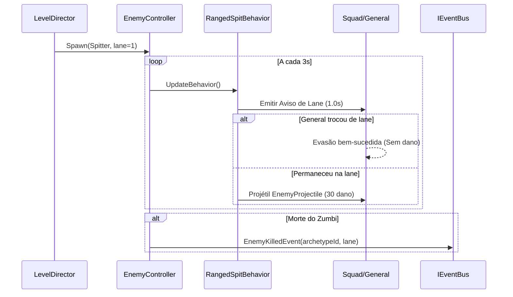

# Plano de Implementação: M10 · Inimigos por dados (arquétipos, cuspe com aviso e Xamã)
> Data: 2026-10-02
> Issue: NEX-515
> Status: Pronto para Execução via /conduzir

## 1. Contexto & Arquitetura
- **Resumo**: Implementar `EnemyDefinition` orientada a dados (JSON → SO), os 7 arquétipos de zumbis da M10 (Andarilho, Corredor, Brutamontes, Explosivo, Cuspidor, Escudeiro, Xamã) com comportamentos desacoplados via `[SerializeReference]` (`IEnemyBehavior`), aviso e evasão de cuspe na lane, física em `EnemyProjectile`, escala de vida por fase e integração com o simulador headless.
- **Stack**: Unity, C#, ScriptableObjects, JSON (`Content/Source/Enemies/`), Harness `tools/unity`.
- **Verificação**: TDD com pirâmide de testes EditMode e PlayMode via harness CLI (`tools/unity`).

## 2. Armadilhas do Repositório & Regras Críticas
| Armadilha | Onde morde | Regra a respeitar |
|---|---|---|
| Comentários narrativos | Qualquer arquivo C# | PROIBIDO comentários que explicam o que o código faz. Apenas o "porquê" de invariantes de negócio. |
| Diffs grandes (> 300 linhas) | PRs | Cada Marco deve ser uma fatia cirúrgica estrita de até 300 linhas de código alterado. |
| Ruído de regeneração Unity | `Assets/_Game/Data/Perks/` e `Scenes/` | Reverter com `git checkout -- Assets/...` antes de commitar qualquer PR. |
| Dependência de asmdef | `Game.Core`, `Game.Data`, `Game.Gameplay` | `Game.Data` e `Game.Core` não referenciam `Game.Gameplay`. Comportamentos puros vivem em `Game.Core`/`Game.Data` ou orquestrados em `Game.Gameplay`. |
| Assinaturas `[MenuItem]` | `Game.Editor` | Devem ser `public static void` sem parâmetros adicionais. |
| Memory leaks em EditMode | Testes com GameObjects | Todo teste que instancia GameObjects deve destruí-los com `Object.DestroyImmediate` em `[TearDown]`. |

## 3. Árvore de Arquivos
- [NOVO] `Assets/_Game/Scripts/Data/Enemies/EnemyDefinition.cs`
- [NOVO] `Assets/_Game/Scripts/Data/Enemies/EnemyCatalog.cs`
- [NOVO] `Assets/_Game/Scripts/Data/Enemies/IEnemyBehavior.cs`
- [NOVO] `Assets/_Game/Scripts/Data/Enemies/Behaviors/MoveStraightBehavior.cs`
- [NOVO] `Assets/_Game/Scripts/Data/Enemies/Behaviors/ChaseLaneBehavior.cs`
- [NOVO] `Assets/_Game/Scripts/Data/Enemies/Behaviors/StopAtBehavior.cs`
- [NOVO] `Assets/_Game/Scripts/Data/Enemies/Behaviors/FrontShieldBehavior.cs`
- [NOVO] `Assets/_Game/Scripts/Data/Enemies/Behaviors/ExplodeOnContactBehavior.cs`
- [NOVO] `Assets/_Game/Scripts/Data/Enemies/Behaviors/ExplodeOnDeathBehavior.cs`
- [NOVO] `Assets/_Game/Scripts/Data/Enemies/Behaviors/RangedSpitBehavior.cs`
- [NOVO] `Assets/_Game/Scripts/Data/Enemies/Behaviors/HealAuraBehavior.cs`
- [NOVO] `Assets/_Game/Scripts/Data/Enemies/Behaviors/ResurrectBehavior.cs`
- [NOVO] `Assets/_Game/Scripts/Editor/EnemyImporter.cs`
- [NOVO] `Content/Source/Enemies/walker.json`
- [NOVO] `Content/Source/Enemies/runner.json`
- [NOVO] `Content/Source/Enemies/brute.json`
- [NOVO] `Content/Source/Enemies/exploder.json`
- [NOVO] `Content/Source/Enemies/spitter.json`
- [NOVO] `Content/Source/Enemies/shielded.json`
- [NOVO] `Content/Source/Enemies/shaman.json`
- [MODIFICADO] `Assets/_Game/Scripts/Gameplay/Enemies/EnemyController.cs`
- [MODIFICADO] `Assets/_Game/Scripts/Editor/Cli.cs`
- [MODIFICADO] `Assets/_Game/Scripts/Editor/Tools/SimulateCommand.cs`
- [NOVO] `Assets/_Game/Scripts/Tests/EditMode/EnemyBehaviorTests.cs`
- [NOVO] `Assets/_Game/Scripts/Tests/EditMode/EnemyImporterTests.cs`

## 4. Arquitetura & Contratos

```csharp
namespace Game.Data
{
    public interface IEnemyBehavior
    {
        void UpdateBehavior(EnemyController enemy, EnemyBehaviorContext context, float deltaTime);
        void OnHit(EnemyController enemy, ref DamageInfo hit);
        void OnEngage(EnemyController enemy);
        void OnDeath(EnemyController enemy);
    }

    [CreateAssetMenu(menuName = "Game/Data/Enemy Definition", fileName = "EnemyDefinition")]
    public class EnemyDefinition : ScriptableObject
    {
        public string Id;
        public int BaseHp;
        public float Speed;
        public float ContactDps;
        public int CoinValue;
        [SerializeReference] public IEnemyBehavior[] Behaviors;
    }
}
```

## 5. Divisão de Execução por Marco
| Faixa | Marcos | Por quê |
|---|---|---|
| **Modelo forte (hard)** | 0, 1, 2, 3, 4, 5 | Lógica de física de projéteis, balanceamento de vida/dano, comportamentos de IA e validação de simulador determinístico. |

## 6. Checklist de Execução

- [x] **Passo 0 (Marco 0)**: `Suíte de Cenários & Contratos de Inimigos por Dados` [NEX-751]
  - **Ação**: Criar stubs de contratos (`EnemyDefinition`, `IEnemyBehavior`, comportamentos) e testes EditMode Red.
  - **Seam Público**: `Game.Data.EnemyDefinition`, `Game.Data.IEnemyBehavior`.
  - **Marco de PR**: Marco 0
  - **Runtime**: hard

- [x] **Passo 1 (Marco 1)**: `Data & Importer: Definições e Arquivos JSON dos 7 Arquétipos` [NEX-752]
  - **Ação**: Implementar `EnemyDefinition`, `EnemyCatalog`, os 7 JSONs canônicos em `Content/Source/Enemies/` e `EnemyImporter`.
  - **Seam Público**: `EnemyImporter`, `EnemyCatalog`.
  - **Marco de PR**: Marco 1
  - **Runtime**: hard

- [x] **Passo 2 (Marco 2)**: `Gameplay: Comportamentos de Movimentação e Perseguição` [NEX-754]
  - **Ação**: Implementar `MoveStraightBehavior`, `ChaseLaneBehavior` (Corredor persegue lane do General após 1s), `StopAtBehavior`.
  - **Seam Público**: `MoveStraightBehavior`, `ChaseLaneBehavior`, `StopAtBehavior`.
  - **Marco de PR**: Marco 2
  - **Runtime**: hard

- [x] **Passo 3 (Marco 3)**: `Gameplay: Comportamentos Defensivos e Reativos` [NEX-755]
  - **Ação**: Implementar `FrontShieldBehavior` (bloqueia tiros retos até receber status/área), `ExplodeOnContactBehavior` e `ExplodeOnDeathBehavior`.
  - **Seam Público**: `FrontShieldBehavior`, `ExplodeOnContactBehavior`, `ExplodeOnDeathBehavior`.
  - **Marco de PR**: Marco 3
  - **Runtime**: hard

- [x] **Passo 4 (Marco 4)**: `Gameplay: Ataque à Distância e Suporte (Cuspidor e Xamã)` [NEX-756]
  - **Ação**: Implementar `RangedSpitBehavior` (aviso 1.0s na lane, projétil `EnemyProjectile`), `HealAuraBehavior` (5 HP/s raio 4m) e `ResurrectBehavior` (1 Andarilho a cada 6s).
  - **Seam Público**: `RangedSpitBehavior`, `HealAuraBehavior`, `ResurrectBehavior`.
  - **Marco de PR**: Marco 4
  - **Runtime**: hard

- [x] **Passo 5 (Marco 5)**: `Simulador & Escala: Integração e Escala de Vida por Fase` [NEX-757]
  - **Ação**: Aplicar escala `hp * (1 + 0.08 * (fase - 1))`, integrar os 7 arquétipos no `SimulateCommand` headless e validar taxas de vitória.
  - **Seam Público**: `SimulateCommand`, `LevelDefinition`.
  - **Marco de PR**: Marco 5
  - **Runtime**: hard

## 7. Diagrama de Sequência (Comportamentos e Cuspe com Aviso)


