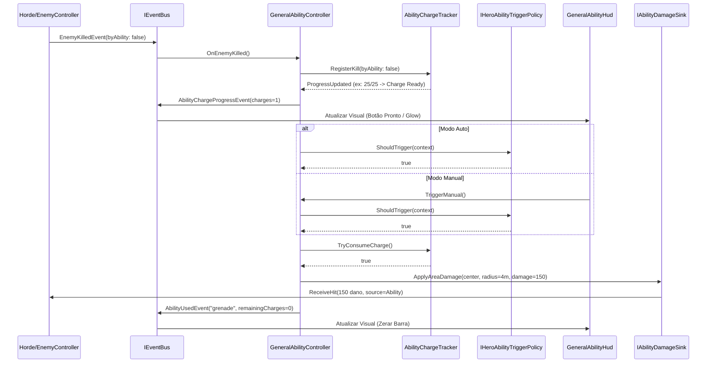

# Plano de Implementação: M16 · Poder do General (Granada e Disparo Auto/Manual)
> Data: 2026-10-02
> Issue: NEX-651
> Status: Cenários validados — Suíte Red comprovada em 2026-10-02

## 1. Contexto & Arquitetura
- **Resumo**: Implementar a habilidade ativa do General (`GeneralAbilityDefinition`) orientada a dados (JSON → SO), introduzindo a Granada (150 de dano, raio de 4 m na lane atual) carregada por 25 abates de zumbis. O disparo suporta os modos Automático e Manual via `IHeroAbilityTriggerPolicy` com toggle persistido, HUD de acompanhamento de carga e disparo manual, evento `AbilityUsedEvent` publicado no barramento, e suporte a carga bônus por rewarded ad (`RunConfig.BonusAbilityCharges`).
- **Stack**: Unity 6, C#, ScriptableObjects (`[SerializeReference]`), JSON (`Content/Source/Abilities/`), Harness CLI (`tools/unity`).
- **Verificação disponível**: Suíte automatizada confiável (test-edit com 528+ testes EditMode, test-play, compile, validate via harness CLI `tools/unity`).

## 2. Armadilhas do Repositório & Regras Críticas
| Armadilha | Onde morde (arquivo/passo) | Regra a respeitar |
|---|---|---|
| Auto-recarga infinita de granada | `AbilityChargeTracker.cs` / `EnemyController.cs` — Passo 1 e 3 | Abates provocados pela própria habilidade (`byAbility == true`) NUNCA devem contar para recarregar a habilidade. Caso contrário, detonar uma granada numa horda de 25+ zumbis causaria recarga instantânea contínua. |
| Colisão e Rigidbody de projéteis e explosão | `GeneralAbilityController.cs` — Passo 3 | Projéteis e detonadores de habilidade devem estar na camada física correta (`PlayerProjectile` ou dano via máscara `EnemyMask`), ter Rigidbody cinemático próprio e NUNCA ser filhos hierárquicos do General (evita bugs de escala e física do GH #47). |
| Destruição em testes EditMode | Testes EditMode — Passos 0 a 4 | Todo teste que instancia GameObjects deve destruí-los com `UnityEngine.Object.DestroyImmediate` no `[TearDown]` para evitar memory leak em EditMode. |
| Ordem no importador de conteúdo | `Cli.cs` / `AbilityImporter.cs` — Passo 2 | No método `Cli.ImportContent()`, habilidades devem ser importadas respeitando a independência de catálogos e reportando erros em lista de falhas. |
| Diffs cirúrgicos | Todos os PRs | Cada Marco deve ser uma fatia cirúrgica estrita de até 300 linhas de código alterado. |
| Comentários narrativos proibidos | Todos os arquivos C# | PROIBIDO comentários que narram o que a linha seguinte faz. Apenas o "porquê" de invariantes de negócio não óbvias. |

## 3. Árvore de Arquivos
- [NOVO] `Assets/_Game/Scripts/Core/Abilities/IAbilityEffect.cs`
- [NOVO] `Assets/_Game/Scripts/Core/Abilities/AbilityExecutionContext.cs`
- [NOVO] `Assets/_Game/Scripts/Core/Abilities/IAbilityDamageSink.cs`
- [NOVO] `Assets/_Game/Scripts/Core/Abilities/IHeroAbilityTriggerPolicy.cs`
- [NOVO] `Assets/_Game/Scripts/Core/Abilities/HeroAbilityTriggerMode.cs`
- [NOVO] `Assets/_Game/Scripts/Core/Abilities/AbilityTriggerContext.cs`
- [NOVO] `Assets/_Game/Scripts/Core/Abilities/AbilityChargeTracker.cs`
- [NOVO] `Assets/_Game/Scripts/Core/Abilities/Effects/GrenadeAbilityEffect.cs`
- [NOVO] `Assets/_Game/Scripts/Core/Events/AbilityUsedEvent.cs`
- [NOVO] `Assets/_Game/Scripts/Core/Events/AbilityChargeProgressEvent.cs`
- [NOVO] `Assets/_Game/Scripts/Data/Abilities/GeneralAbilityDefinition.cs`
- [NOVO] `Assets/_Game/Scripts/Data/Abilities/AbilityCatalog.cs`
- [NOVO] `Content/Source/Abilities/grenade.json`
- [NOVO] `Assets/_Game/Scripts/Editor/AbilityImporter.cs`
- [NOVO] `Assets/_Game/Scripts/Gameplay/Abilities/GeneralAbilityController.cs`
- [NOVO] `Assets/_Game/Scripts/Presentation/GeneralAbilityHud.cs`
- [NOVO] `Assets/_Game/Scripts/Presentation/IAbilitySettings.cs`
- [NOVO] `Assets/_Game/Scripts/Presentation/PlayerPrefsAbilitySettings.cs`
- [NOVO] `Assets/_Game/Scripts/Tests/EditMode/GeneralAbilityCoreTests.cs`
- [NOVO] `Assets/_Game/Scripts/Tests/EditMode/AbilityImporterTests.cs`
- [NOVO] `Assets/_Game/Scripts/Tests/EditMode/GeneralAbilityGameplayTests.cs`
- [NOVO] `Assets/_Game/Scripts/Tests/PlayMode/GeneralAbilityPlayModeTests.cs`
- [MODIFICADO] `Assets/_Game/Scripts/Core/State/RunConfig.cs`
- [MODIFICADO] `Assets/_Game/Scripts/Gameplay/Enemies/EnemyController.cs`
- [MODIFICADO] `Assets/_Game/Scripts/Editor/Cli.cs`
- [MODIFICADO] `Assets/_Game/Scripts/Editor/SceneBuilder.cs`
- [MODIFICADO] `Assets/_Game/Scripts/Editor/Tools/SimulateCommand.cs`
- [MODIFICADO] `Assets/_Game/Scripts/Editor/Tools/ValidateCommand.cs`

## 4. Contratos e Interfaces

```csharp
namespace Game.Core.Abilities
{
    public enum HeroAbilityTriggerMode
    {
        Manual = 0,
        Auto = 1
    }

    public readonly struct AbilityTriggerContext
    {
        public int CurrentCharges { get; }
        public bool HasTargetsInLane { get; }
        public bool ManualTriggerRequested { get; }

        public AbilityTriggerContext(int currentCharges, bool hasTargetsInLane, bool manualTriggerRequested)
        {
            CurrentCharges = currentCharges;
            HasTargetsInLane = hasTargetsInLane;
            ManualTriggerRequested = manualTriggerRequested;
        }
    }

    public interface IHeroAbilityTriggerPolicy
    {
        HeroAbilityTriggerMode Mode { get; }
        bool ShouldTrigger(in AbilityTriggerContext context);
    }

    public interface IAbilityDamageSink
    {
        int ApplyAreaDamage(UnityEngine.Vector3 center, float radius, int damage, DamageType type = DamageType.Area, object source = null);
    }

    public class AbilityExecutionContext
    {
        public UnityEngine.Vector3 OriginPosition { get; set; }
        public int TargetLane { get; set; }
        public IAbilityDamageSink DamageSink { get; set; }
        public IEventBus EventBus { get; set; }
    }

    public interface IAbilityEffect
    {
        string Description { get; }
        void Execute(AbilityExecutionContext context);
    }
}
```

```csharp
namespace Game.Core.Events
{
    public readonly struct AbilityUsedEvent
    {
        public string AbilityId { get; }
        public int RemainingCharges { get; }

        public AbilityUsedEvent(string abilityId, int remainingCharges)
        {
            AbilityId = abilityId;
            RemainingCharges = remainingCharges;
        }
    }

    public readonly struct AbilityChargeProgressEvent
    {
        public string AbilityId { get; }
        public int CurrentKills { get; }
        public int TargetKills { get; }
        public int CurrentCharges { get; }

        public AbilityChargeProgressEvent(string abilityId, int currentKills, int targetKills, int currentCharges)
        {
            AbilityId = abilityId;
            CurrentKills = currentKills;
            TargetKills = targetKills;
            CurrentCharges = currentCharges;
        }
    }
}
```

## 4.5 Linear overlay
- **História (issue-pai):** `NEX-651`
- **Sub-issues deste plano:**
  - `NEX-760`: Marco 0: Suíte de Cenários & Contratos do Poder do General [NEX-651] (priority: High)
  - `NEX-761`: Marco 1: Modelo Puro de Carga, Políticas de Disparo e Efeito Granada [NEX-651] (priority: High)
  - `NEX-762`: Marco 2: Definições de Dados, Catálogo, JSON da Granada e Importer [NEX-651] (priority: High)
  - `NEX-763`: Marco 3: Gameplay: GeneralAbilityController e Emissão de EnemyKilledEvent [NEX-651] (priority: High)
  - `NEX-764`: Marco 4: HUD de Carga, Toggle Auto/Manual e Integração SceneBuilder [NEX-651] (priority: High)
  - `NEX-765`: Marco 5: Simulador Headless e Validação de Conteúdo [NEX-651] (priority: High)
- **PRs (modelo C):** história = `jamilzerati/nex-651-story-m16-poder-do-general`; draft PR → `main`. Cada tarefa ramifica da branch da história e abre PR para a branch da história.

## 5. Divisão de Execução por Passo
| Faixa | Passos | Por quê |
|---|---|---|
| **Modelo forte, obrigatório** | 0, 1, 2, 3, 4, 5 | Cálculos de abates e limiares de recarga (25), descarte estrito de mortes por habilidade (`byAbility`), precedência de disparo automático versus solicitação manual, raio e decaimento de área (4 m, 150 dano), desserialização polimórfica `[SerializeReference]` e sincronização de simulação determinística headless. |

## 6. Checklist de Execução

- [x] **Passo 0 (Marco 0)**: `Suíte de Cenários & Contratos do Poder do General` [NEX-760]
  - **Ação**: Criar stubs de contratos (`IAbilityEffect`, `IHeroAbilityTriggerPolicy`, `AbilityTriggerContext`, `AbilityExecutionContext`, `IAbilityDamageSink`), eventos `AbilityUsedEvent` e `AbilityChargeProgressEvent`, e testes Red comportamentais em `GeneralAbilityCoreTests.cs`.
  - **Lógica de Negócios / Responsabilidade**: Fixar as interfaces puras de domínio em `Game.Core`, assegurando que o sistema de habilidade não dependa de UnityEngine e seja completamente testável em EditMode.
  - **Dependências / Pré-requisitos**: Nenhum.
  - **Seam Público**: `Game.Core.Abilities.IAbilityEffect`, `Game.Core.Abilities.IHeroAbilityTriggerPolicy`, `Game.Core.Events.AbilityUsedEvent`.
  - **Marco de PR**: Marco 0 + `NEX-760`
  - **Runtime**: hard

- [x] **Passo 1 (Marco 1)**: `Modelo Puro de Carga, Políticas de Disparo e Efeito Granada` [NEX-761]
  - **Ação**: Implementar `AbilityChargeTracker` (25 abates por carga, suporte a carga bônus/rewarded, ignora abates de habilidade), `AutoHeroAbilityTriggerPolicy`, `ManualHeroAbilityTriggerPolicy` e `GrenadeAbilityEffect` (150 dano, raio 4 m, lane atual) em `Game.Core.Abilities`.
  - **Lógica de Negócios / Responsabilidade**: Gerenciar contadores de abates de forma determinística e encapsulada; calcular condições de disparo nos modos Auto e Manual; executar o efeito da granada chamando `IAbilityDamageSink.ApplyAreaDamage`. Implementar a armadilha de recarga infinita (ignorar `byAbility == true`).
  - **Dependências / Pré-requisitos**: Passo 0 (`NEX-760`).
  - **Seam Público**: `Game.Core.Abilities.AbilityChargeTracker`, `Game.Core.Abilities.Effects.GrenadeAbilityEffect`.
  - **Marco de PR**: Marco 1 + `NEX-761`
  - **Runtime**: hard

- [x] **Passo 2 (Marco 2)**: `Definições de Dados, Catálogo, JSON da Granada e Importer` [NEX-762]
  - **Ação**: Implementar `GeneralAbilityDefinition` e `AbilityCatalog` (ScriptableObjects com `[SerializeReference]`), criar `Content/Source/Abilities/grenade.json`, implementar `AbilityImporter` no `Game.Editor` com gancho em `Cli.ImportContent()`, e cobrir com testes em `AbilityImporterTests.cs`.
  - **Lógica de Negócios / Responsabilidade**: Autorar o dado canônico da Granada fora do código; converter JSON em SO gerado; alimentar o pipeline CLI `tools/unity import-content`.
  - **Dependências / Pré-requisitos**: Passo 1 (`NEX-761`).
  - **Seam Público**: `Game.Data.GeneralAbilityDefinition`, `Game.Editor.AbilityImporter`.
  - **Marco de PR**: Marco 2 + `NEX-762`
  - **Runtime**: hard

- [x] **Passo 3 (Marco 3)**: `Gameplay: GeneralAbilityController e Emissão de EnemyKilledEvent` [NEX-763]
  - **Ação**: Garantir emissão de `EnemyKilledEvent` com flag `byAbility` no ciclo de morte de `EnemyController`. Criar `GeneralAbilityController` em `Game.Gameplay` (subscrição a `EnemyKilledEvent`, avanço do tracker, disparo Auto/Manual, despacho da granada via física/camada `CollisionLayers.EnemyMask` e publicação de `AbilityUsedEvent`). Cobrir com testes em `GeneralAbilityGameplayTests.cs` e `GeneralAbilityPlayModeTests.cs`.
  - **Lógica de Negócios / Responsabilidade**: Conectar o domínio de combate ao ciclo de vida da cena; encontrar inimigos no raio de 4 m na lane alvo e causar 150 de dano com `DamageType.Area`; propagar cargas extras vindas de `RunConfig.BonusAbilityCharges`.
  - **Dependências / Pré-requisitos**: Passo 2 (`NEX-762`).
  - **Seam Público**: `Game.Gameplay.GeneralAbilityController`, `Game.Gameplay.EnemyController`.
  - **Marco de PR**: Marco 3 + `NEX-763`
  - **Runtime**: hard

- [x] **Passo 4 (Marco 4)**: `HUD de Carga, Toggle Auto/Manual e Integração SceneBuilder` [NEX-764]
  - **Ação**: Criar `[TELA]` `GeneralAbilityHud` em `Game.Presentation` (barra/preenchimento de progresso 0..25, indicador numérico de cargas, botão manual com feedback quando pronto, indicador/toggle de modo Auto/Manual), persistência de preferência via `IAbilitySettings` (`PlayerPrefsAbilitySettings`) e montar fiação na cena M6 via `SceneBuilder`.
  - **Lógica de Negócios / Responsabilidade**: Apresentar ao jogador o estado da habilidade; viabilizar acionamento manual por toque/clique e seleção de modo de disparo; atualizar `SceneBuilder` para instanciar o HUD e o controller sem necessidade de edição manual de cena.
  - **Dependências / Pré-requisitos**: Passo 3 (`NEX-763`).
  - **Seam Público**: `Game.Presentation.GeneralAbilityHud`, `Game.Editor.SceneBuilder`.
  - **Marco de PR**: Marco 4 + `NEX-764`
  - **Runtime**: hard

- [x] **Passo 5 (Marco 5)**: `Simulador Headless e Validação de Conteúdo` [NEX-765]
  - **Ação**: Integrar a execução da habilidade no simulador headless `SimulateCommand` (bot ativa Granada ao acumular 25 abates, eliminando zumbis na lane) e adicionar validação de integridade de dados de habilidades no `ValidateCommand`.
  - **Lógica de Negócios / Responsabilidade**: Permitir que simulações determinísticas de balanceamento reflitam o impacto do poder do General nas taxas de vitória; validar integridade de ScriptableObjects de habilidades em `tools/unity validate`.
  - **Dependências / Pré-requisitos**: Passo 4 (`NEX-764`).
  - **Seam Público**: `Game.Editor.Tools.SimulateCommand`, `Game.Editor.Tools.ValidateCommand`.
  - **Marco de PR**: Marco 5 + `NEX-765`
  - **Runtime**: hard

## 7. Diagrama de Sequência (Ciclo do Poder do General)



## Grafo de Execução (workflow-graph/v1)

```workflow-graph/v1
{
  "version": "workflow-graph/v1",
  "story": "NEX-651",
  "revision": "1",
  "approved": true,
  "approvalEvidence": "docs/planos/2026-10-02-NEX-651-poder-do-general-granada-e-disparo-auto-manual.md",
  "repo": "D:/Projects/game/ZumbiRunner",
  "githubRepo": "JamilZerati/ZumbiRunner",
  "target": "jamilzerati/nex-651-story-m16-poder-do-general",
  "priority": 2,
  "tasks": [
    { "id": "NEX-760", "marco": 1, "cwd": "D:/Projects/worktrees/ZumbiRunner/nex-760", "branch": "jamilzerati/nex-760-marco-0-suite-de-cenarios-contratos-do-poder-do-general-nex", "files": [], "resources": ["unity:ZumbiRunner"], "dependsOn": [], "gates": [{ "id": "unity-test-edit", "command": ["powershell", "-NoProfile", "-ExecutionPolicy", "Bypass", "-File", "tools/unity.ps1", "test-edit"] }] },
    { "id": "NEX-761", "marco": 2, "cwd": "D:/Projects/worktrees/ZumbiRunner/nex-761", "branch": "jamilzerati/nex-761-marco-1-modelo-puro-de-carga-politicas-de-disparo-e-efeito", "files": [], "resources": ["unity:ZumbiRunner"], "dependsOn": [{ "task": "NEX-760", "type": "implementation" }], "gates": [{ "id": "unity-test-edit", "command": ["powershell", "-NoProfile", "-ExecutionPolicy", "Bypass", "-File", "tools/unity.ps1", "test-edit"] }] },
    { "id": "NEX-762", "marco": 3, "cwd": "D:/Projects/worktrees/ZumbiRunner/nex-762", "branch": "jamilzerati/nex-762-marco-2-definicoes-de-dados-catalogo-json-da-granada-e", "files": [], "resources": ["unity:ZumbiRunner"], "dependsOn": [{ "task": "NEX-761", "type": "implementation" }], "gates": [{ "id": "unity-test-edit", "command": ["powershell", "-NoProfile", "-ExecutionPolicy", "Bypass", "-File", "tools/unity.ps1", "test-edit"] }] },
    { "id": "NEX-763", "marco": 4, "cwd": "D:/Projects/worktrees/ZumbiRunner/nex-763", "branch": "jamilzerati/nex-763-marco-3-gameplay-generalabilitycontroller-e-emissao-de", "files": [], "resources": ["unity:ZumbiRunner"], "dependsOn": [{ "task": "NEX-762", "type": "implementation" }], "gates": [{ "id": "unity-test-edit", "command": ["powershell", "-NoProfile", "-ExecutionPolicy", "Bypass", "-File", "tools/unity.ps1", "test-edit"] }] },
    { "id": "NEX-764", "marco": 5, "cwd": "D:/Projects/worktrees/ZumbiRunner/nex-764", "branch": "jamilzerati/nex-764-marco-4-hud-de-carga-toggle-automanual-e-integracao", "files": [], "resources": ["unity:ZumbiRunner"], "dependsOn": [{ "task": "NEX-763", "type": "implementation" }], "gates": [{ "id": "unity-test-edit", "command": ["powershell", "-NoProfile", "-ExecutionPolicy", "Bypass", "-File", "tools/unity.ps1", "test-edit"] }] },
    { "id": "NEX-765", "marco": 6, "cwd": "D:/Projects/worktrees/ZumbiRunner/nex-765", "branch": "jamilzerati/nex-765-marco-5-simulador-headless-e-validacao-de-conteudo-nex-651", "files": [], "resources": ["unity:ZumbiRunner"], "dependsOn": [{ "task": "NEX-764", "type": "implementation" }], "gates": [{ "id": "unity-test-edit", "command": ["powershell", "-NoProfile", "-ExecutionPolicy", "Bypass", "-File", "tools/unity.ps1", "test-edit"] }] },
    { "id": "NEX-779", "marco": 7, "cwd": "D:/Projects/worktrees/ZumbiRunner/nex-779", "branch": "jamilzerati/nex-779-gh-84-poder-do-general-nunca-carrega-em-play-mode-nenhum", "files": [], "resources": ["unity:ZumbiRunner"], "dependsOn": [{ "task": "NEX-765", "type": "implementation" }], "gates": [{ "id": "unity-test-play", "command": ["powershell", "-NoProfile", "-ExecutionPolicy", "Bypass", "-File", "tools/unity.ps1", "test-play"] }] },
    { "id": "NEX-778", "marco": 8, "cwd": "D:/Projects/worktrees/ZumbiRunner/nex-778", "branch": "jamilzerati/nex-778-assets-da-granada-icone-hud-sfx-de-explosao-e-evidencia", "files": [], "resources": ["unity:ZumbiRunner"], "dependsOn": [{ "task": "NEX-779", "type": "implementation" }], "gates": [{ "id": "unity-test-edit", "command": ["powershell", "-NoProfile", "-ExecutionPolicy", "Bypass", "-File", "tools/unity.ps1", "test-edit"] }] },
    { "id": "NEX-780", "marco": 9, "cwd": "D:/Projects/worktrees/ZumbiRunner/nex-780", "branch": "jamilzerati/nex-780-gh-86-botoes-do-hud-nao-respondem-a-toque-cenas-de-combate", "files": [], "resources": ["unity:ZumbiRunner"], "dependsOn": [{ "task": "NEX-778", "type": "implementation" }], "gates": [{ "id": "unity-test-play", "command": ["powershell", "-NoProfile", "-ExecutionPolicy", "Bypass", "-File", "tools/unity.ps1", "test-play"] }] },
    { "id": "NEX-879", "marco": 10, "cwd": "D:/Projects/worktrees/ZumbiRunner/nex-879", "branch": "jamilzerati/nex-879-arremesso-dinamico-da-granada-mira-e-alcance-arraste-no-hud", "files": [], "resources": ["unity:ZumbiRunner"], "dependsOn": [{ "task": "NEX-780", "type": "implementation" }], "gates": [{ "id": "unity-test-edit", "command": ["powershell", "-NoProfile", "-ExecutionPolicy", "Bypass", "-File", "tools/unity.ps1", "test-edit"] }] },
    { "id": "NEX-781", "marco": 11, "cwd": "D:/Projects/worktrees/ZumbiRunner/nex-781", "branch": "jamilzerati/nex-781-overlay-de-debug-em-texto-tropa-arma-elementos-perks-e", "files": [], "resources": ["unity:ZumbiRunner"], "dependsOn": [{ "task": "NEX-879", "type": "implementation" }], "gates": [{ "id": "unity-test-edit", "command": ["powershell", "-NoProfile", "-ExecutionPolicy", "Bypass", "-File", "tools/unity.ps1", "test-edit"] }] }
  ]
}
```
