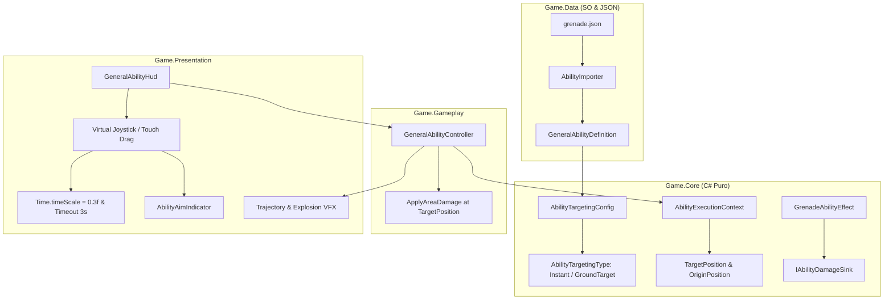

# Arremesso Dinâmico da Granada com Mira e Alcance Implementation Plan

> **For agentic workers:** REQUIRED SUB-SKILL: Use superpowers:subagent-driven-development to implement this plan task-by-task. Steps use checkbox (`- [ ]`) syntax for tracking.

**Goal:** Implementar o arremesso espacial da Granada permitindo escolha de lane e distância no eixo Z com limite de alcance (`MaxRange = 20 m`), controle por arraste no HUD (estilo Brawl Stars), desaceleração temporária (`timeScale = 0.3f`) de até 3 s e arquitetura extensível para habilidades `Instant` (buffs) e `GroundTarget`.

**Architecture:** O domínio puro em `Game.Core` define `AbilityTargetingType` (`Instant` vs `GroundTarget`) e `AbilityTargetingConfig` com lógica de clamping determinística. `Game.Data` expõe esses dados via JSON e ScriptableObject. `Game.Gameplay` executa o dano no ponto mirado `TargetPosition`. `Game.Presentation` gerencia o joystick virtual relativo no botão do HUD, o indicador de retículo na pista e a trajetória parabólica com controle de `timeScale`.

**Architecture Diagram:**



**Tech Stack:** Unity 6 (6000.6.3f1), C#, UnityEngine.InputSystem, Harness CLI (`tools/unity compile`, `test-edit`, `test-play`, `import-content`).

## Global Constraints

- Asmdefs unidirecionais estritos: `Game.Core` (sem UnityEngine) ← `Game.Data` ← `Game.Gameplay` ← `Game.Presentation`.
- Diffs cirúrgicos: até 300 linhas de código por fatia/tarefa.
- Proibido comentários que narram o que a linha seguinte faz; apenas o "porquê" de invariantes de negócio.
- Todo teste EditMode que instanciar GameObjects deve destruí-los com `UnityEngine.Object.DestroyImmediate` no `TearDown`.
- Português do Brasil em docs e mensagens de commit (`tipo(escopo): resumo [NEX-651]`).

---

### Task 1: Core Domain — Tipos e Contratos de Mira

**Files:**
- Create: [`Assets/_Game/Scripts/Core/Abilities/AbilityTargetingType.cs`](file:///D:/Projects/worktrees/ZumbiRunner/nex-778/Assets/_Game/Scripts/Core/Abilities/AbilityTargetingType.cs)
- Create: [`Assets/_Game/Scripts/Core/Abilities/AbilityTargetingConfig.cs`](file:///D:/Projects/worktrees/ZumbiRunner/nex-778/Assets/_Game/Scripts/Core/Abilities/AbilityTargetingConfig.cs)
- Modify: [`Assets/_Game/Scripts/Core/Abilities/AbilityExecutionContext.cs`](file:///D:/Projects/worktrees/ZumbiRunner/nex-778/Assets/_Game/Scripts/Core/Abilities/AbilityExecutionContext.cs)
- Modify: [`Assets/_Game/Scripts/Core/Abilities/Effects/GrenadeAbilityEffect.cs`](file:///D:/Projects/worktrees/ZumbiRunner/nex-778/Assets/_Game/Scripts/Core/Abilities/Effects/GrenadeAbilityEffect.cs)
- Create: [`Assets/_Game/Scripts/Tests/EditMode/AbilityTargetingCoreTests.cs`](file:///D:/Projects/worktrees/ZumbiRunner/nex-778/Assets/_Game/Scripts/Tests/EditMode/AbilityTargetingCoreTests.cs)

**Interfaces:**
- Consumes: `AbilityPosition`, `IAbilityEffect`, `IAbilityDamageSink`.
- Produces: `AbilityTargetingType`, `AbilityTargetingConfig.ClampTarget()`, `AbilityExecutionContext.TargetPosition`.

- [x] **Step 1: Escrever teste Red para `AbilityTargetingConfig` e `ClampTarget`**

```csharp
// Assets/_Game/Scripts/Tests/EditMode/AbilityTargetingCoreTests.cs
using Game.Core.Abilities;
using Game.Core.Abilities.Effects;
using NUnit.Framework;

namespace Game.Tests.EditMode
{
    [TestFixture]
    public class AbilityTargetingCoreTests
    {
        [Test]
        public void InstantTargeting_ClampsToOrigin()
        {
            var config = new AbilityTargetingConfig { Type = AbilityTargetingType.Instant, MaxRange = 0f };
            var origin = new AbilityPosition(0f, 0f, 10f);
            var desired = new AbilityPosition(2f, 0f, 25f);

            var result = config.ClampTarget(origin, desired);

            Assert.AreEqual(origin.X, result.X);
            Assert.AreEqual(origin.Z, result.Z);
        }

        [Test]
        public void GroundTarget_ClampsZDistanceToMaxRange()
        {
            var config = new AbilityTargetingConfig { Type = AbilityTargetingType.GroundTarget, MaxRange = 20f };
            var origin = new AbilityPosition(0f, 0f, 10f);
            var desiredFar = new AbilityPosition(1f, 0f, 40f);

            var result = config.ClampTarget(origin, desiredFar);

            Assert.AreEqual(1f, result.X);
            Assert.AreEqual(30f, result.Z); // origin.Z + MaxRange
        }

        [Test]
        public void GroundTarget_DoesNotAllowNegativeZBehindOrigin()
        {
            var config = new AbilityTargetingConfig { Type = AbilityTargetingType.GroundTarget, MaxRange = 20f };
            var origin = new AbilityPosition(0f, 0f, 10f);
            var desiredBehind = new AbilityPosition(1f, 0f, 5f);

            var result = config.ClampTarget(origin, desiredBehind);

            Assert.AreEqual(10f, result.Z); // clamped at origin.Z
        }
    }
}
```

- [x] **Step 2: Executar `./tools/unity test-edit` e confirmar falha Red**

- [x] **Step 3: Implementar `AbilityTargetingType.cs`, `AbilityTargetingConfig.cs` e atualizar `AbilityExecutionContext`**

```csharp
// Assets/_Game/Scripts/Core/Abilities/AbilityTargetingType.cs
namespace Game.Core.Abilities
{
    public enum AbilityTargetingType
    {
        Instant = 0,
        GroundTarget = 1
    }
}
```

```csharp
// Assets/_Game/Scripts/Core/Abilities/AbilityTargetingConfig.cs
using System;

namespace Game.Core.Abilities
{
    [Serializable]
    public class AbilityTargetingConfig
    {
        public AbilityTargetingType Type = AbilityTargetingType.Instant;
        public float MaxRange = 0f;
        public float Radius = 4f;

        public AbilityPosition ClampTarget(AbilityPosition origin, AbilityPosition desired)
        {
            if (Type == AbilityTargetingType.Instant)
            {
                return origin;
            }

            float deltaZ = desired.Z - origin.Z;
            if (deltaZ < 0f) deltaZ = 0f;
            if (deltaZ > MaxRange) deltaZ = MaxRange;

            return new AbilityPosition(desired.X, origin.Y, origin.Z + deltaZ);
        }
    }
}
```

Atualizar `AbilityExecutionContext.cs` para incluir `TargetPosition`:
```csharp
public AbilityPosition TargetPosition { get; set; }
```

Atualizar `GrenadeAbilityEffect.cs` para usar `TargetPosition`:
```csharp
var center = context.TargetPosition.Z != 0f || context.TargetPosition.X != 0f ? context.TargetPosition : context.OriginPosition;
context.DamageSink.ApplyAreaDamage(center, DefaultRadius, DefaultDamage, DamageType.Area, this);
```

- [x] **Step 4: Executar `./tools/unity test-edit` e verificar se passou Green**

- [x] **Step 5: Commitar Task 1**
```bash
git add Assets/_Game/Scripts/Core/ Assets/_Game/Scripts/Tests/EditMode/AbilityTargetingCoreTests.cs
git commit -m "feat(core): adicionar AbilityTargetingType e configuracao de mira com clamping [NEX-651]"
```

---

### Task 2: Data Pipeline — Serialização JSON e Importador

**Files:**
- Modify: [`Content/Source/Abilities/grenade.json`](file:///D:/Projects/worktrees/ZumbiRunner/nex-778/Content/Source/Abilities/grenade.json)
- Modify: [`Assets/_Game/Scripts/Data/Abilities/GeneralAbilityDefinition.cs`](file:///D:/Projects/worktrees/ZumbiRunner/nex-778/Assets/_Game/Scripts/Data/Abilities/GeneralAbilityDefinition.cs)
- Modify: [`Assets/_Game/Scripts/Editor/AbilityImporter.cs`](file:///D:/Projects/worktrees/ZumbiRunner/nex-778/Assets/_Game/Scripts/Editor/AbilityImporter.cs)
- Modify: [`Assets/_Game/Scripts/Tests/EditMode/AbilityImporterTests.cs`](file:///D:/Projects/worktrees/ZumbiRunner/nex-778/Assets/_Game/Scripts/Tests/EditMode/AbilityImporterTests.cs)

**Interfaces:**
- Consumes: `AbilityTargetingConfig`, `GeneralAbilityDefinition`.
- Produces: Importação via `tools/unity import-content`.

- [x] **Step 1: Atualizar `AbilityImporterTests.cs` com asserções sobre `Targeting`**

```csharp
Assert.IsNotNull(def.Targeting);
Assert.AreEqual(AbilityTargetingType.GroundTarget, def.Targeting.Type);
Assert.AreEqual(20f, def.Targeting.MaxRange);
Assert.AreEqual(4f, def.Targeting.Radius);
```

- [x] **Step 2: Executar `./tools/unity test-edit` e validar falha Red**

- [x] **Step 3: Atualizar `grenade.json`, `GeneralAbilityDefinition.cs` e `AbilityImporter.cs`**

Em `grenade.json`:
```json
{
  "id": "grenade",
  "name": "Granada",
  "chargeKills": 25,
  "targeting": {
    "type": "GroundTarget",
    "maxRange": 20.0,
    "radius": 4.0
  },
  "effect": {
    "$type": "Game.Core.Abilities.Effects.GrenadeAbilityEffect, Game.Core",
    "damage": 150
  }
}
```

Em `GeneralAbilityDefinition.cs`:
```csharp
[SerializeField] private AbilityTargetingConfig targeting = new AbilityTargetingConfig();
public AbilityTargetingConfig Targeting => targeting;
```

Em `AbilityImporter.cs`: deserializar a chave `targeting` e preencher no ScriptableObject gerado.

- [x] **Step 4: Rodar `./tools/unity import-content` e `./tools/unity test-edit` (Green)**

- [x] **Step 5: Commitar Task 2**
```bash
git add Content/Source/Abilities/ Assets/_Game/Scripts/Data/ Assets/_Game/Scripts/Editor/ Assets/_Game/Scripts/Tests/EditMode/AbilityImporterTests.cs
git commit -m "feat(data): expor configuracao de targeting no JSON da granada e importer [NEX-651]"
```

---

### Task 3: Gameplay — Disparo com Ponto de Impacto e Clamping de Alcance

**Files:**
- Modify: [`Assets/_Game/Scripts/Gameplay/Abilities/GeneralAbilityController.cs`](file:///D:/Projects/worktrees/ZumbiRunner/nex-778/Assets/_Game/Scripts/Gameplay/Abilities/GeneralAbilityController.cs)
- Modify: [`Assets/_Game/Scripts/Tests/EditMode/GeneralAbilityGameplayTests.cs`](file:///D:/Projects/worktrees/ZumbiRunner/nex-778/Assets/_Game/Scripts/Tests/EditMode/GeneralAbilityGameplayTests.cs)

**Interfaces:**
- Consumes: `AbilityTargetingConfig`, `AbilityPosition`.
- Produces: `TriggerAbility(bool manual = false, AbilityPosition? targetOverride = null)`.

- [x] **Step 1: Escrever testes Red em `GeneralAbilityGameplayTests.cs`**
  - Testar que disparar com `targetOverride` aplica o dano centrado na posição Z mirada e atinge inimigos no raio de 4 m daquele ponto.
  - Testar que disparar no modo Auto calcula automaticamente a posição à frente na lane atual.

- [x] **Step 2: Executar `./tools/unity test-edit` e validar falha Red**

- [ ] **Step 3: Implementar suporte a `targetOverride` em `GeneralAbilityController.cs`**

```csharp
public bool TriggerAbility(bool manual = false, AbilityPosition? targetOverride = null)
{
    // ... validações existentes de tracker e policy ...
    Vector3 generalPos = _generalTransform != null ? _generalTransform.position : transform.position;
    var originPos = new AbilityPosition(generalPos.x, generalPos.y, generalPos.z);
    
    AbilityPosition finalTarget;
    int targetLane = currentLane;

    if (targetOverride.HasValue && Definition != null && Definition.Targeting != null)
    {
        finalTarget = Definition.Targeting.ClampTarget(originPos, targetOverride.Value);
    }
    else
    {
        // Padrão Auto ou disparo sem mira: +12m à frente na lane atual
        float defaultForward = Definition != null && Definition.Targeting != null ? Mathf.Min(12f, Definition.Targeting.MaxRange) : 12f;
        finalTarget = new AbilityPosition(originPos.X, originPos.Y, originPos.Z + defaultForward);
    }

    var executionContext = new AbilityExecutionContext
    {
        OriginPosition = originPos,
        TargetPosition = finalTarget,
        TargetLane = targetLane,
        DamageSink = this,
        EventBus = _eventBus
    };

    _definition.Effect.Execute(executionContext);
    // ... publish events ...
    return true;
}
```

- [x] **Step 4: Executar `./tools/unity test-edit` e verificar se passou Green**

- [x] **Step 5: Commitar Task 3**
```bash
git add Assets/_Game/Scripts/Gameplay/Abilities/ Assets/_Game/Scripts/Tests/EditMode/GeneralAbilityGameplayTests.cs
git commit -m "feat(gameplay): suportar alvo customizado e limite de alcance no controller [NEX-651]"
```

---

### Task 4: Presentation — Indicador de Mira 3D e Projétil Parabólico

**Files:**
- Create: [`Assets/_Game/Scripts/Presentation/AbilityAimIndicator.cs`](file:///D:/Projects/worktrees/ZumbiRunner/nex-778/Assets/_Game/Scripts/Presentation/AbilityAimIndicator.cs)
- Modify: [`Assets/_Game/Scripts/Presentation/GeneralAbilityExplosionVfx.cs`](file:///D:/Projects/worktrees/ZumbiRunner/nex-778/Assets/_Game/Scripts/Presentation/GeneralAbilityExplosionVfx.cs)
- Create: [`Assets/_Game/Scripts/Tests/EditMode/AbilityAimIndicatorTests.cs`](file:///D:/Projects/worktrees/ZumbiRunner/nex-778/Assets/_Game/Scripts/Tests/EditMode/AbilityAimIndicatorTests.cs)

**Interfaces:**
- Consumes: `AbilityTargetingConfig`, `Vector3`.
- Produces: `AbilityAimIndicator.Show()`, `AbilityAimIndicator.UpdateAim()`, `AbilityAimIndicator.Hide()`.

- [x] **Step 1: Escrever testes Red para `AbilityAimIndicator`**
  - Testar ativação/desativação do renderer.
  - Testar posicionamento da retícula nas coordenadas de mundo.
  - Testar troca de estado visual para cancelamento.

- [x] **Step 2: Executar `./tools/unity test-edit` e validar falha Red**

- [x] **Step 3: Implementar `AbilityAimIndicator.cs`**
  - Renderiza círculo plano de raio `Radius` no chão (`Y = 0.05f`).
  - Atualiza posição em tempo real e muda cor para avermelhado quando `isCanceling == true`.

- [x] **Step 4: Executar `./tools/unity test-edit` e validar Green**

- [x] **Step 5: Commitar Task 4**
```bash
git add Assets/_Game/Scripts/Presentation/ Assets/_Game/Scripts/Tests/EditMode/AbilityAimIndicatorTests.cs
git commit -m "feat(presentation): adicionar indicador de mira 3D na pista [NEX-651]"
```

---

### Task 5: Presentation & Input — Joystick de Mira no HUD, Câmera Lenta e Timeout

**Files:**
- Modify: [`Assets/_Game/Scripts/Presentation/GeneralAbilityHud.cs`](file:///D:/Projects/worktrees/ZumbiRunner/nex-778/Assets/_Game/Scripts/Presentation/GeneralAbilityHud.cs)
- Modify: [`Assets/_Game/Scripts/Editor/SceneBuilder.cs`](file:///D:/Projects/worktrees/ZumbiRunner/nex-778/Assets/_Game/Scripts/Editor/SceneBuilder.cs)
- Modify: [`Assets/_Game/Scripts/Tests/EditMode/GeneralAbilityHudTests.cs`](file:///D:/Projects/worktrees/ZumbiRunner/nex-778/Assets/_Game/Scripts/Tests/EditMode/GeneralAbilityHudTests.cs)

**Interfaces:**
- Consumes: `IPointerDownHandler`, `IDragHandler`, `IPointerUpHandler`, `AbilityAimIndicator`.
- Produces: Disparo de mira manual e controle de `Time.timeScale`.

- [x] **Step 1: Escrever testes Red para os eventos de mira do HUD**
  - Testar que para `Instant`, clique dispara diretamente.
  - Testar que para `GroundTarget`, pointer down inicia slow motion e timer.
  - Testar que pointer up na zona morta cancela sem disparar.
  - Testar que timeout de 3s força o disparo.

- [x] **Step 2: Executar `./tools/unity test-edit` e validar falha Red**

- [x] **Step 3: Implementar joystick relativo no `GeneralAbilityHud.cs`**
  - Implementar interfaces de ponteiro do Unity UI.
  - Gerenciar `Time.timeScale = 0.3f` durante mira e restauração para `1.0f`.
  - Integrar `AbilityAimIndicator` na inicialização do HUD.
  - Atualizar `SceneBuilder.cs` para instanciar o indicador na cena M6.

- [x] **Step 4: Executar `./tools/unity test-edit` e validar Green**

- [x] **Step 5: Commitar Task 5**
```bash
git add Assets/_Game/Scripts/Presentation/ Assets/_Game/Scripts/Editor/SceneBuilder.cs Assets/_Game/Scripts/Tests/EditMode/GeneralAbilityHudTests.cs
git commit -m "feat(presentation): implementar controle por arraste no HUD com slow motion e timeout [NEX-879]"
```

---

### Task 6: Testes PlayMode Integrados e Portão Completo de Verificação

**Files:**
- Create: [`Assets/_Game/Scripts/Tests/PlayMode/GeneralAbilityAimPlayModeTests.cs`](file:///D:/Projects/worktrees/ZumbiRunner/nex-778/Assets/_Game/Scripts/Tests/PlayMode/GeneralAbilityAimPlayModeTests.cs)
- Modify: [`Assets/_Game/Scripts/Tests/EditMode/SceneBuilderM6Tests.cs`](file:///D:/Projects/worktrees/ZumbiRunner/nex-778/Assets/_Game/Scripts/Tests/EditMode/SceneBuilderM6Tests.cs)

**Interfaces:**
- Consumes: Toda a pilha integrada na cena M6.
- Produces: Validação PlayMode de ponta a ponta e portão verde.

- [x] **Step 1: Criar testes PlayMode cobrindo:**
  - Simulação de toque no botão manual com arraste para frente.
  - Verificação de desaceleração de tempo e restauração.
  - Verificação de dano e abates aplicados nas coordenadas exatas da lane e Z mirados.

- [x] **Step 2: Rodar portão completo pelo harness:**
  - `./tools/unity compile` (0 erros)
  - `./tools/unity test-edit` (todos passando)
  - `./tools/unity test-play` (todos passando)

- [x] **Step 3: Commitar Task 6 e restaurar ruído de regeneração**
```bash
git add Assets/_Game/Scripts/Tests/PlayMode/ Assets/_Game/Scripts/Tests/EditMode/SceneBuilderM6Tests.cs Assets/_Game/Scripts/Gameplay/Abilities/GeneralAbilityController.cs docs/superpowers/plans/
git commit -m "test(playmode): validar ciclo de mira e arremesso dinamico [NEX-879]"
```

---

## Auto-Revisão do Plano

1. **Cobertura da Spec:**
   - [x] Extensibilidade `Instant` vs `GroundTarget`: Tarefas 1 e 2.
   - [x] Arraste no HUD estilo Brawl Stars: Tarefa 5.
   - [x] Câmera lenta (`0.3f`) com timeout de 3s: Tarefa 5.
   - [x] Limite de alcance (`MaxRange = 20m`) e clamping: Tarefas 1 e 3.
   - [x] Retículo no chão com raio de 4m: Tarefa 4.
   - [x] Manutenção do disparo Auto: Tarefa 3.
2. **Sem Placeholders:** Todas as assinaturas, tipos e trechos de código essenciais estão explicitados.
3. **Consistência de Tipos:** Nomes de tipos e métodos (`AbilityTargetingType`, `AbilityTargetingConfig`, `TargetPosition`, `ClampTarget`) consistentes em todas as tarefas.
