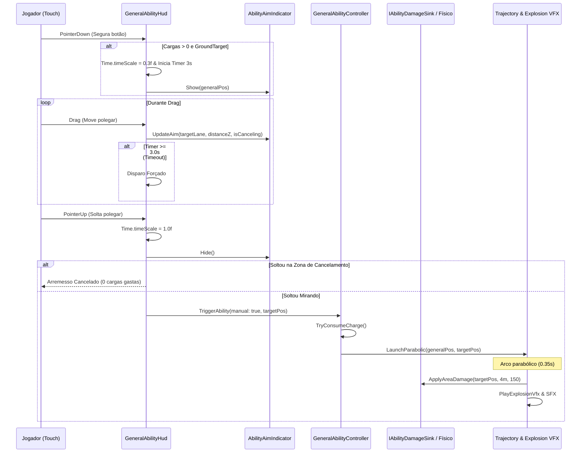

# Especificação de Design: Arremesso Dinâmico da Granada com Mira e Alcance

> **Data:** 2026-10-08  
> **Status:** Aprovado em Brainstorming  
> **Escopo:** Extensibilidade de Mira de Habilidades do General (`Instant` vs `GroundTarget`), Mira por Arraste no HUD, Desaceleração Temporária (`timeScale`), Limite de Alcance e Arremesso Parabólico.

---

## 1. Visão Geral e Objetivos

Atualmente, o Poder do General na M16 ([NEX-651](https://linear.app/aintegrado/issue/NEX-651/story-m16-poder-do-general)) detona a Granada de forma estática centrada na posição atual do General no eixo Z e na lane onde ele estiver posicionado.

O objetivo deste design é:
1. **Permitir escolha de alvo espacial (altura/distância no eixo Z e escolha de lane):** O jogador poderá mirar em qualquer uma das 3 lanes e definir a distância à frente na lane até um limite de alcance máximo (`MaxRange`, padrão 20 m).
2. **Controle por arraste no botão do HUD (Estilo Brawl Stars):** Segurar o botão manual no HUD e arrastar o dedo guia um retículo de mira no chão da pista; soltar arremessa no alvo; arrastar de volta para o botão inicial cancela.
3. **Câmera lenta temporária com timeout:** Enquanto mira, o jogo desacelera (`Time.timeScale = 0.3f`) por até 3,0 segundos. Ao esgotar o tempo, dispara automaticamente nas coordenadas atuais da mira.
4. **Arquitetura extensível para futuras habilidades:** Suportar nativamente dois tipos de ativação via dados (`AbilityTargetingType`):
   * `Instant`: Habilidades de autocast/buff que disparam com um clique simples (ex.: bônus de cadência de tiro, escudo para soldados).
   * `GroundTarget`: Habilidades espaciais com mira na pista e limite de alcance (ex.: Granada, Ataque Aéreo).
5. **Feedback visual (VFX):** Retículo projetado no chão com o raio de 4 metros e projétil com curva parabólica rápida do General até o alvo antes da explosão.

---

## 2. Decisões de Design e UX

| Aspecto | Decisão Aprovada | Racional |
|---|---|---|
| **Gesto de Entrada** | Joystick virtual relativo no botão do HUD (arrastar a partir do botão). | Não obstrui a visão do corredor/horda com a mão do jogador em tela vertical mobile. |
| **Escopo de Faixas** | Arraste lateral seleciona qualquer uma das 3 lanes (-1 = Esquerda, 0 = Centro, +1 = Direita). | Permite limpar hordas em lanes adjacentes sem forçar o General a trocar de faixa primeiro. |
| **Escopo de Alcance** | Distância contínua no eixo Z de `0` até `MaxRange` (20 m à frente do General). | Jogador escolhe detonar na horda que está longe ou salvar-se da que está logo à frente. |
| **Dinâmica Temporal** | `Time.timeScale = 0.3f` durante a mira, limitado a 3,0 segundos. | Permite mira tática precisa mesmo com o runner correndo a 8 m/s. |
| **Timeout de Mira** | Ao atingir 3,0 s de mira, auto-dispara no ponto atual e restaura `timeScale = 1.0f`. | Evita que o jogador congele o jogo indefinidamente como exploit de pausa. |
| **Cancelamento** | Retornar o toque para a área interna do botão (< 35 px do centro). | Padrão ergonômico mobile para cancelar sem disparar nem gastar carga. |
| **Modo Automático** | Sem intervenção do jogador: auto-mira na lane do General a um offset seguro à frente. | Mantém paridade e automação completa para quem opta por jogar em modo Auto. |

---

## 3. Arquitetura e Modelo de Dados

### 3.1 Camada de Domínio (`Game.Core`)

```csharp
namespace Game.Core.Abilities
{
    public enum AbilityTargetingType
    {
        Instant = 0,
        GroundTarget = 1
    }

    [System.Serializable]
    public class AbilityTargetingConfig
    {
        public AbilityTargetingType Type { get; set; } = AbilityTargetingType.Instant;
        public float MaxRange { get; set; } = 0f;
        public float Radius { get; set; } = 4f;

        public AbilityPosition ClampTarget(AbilityPosition origin, AbilityPosition desired)
        {
            if (Type == AbilityTargetingType.Instant)
            {
                return origin;
            }

            float deltaZ = Mathf.Clamp(desired.Z - origin.Z, 0f, MaxRange);
            return new AbilityPosition(desired.X, origin.Y, origin.Z + deltaZ);
        }
    }
}
```

### 3.2 Atualização do Contexto de Execução (`AbilityExecutionContext`)

```csharp
namespace Game.Core.Abilities
{
    public class AbilityExecutionContext
    {
        public AbilityPosition OriginPosition { get; set; }
        public AbilityPosition TargetPosition { get; set; }
        public int TargetLane { get; set; }
        public IAbilityDamageSink DamageSink { get; set; }
        public IEventBus EventBus { get; set; }
    }
}
```

O `GrenadeAbilityEffect.cs` aplica dano centrado em `TargetPosition` usando o raio de `AbilityTargetingConfig.Radius`:
```csharp
context.DamageSink.ApplyAreaDamage(context.TargetPosition, Radius, Damage, DamageType.Area, this);
```

### 3.3 Esquema de Dados JSON (`Content/Source/Abilities/grenade.json`)

```json
{
  "id": "grenade",
  "name": "Granada",
  "chargeKills": 25,
  "targeting": {
    "type": "GroundTarget",
    "maxRange": 20.0,
    "radius": 4.0
  },
  "effect": {
    "$type": "Game.Core.Abilities.Effects.GrenadeAbilityEffect, Game.Core",
    "damage": 150
  }
}
```

---

## 4. Componentes e Responsabilidades por Camada

### 4.1 `Game.Core` (C# Puro)
* **`AbilityTargetingType` & `AbilityTargetingConfig`:** Tipagem pura e lógica de restrição de alcance (`ClampTarget`).
* **`AbilityExecutionContext`:** Transporta tanto a origem do General quanto o ponto final do alvo mirado.
* **`GrenadeAbilityEffect`:** Executa o dano centrado na posição alvo (`TargetPosition`), removendo o raio constante fixo do código.

### 4.2 `Game.Data` (ScriptableObjects)
* **`GeneralAbilityDefinition`:** Armazena `AbilityTargetingConfig` serializado e exposto pelo inspector/JSON.
* **`AbilityImporter`:** Importa a seção `targeting` do JSON no pipeline `tools/unity import-content`.

### 4.3 `Game.Gameplay` (MonoBehaviour & Combate)
* **`GeneralAbilityController`:**
  * Assinatura estendida: `bool TriggerAbility(bool manual = false, AbilityPosition? targetOverride = null)`.
  * Valida e clampa `targetOverride` contra `targeting.MaxRange`.
  * No modo Automático: seleciona automaticamente o alvo à frente (`generalZ + 12m` na lane do General).
  * Consome carga e aciona o efeito na posição validada.

### 4.4 `Game.Presentation` (HUD, Input e VFX)
* **`GeneralAbilityHud`:**
  * Reconhece `Targeting.Type`. Se `Instant`, atua no `OnClick`. Se `GroundTarget`, aciona os manipuladores de ponteiro (`PointerDown`, `Drag`, `PointerUp`).
  * Gerencia o joystick relativo e o estado de mira (mirando vs cancelando).
  * Controla o temporizador de câmera lenta (`Time.timeScale = 0.3f` com timeout de 3,0 s).
* **`AbilityAimIndicator` (Novo Componente Presentation):**
  * Projeta o retículo no chão (`Decal` ou Sprite plano circular com diâmetro `2 * Radius = 8m`).
  * Atualiza a posição X pela lane alvo e a posição Z pelo alcance calculado.
  * Muda de cor/opacidade quando o dedo está na zona de cancelamento.
* **`GrenadeTrajectoryVfx` (Novo ou integrado a `GeneralAbilityExplosionVfx`):**
  * Spawna um projétil rápido que percorre um arco parabólico da mão do General até `TargetPosition` (~0,35 s).
  * Ao atingir `TargetPosition`, despacha a explosão visual e o SFX de detonação.

---

## 5. Fluxo de Execução (Diagrama de Sequência)



---

## 6. Tratamento de Erros e Casos de Borda

1. **Pausa do Jogo / Perda de Foco:** Se o jogo pausar ou a aplicação perder o foco enquanto o jogador estiver segurando a mira, a mira deve ser cancelada imediatamente e o `timeScale` restaurado para evitar congelamentos de tempo residuais.
2. **Mudança de Lane do General durante a Mira:** O General continua correndo para frente (em velocidade 0.3x). A mira Z acompanha a distância relativa ao General (`generalZ + aimDistanceZ`) para que o retículo não fique para trás.
3. **Morte do General / Vitória:** Se a corrida for resolvida durante a mira, a mira fecha instantaneamente e restaura `timeScale = 1.0f`.
4. **Resoluções de Tela Diferentes:** O joystick virtual usa normalização em pixels escalonada pelo tamanho da tela (`Screen.dpi` ou porcentagem da altura do Canvas).

---

## 7. Estratégia de Verificação e Testes

* **Testes EditMode (Core & Dados):**
  * `AbilityTargetingConfigTests`: verifica que `ClampTarget` limita no `MaxRange` e que `Instant` retorna a origem.
  * `AbilityImporterTests`: verifica que o `grenade.json` com `targeting` é importado corretamente para o ScriptableObject.
  * `GrenadeAbilityEffectTests`: verifica que o dano é aplicado em `TargetPosition` e não apenas em `OriginPosition`.
* **Testes EditMode (Gameplay):**
  * `GeneralAbilityControllerAimTests`: verifica que passar um `targetOverride` dispara o dano no ponto correto e respeita a lane selecionada.
* **Testes PlayMode:**
  * `GeneralAbilityAimInputPlayModeTests`: simula `PointerDown` → `Drag` → `PointerUp` e verifica o consumo de carga, restauração de `timeScale` e detonação nas coordenadas miradas.
